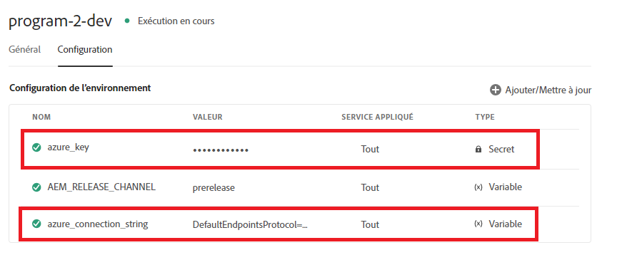

# Configurations du cloud basées sur le contexte

Lorsque vous créez une configuration cloud dans votre environnement local et lors de tests réussis, vous souhaiterez utiliser la même configuration cloud dans vos environnements en amont, mais sans avoir à modifier le point de terminaison, la clé/mot de passe secrète et ou le nom d’utilisateur. Pour réaliser ce cas d’utilisation, AEM Forms on Cloud Service a introduit la possibilité de définir des configurations cloud basées sur le contexte.
Par exemple, la configuration cloud du compte de stockage Azure peut être réutilisée dans les environnements de développement, d’évaluation et de production à l’aide de différentes chaînes et clés de connexion pour .

Les étapes suivantes sont nécessaires pour créer une configuration cloud contextuelle.

## Création de variables d’environnement

Les variables d’environnement standard peuvent être configurées et gérées via Cloud Manager. Elles sont fournies à l’environnement d’exécution et peuvent être utilisés dans des configurations OSGi. [Les variables d’environnement peuvent être des valeurs spécifiques à un environnement ou des secrets d’environnement, en fonction de ce qui est modifié.](https://experienceleague.adobe.com/docs/experience-manager-cloud-service/content/implementing/using-cloud-manager/environment-variables.html?lang=en)


La capture d’écran suivante montre les variables d’environnement azure_key et azure_connection_string définies


Ces variables d’environnement peuvent ensuite être spécifiées dans les fichiers de configuration à utiliser dans l’environnement approprié. Par exemple, si vous souhaitez que toutes vos instances d’auteur utilisent ces variables d’environnement, vous définirez le fichier de configuration dans le dossier config.author comme indiqué ci-dessous.

## Création d’un fichier de configuration

Ouvrez votre projet dans IntelliJ. Accédez à config.author et créez un fichier appelé

```java
org.apache.sling.caconfig.impl.override.OsgiConfigurationOverrideProvider-integrationTest.cfg.json
```


Copiez le texte suivant dans le fichier que vous avez créé à l’étape précédente. Le code de ce fichier remplace la valeur des propriétés accountName et accountKey par des variables d’environnement. **azure_connection_string** et **azure_key**.

```json
{
  "enabled":true,
  "description":"dermisITOverrideConfig",
  "overrides":[
   "cloudconfigs/azurestorage/FormsCSAndAzureBlob/accountName=\"$[env:azure_connection_string]\"",
   "cloudconfigs/azurestorage/FormsCSAndAzureBlob/accountKey=\"$[secret:azure_key]\""

  ]
}
```

>[!NOTE]
>
>Cette configuration s’applique à tous les environnements de création de votre instance de service cloud. Pour appliquer la configuration aux environnements de publication, vous devez placer le même fichier de configuration dans le dossier config.publish de votre projet intelliJ.
>[!NOTE]
> Assurez-vous que la propriété en cours de remplacement est une propriété valide de la configuration cloud. Accédez à la configuration cloud pour trouver la propriété à remplacer, comme illustré ci-dessous.


Pour les configurations cloud REST avec authentification de base, vous souhaiterez généralement créer des variables d’environnement pour les propriétés serviceEndPoint, userName et password.

## Étapes suivantes

[Poussez votre projet AEM vers le gestionnaire de cloud](./push-project-to-cloud-manager-git.md)
