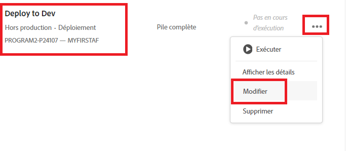
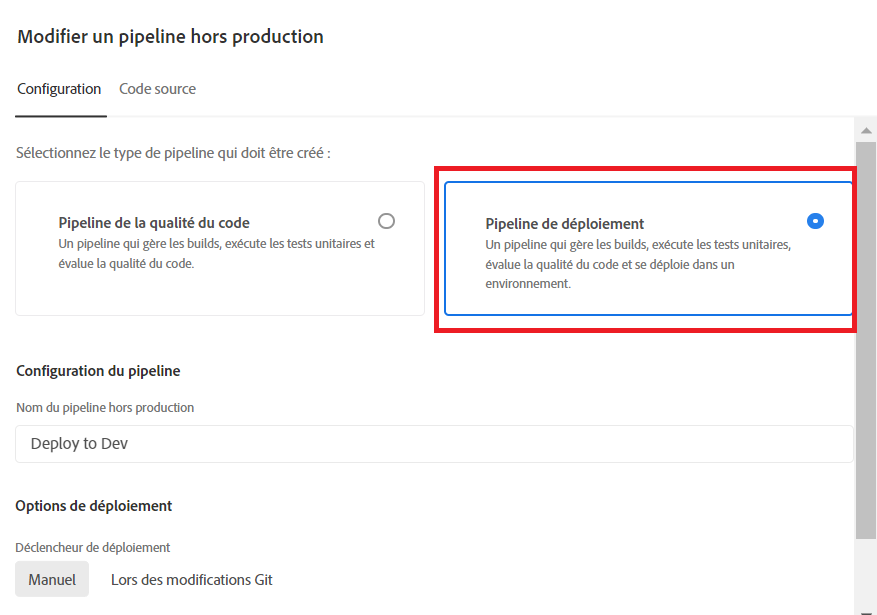
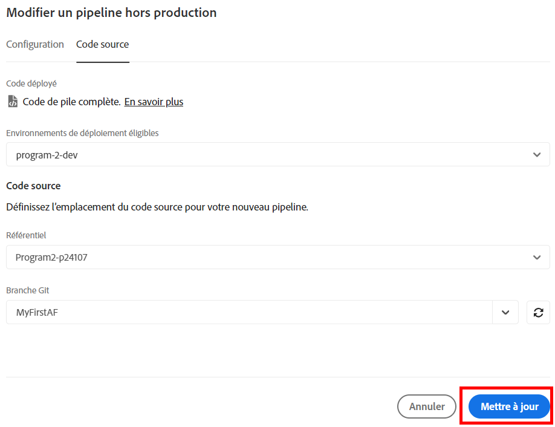
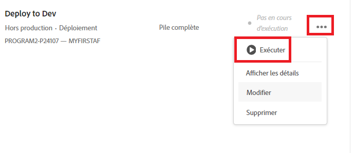

# Déployer sur l’environnement de développement

Au cours de l’étape précédente, nous avons transféré notre branche principale de notre référentiel git local vers la branche MyFirstAF du référentiel Cloud Manager.

L’étape suivante consiste à déployer le code dans l’environnement de développement.
Connectez-vous à Cloud Manager et sélectionnez votre programme.

Sélectionnez Déployer pour le développement comme illustré ci-dessous.

Sélectionnez Pipeline de déploiement comme indiqué

Sélectionnez le code source et la branche Git appropriée.

Veillez à mettre à jour vos modifications.

Exécutez le pipeline

Une fois le code déployé, les modifications doivent s’afficher dans votre instance de service cloud d’AEM Forms.

## Étapes suivantes

[Mettre à jour le projet d’archétype Maven](./updating-project-archetype.md)
