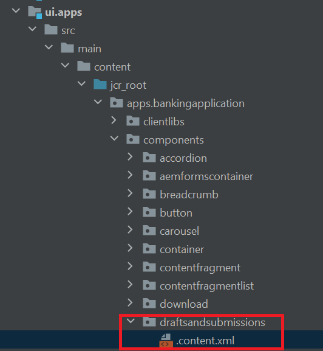

# Composants du portail Formulaires

AEM Forms fournit les composants de portail suivants prêts à l’emploi :

**Search &amp; Lister** : ce composant vous permet d’énumérer les formulaires du référentiel de formulaires sur la page du portail et propose des options de configuration pour énumérer les formulaires selon des critères spécifiés.

**Brouillons et envois** : alors que le composant Search &amp; Lister affiche les formulaires rendus publics par l’auteur ou l’autrice de Forms, le composant Brouillons et envois affiche les formulaires enregistrés en tant que brouillons en vue d’être remplis et envoyés ultérieurement. Ce composant fournit une expérience personnalisée à toute personne utilisatrice.

**Lien** : ce composant vous permet de créer un lien vers un formulaire à partir de n’importe quel emplacement sur la page.

## Activer les composants du portail Formulaires

Lancez IntelliJ et ouvrez le projet BankingApplication créé au cours de l’[étape précédente.](./getting-started.md)Développez ui.apps->src->main->content->jcr_root->apps.bankingapplication->components.

Pour utiliser n’importe quel composant principal (y compris les composants de portail prêts à l’emploi) dans un site Adobe Experience Manager (AEM), vous devez créer un composant proxy et l’activer pour votre site.
Le nouveau composant proxy doit pointer vers le composant de formulaires prêts à l’emploi, afin d’hériter de toutes leurs caractéristiques. Pour ce faire, modifiez la propriété resourceSuperType dans le fichier content.xml du composant proxy. Le fichier content.xml permet également d’indiquer le titre et le groupe du composant.
>[!NOTE]
>
> Vous pouvez créer un super type de ressource pour chacun de [ces composants à partir d’ici](https://github.com/adobe/aem-core-forms-components/tree/master/ui.apps/src/main/content/jcr_root/apps/core/fd/components/formsportal).


### Brouillons et envois

Effectuez une copie d’un composant existant (par exemple `button`) et donnez-lui le nom _draftsandsubmissions_.

Remplacez le contenu de `.content.xml` par le code XML suivant :

```xml
<?xml version="1.0" encoding="UTF-8"?>
<jcr:root xmlns:sling="http://sling.apache.org/jcr/sling/1.0" xmlns:cq="http://www.day.com/jcr/cq/1.0" xmlns:jcr="http://www.jcp.org/jcr/1.0"
          jcr:primaryType="cq:Component"
          jcr:title="Drafts And Submissions"
          sling:resourceSuperType="core/fd/components/formsportal/draftsandsubmissions/v1/draftsandsubmissions"
          componentGroup="BankingApplication - Content"/>
```

### Search and Lister

Effectuez une copie du composant Bouton et renommez-le en _searchandlister_.
Remplacez le contenu de `.content.xml` par le code XML suivant :


```xml
<?xml version="1.0" encoding="UTF-8"?>
<jcr:root xmlns:sling="http://sling.apache.org/jcr/sling/1.0" xmlns:cq="http://www.day.com/jcr/cq/1.0" xmlns:jcr="http://www.jcp.org/jcr/1.0"
          jcr:primaryType="cq:Component"
          jcr:title="Search And Lister"
          sling:resourceSuperType="core/fd/components/formsportal/searchlister/v1/searchlister"
          componentGroup="BankingApplication - Content"/>
```

### Composant Lien

Effectuez une copie du composant Bouton et renommez-le en _link_.
Remplacez le contenu de `.content.xml` par le code XML suivant :


```xml
<?xml version="1.0" encoding="UTF-8"?>
<jcr:root xmlns:sling="http://sling.apache.org/jcr/sling/1.0" xmlns:cq="http://www.day.com/jcr/cq/1.0" xmlns:jcr="http://www.jcp.org/jcr/1.0"
          jcr:primaryType="cq:Component"
          jcr:title="Link to Adaptive Form"
          sling:resourceSuperType="core/fd/components/formsportal/link/v2/link"
          componentGroup="BankingApplication - Content"/>
```

Une fois votre projet déployé, vous pouvez utiliser ces composants sur votre page AEM pour créer le portail Formulaires.

## Étapes suivantes

[Inclure la configuration des services cloud](./azure-storage-fdm.md)
