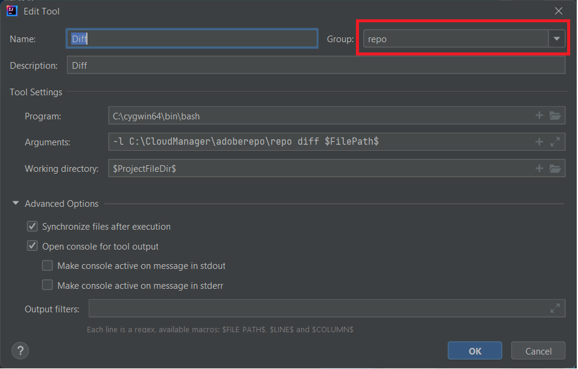

# Installer Cygwin

Cygwin est un environnement de programmation et d’exécution compatible avec POSIX qui s’exécute en mode natif sous Microsoft Windows.
Installez [Cygwin](https://www.cygwin.com/). J’ai effectué l’installation dans le dossier C:\cygwin64.
>[!NOTE]
> Assurez-vous d’installer les packages zip, unzip, curl, rsync avec votre installation cygwin.

Créez un dossier appelé adoberepo sous c:\cloudmanager.

[Installez l’outil de référentiel.](https://github.com/Adobe-Marketing-Cloud/tools/tree/master/repo) L’installation de l’outil de référentiel n’est rien d’autre que la copie du fichier de référentiel et son placement dans le dossier c:\cloudmanager\adoberepo.

Ajoutez ce qui suit à la variable d’environnement Path C:\cygwin64\bin;C:\CloudManager\adoberepo;

## Configurer les outils externes

* Lancer IntelliJ
* Appuyez sur les touches Ctrl+Alt+S pour ouvrir la fenêtre des paramètres.
* Sélectionnez Outils -> Outils externes, puis cliquez sur le signe + et saisissez ce qui suit, comme illustré dans la copie d’écran.
  
* Veillez à créer un groupe appelé repo en saisissant « repo » dans le champ déroulant Groupe et assurez-vous que toutes les commandes que vous créez appartiennent au groupe **repo**.

**Commande Put**
**Programme** : C:\cygwin64\bin\bash
**Arguments** : -l C:\CloudManager\adoberepo\repo put -f \$FilePath\$
**Répertoire de travail** : \$ProjectFileDir\$

**Commande Get**
**Programme** : C:\cygwin64\bin\bash
**Arguments** : -l C:\CloudManager\adoberepo\repo get -f \$FilePath\$
**Répertoire de travail** : \$ProjectFileDir\$

**Commande Status**
**Programme** : C:\cygwin64\bin\bash
**Arguments** : -l C:\CloudManager\adoberepo\repo st -f \$FilePath\$
**Répertoire de travail** : \$ProjectFileDir\$

**Commande Diff**
**Programme** : C:\cygwin64\bin\bash
**Arguments** : -l C:\CloudManager\adoberepo\repo diff -f $FilePath$
**Répertoire de travail** : \$ProjectFileDir\$

Extrayez le fichier .repo de [repo.zip](assets/repo.zip) et placez-le dans le dossier racine de vos projets AEM (C:\CloudManager\aem-banking-application). Ouvrez le fichier .repo et assurez-vous que le serveur et les paramètres des informations d’identification correspondent à votre environnement.
Ouvrez le fichier .gitignore, ajoutez ce qui suit en bas du fichier et enregistrez les modifications :
\# repo
.repo

Sélectionnez un projet dans votre projet aem-banking-application tel que ui.content et cliquez avec le bouton droit de la souris. L’option de référentiel devrait s’afficher. Sous l’option de référentiel, vous verrez les 4 commandes que nous avons ajoutées précédemment.

## Configurer l’instance de création AEM{#set-up-aem-author-instance}

Les étapes suivantes peuvent être suivies pour configurer rapidement une instance prête pour le cloud sur votre système local.
* [Télécharger le dernier SDK d’AEM](https://experience.adobe.com/#/downloads/content/software-distribution/en/aemcloud.html?lang=fr)

* [Télécharger le dernier module complémentaire AEM Forms](https://experience.adobe.com/#/downloads/content/software-distribution/en/aemcloud.html?lang=fr)

* Créez la structure de dossiers suivante :
\aemformscs\aem-sdk\author

* Extrayez le fichier aem-sdk-quickstart-xxxxxxx.jar du fichier zip du SDK AEM et placez-le dans le dossier c:\aemformscs\aem-sdk\author. Renommez le fichier jar par aem-author-p4502.jar.

* Ouvrez une invite de commande et accédez à c:\aemformscs\aem-sdk\author.
Saisissez la commande suivante java -jar aem-author-p4502.jar -gui. Cela lancera l’installation d’AEM.
* Connectez-vous avec les informations d’identification admin/admin
* Désactivez l’instance AEM
* Créez la structure de dossiers suivante : C:\aemformscs\aem-sdk\author\crx-quickstart\install.
* Copiez aem-forms-addon-xxxxxx.far dans le dossier d’installation.
* Ouvrez une invite de commande et accédez à c:\aemformscs\aem-sdk\author.
Saisissez la commande suivante java -jar aem-author-p4502.jar -gui. Le module complémentaire de formulaires sera ainsi déployé dans votre instance AEM.

## Étapes suivantes

[Synchroniser vos formulaires et modèles AEM avec le projet AEM](./deploy-your-first-form.md)
