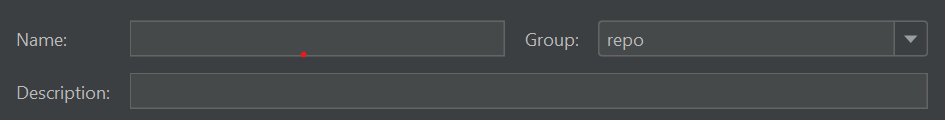

# Installation de Cygwin

Cygwin est un environnement de programmation et d’exécution compatible POSIX qui s’exécute en mode natif sous Microsoft Windows.
Installer [Cygwin](https://www.cygwin.com/). J’ai installé dans C:\cygwin64 folder
>[!NOTE]
> Assurez-vous d’installer les packages zip, unzip, curl, rsync avec votre installation cygwin.

Créez un dossier appelé adoberepo sous c:\cloudmanager.

[Installation de l’outil de référentiel].(https://github.com/Adobe-Marketing-Cloud/tools/tree/master/repo).Installing l’outil de référentiel n’est rien d’autre que de copier le fichier de référentiel et de le placer dans votre c:\cloudmanger\adoberepo folder.

Ajoutez ce qui suit à la variable d’environnement Path C:\cygwin64\bin;C:\CloudManager\adoberepo;

## Configuration des outils externes

* Launch IntelliJ
* Appuyez sur les touches Ctrl+Alt+S pour lancer la fenêtre de paramètres.
* Sélectionnez Outils -> Outils externes, puis cliquez sur le signe + et saisissez ce qui suit, comme illustré dans la capture d’écran.
   
* Veillez à créer un groupe appelé repo en saisissant &quot;repo&quot; dans le champ déroulant Groupe et toutes les commandes que vous créez appartiennent au **repo** group

**Put, Commande**
**Programme**: C:\cygwin64\bin\bash
**Arguments**: -l C:\CloudManager\adoberepo\repo put -f \$FilePath\$
**Dir de travail**: \$ProjectFileDir\$

**Obtenir la commande**
**Programme**: C:\cygwin64\bin\bash
**Arguments**: -l C:\CloudManager\adoberepo\repo get -f \$FilePath\$
**Dir de travail**: \$ProjectFileDir\$

**Status, commande**
**Programme**: C:\cygwin64\bin\bash
**Arguments**: -l C:\CloudManager\adoberepo\repo st -f \$FilePath\$
**Dir de travail**: \$ProjectFileDir\$

**Diff, commande**
**Programme**: C:\cygwin64\bin\bash
**Arguments**: -l C:\CloudManager\adoberepo\repo diff -f $FilePath$
**Dir de travail**: \$ProjectFileDir\$

Extrayez le fichier .repo de [repo.zip](assets/repo.zip) et placez-le dans le dossier racine de vos projets AEM. (C:\CloudManager\aem-banking-application). Ouvrez le fichier .repo et assurez-vous que le serveur et les paramètres des informations d’identification correspondent à votre environnement.
Ouvrez le fichier .gitignore et ajoutez ce qui suit en bas du fichier et enregistrez les modifications \# repo .repo

Sélectionnez un projet dans votre projet aem-banking-application, tel que ui.content et cliquez avec le bouton droit de la souris. L’option de référentiel devrait s’afficher. Sous l’option de référentiel, vous verrez les 4 commandes que nous avons ajoutées précédemment.

## Configuration de l’instance d’auteur AEM

Les étapes suivantes peuvent être suivies pour configurer rapidement une instance prête pour le cloud sur votre système local.
* [Téléchargement du dernier SDK AEM](https://experience.adobe.com/#/downloads/content/software-distribution/en/aemcloud.html)

* [Télécharger le dernier module complémentaire AEM Forms](https://experience.adobe.com/#/downloads/content/software-distribution/en/aemcloud.html)

* Créez la structure de dossiers suivante c:\aemformscs\aem-sdk\author

* Extrayez le fichier aem-sdk-quickstart-xxxxxxx.jar du fichier zip du SDK AEM et placez-le dans le fichier c:\aemformscs\aem-sdk\author folder.Rename le fichier jar sur aem-author-p4502.jar

* Ouvrez une invite de commande et accédez à c:\aemformscs\aem-sdk\author enter the following command java -jar aem-author-p4502.jar -gui. Cela lancera l’installation d’AEM.
* Connexion à l’aide des informations d’identification admin/admin
* Désactivez l’instance AEM
* Créez la structure de dossiers suivante.C:\aemformscs\aem-sdk\author\crx-quickstart\install
* Copiez aem-forms-addon-xxxxxx.far dans le dossier d’installation.
* Ouvrez une invite de commande et accédez à c:\aemformscs\aem-sdk\author enter the following command java -jar aem-author-p4502.jar -gui. Le module complémentaire de formulaires sera ainsi déployé dans votre instance AEM.

