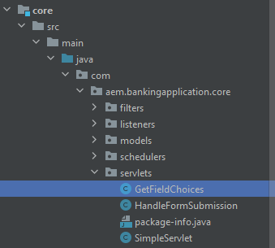

# Présentation

La liaison de servlets par chemins présente plusieurs inconvénients par rapport à la liaison par types de ressources, à savoir :

* Les servlets liés au chemin d’accès ne peuvent pas être contrôlés à l’aide des ACL par défaut du référentiel JCR
* Les servlets liés au chemin ne peuvent être enregistrés que dans un chemin et non dans un type de ressource (c’est-à-dire qu’il n’y a pas de gestion des suffixes).
* Si une servlet liée au chemin d’accès n’est pas active, par exemple si le lot est manquant ou n’est pas démarré, un POST peut entraîner des résultats inattendus. créant généralement un noeud à l’adresse `/bin/xyz` qui incruste ensuite le chemin servlets liant le mappage n’est pas transparent pour un développeur ne regardant que le référentiel. Compte tenu de ces inconvénients, il est fortement recommandé de lier les servlets aux types de ressources plutôt qu’aux chemins.

## Créer un servlet

Lancez votre projet aem-banking dans IntelliJ. Créez une servlet appelée GetFieldChoices sous le dossier servlets, comme illustré dans la capture d’écran ci-dessous.


## Exemple de servlet

Le servlet suivant est lié au type de ressource Sling : _**azure/fetchchoice**_


```java
import org.apache.sling.api.SlingHttpServletRequest;
import org.apache.sling.api.SlingHttpServletResponse;
import org.apache.sling.api.servlets.SlingAllMethodsServlet;
import org.apache.sling.servlets.annotations.SlingServletResourceTypes;
import org.osgi.framework.Constants;
import org.osgi.service.component.annotations.Component;
import org.osgi.service.component.annotations.Reference;
import org.slf4j.Logger;
import org.slf4j.LoggerFactory;

import javax.jcr.Session;
import javax.servlet.Servlet;
import java.io.IOException;
import java.io.Serializable;

@Component(
        service={Servlet.class }
)

        @SlingServletResourceTypes(
                resourceTypes="azure/fetchchoices",
                methods= "GET",
                extensions="json"
                )


public class GetFieldChoices extends SlingAllMethodsServlet implements Serializable {
    private static final long serialVersionUID = 1L;
    private final  transient Logger log = LoggerFactory.getLogger(this.getClass());


   

    protected void doGet(SlingHttpServletRequest request, SlingHttpServletResponse response) {

        log.debug("The form path I got was "+request.getParameter("formPath"));

    }
}
```

## Création de ressources dans CRX

* Connectez-vous à votre SDK d’AEM local.
* Création d’une ressource nommée `fetchchoices` (vous pouvez nommer ce noeud quand vous le souhaitez) de type `cq:Page` sous le noeud content .
* Enregistrez vos modifications.
* Créez un noeud appelé `jcr:content` de type `cq:PageContent` et enregistrez les modifications
* Ajoutez les propriétés suivantes au `jcr:content` node

| Nom de la propriété | Valeur de la propriété |
|--------------------|--------------------|
| jcr:title | Servlets utilitaires |
| sling:resourceType | `azure/fetchchoices` |


La variable `sling:resourceType` doit correspondre à resourceTypes=&quot;azure/fetchchoice spécifié dans le servlet.

Vous pouvez désormais appeler votre servlet en demandant la ressource avec `sling:resourceType` = `azure/fetchchoices` à son chemin d’accès complet, avec tous les sélecteurs ou extensions enregistrés dans la servlet Sling.

```html
http://localhost:4502/content/fetchchoices/jcr:content.json?formPath=/content/forms/af/forrahul/jcr:content/guideContainer
```

Chemin d’accès `/content/fetchchoices/jcr:content` est le chemin d’accès de la ressource et de l’extension `.json` est ce qui est spécifié dans le servlet

## Synchroniser votre projet AEM

1. Ouvrez le projet AEM dans votre éditeur favori. J&#39;ai utilisé intelliJ pour ça.
1. Créez un fichier appelé `fetchchoices` sous `\aem-banking-application\ui.content\src\main\content\jcr_root\content`.
1. Clic droit `fetchchoices` et sélectionnez `repo | Get Command` (Cet élément de menu est configuré dans un chapitre précédent de ce tutoriel).

Cela devrait synchroniser ce noeud de AEM à votre projet AEM local.

La structure de votre projet AEM doit ressembler à celle-ci.

Mettez à jour le fichier filter.xml dans le dossier aem-banking-application\ui.content\src\main\content\META-INF\vault avec l’entrée suivante

```xml
<filter root="/content/fetchchoices" mode="merge"/>
```

Vous pouvez désormais transmettre vos modifications à un environnement as a Cloud Service AEM à l’aide de Cloud Manager.

## Étapes suivantes

[Activer les composants du portail Formulaires](./forms-portal-components.md)
