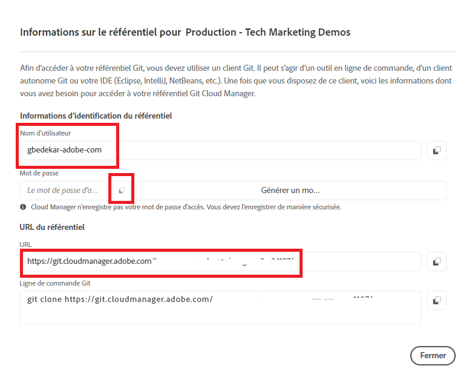

# Installer Git


[Installer Git](https://git-scm.com/downloads). Vous pouvez sélectionner les paramètres par défaut et terminer le processus d’installation.
Accédez à l’invite de commande à l’adresse c:\cloudmanager\aem-banking-app type in git —version. Vous devriez voir la version de GIT installée sur votre système.

## Initialisation Du Référentiel Git Local

Vérifiez que vous vous trouvez dans le fichier c:\cloudmanager\aem-banking-app folder

```
git init
```

La commande ci-dessus initialise le projet en tant que référentiel local Git.

```
git add .
```

Cela permet d’ajouter tous les fichiers de projet au référentiel git prêt à être validé dans le référentiel git.

```
git commit -m "initial commit"
```

Cela valide les fichiers dans le référentiel git.


## Enregistrer le référentiel de gestionnaire de cloud avec notre référentiel Git local

Accès au référentiel de votre gestionnaire de cloud

Obtention des informations d’identification du référentiel de cloud manager


Enregistrez le nom d’utilisateur dans le fichier de configuration.

```java
git config --global credential.username "gbedekar-adobe-com"
```

enregistrer le mot de passe dans le fichier de configuration ;

```java
git config --global user.password "XXXX"
```

(Le mot de passe est votre mot de passe du référentiel git de cloud manager)

Enregistrez le référentiel git de Cloud Manager avec votre référentiel git local. La commande ci-dessous associe **application bancaire** avec le référentiel git de cloud manager distant. Vous pouvez utiliser n’importe quel nom au lieu de **application bancaire**


```shell
git remote add bankingapp https://git.cloudmanager.adobe.com/<cloud-manager-repo-path>
```

(Assurez-vous d’utiliser l’URL de votre référentiel)

Vérifier si le référentiel distant est enregistré

```java
git remote -v
```
