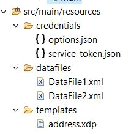

# Importer un projet Eclipse

Téléchargez et décompressez le [fichier zip](./assets/aem-forms-doc-gen.zip).

Lancez Eclipse et importez le projet dans Eclipse.
Le projet comprend les fichiers suivants dans le dossier des ressources :

* DataFile1 et DataFile2 - Exemples de fichiers de données XML à fusionner avec le modèle pour générer le fichier PDF final.
* address.xdp - modèle XDP
* service_token.json - Vous devrez remplacer le contenu de ce fichier par les informations d’identification spécifiques à votre compte.
* options.json - Les options spécifiées dans ce fichier sont utilisées pour définir les propriétés du fichier PDF généré par l’API.

## Tester la solution

* Copiez et collez vos informations d’identification du service dans le fichier de ressources service_token.json du projet.
* Ouvrez le fichier DocumentGeneration.java et spécifiez le dossier dans lequel vous souhaitez enregistrer les fichiers PDF générés.
* Ouvrez Main.java. Définissez la valeur de la variable postURL pour qu’elle pointe vers votre instance.
* Exécutez le fichier Main.java en tant qu’application Java.

>[!NOTE]
> La toute première fois que vous exécutez le programme java, vous obtenez une erreur HTTP 403. Pour contourner ce problème, veillez à accorder les [autorisations appropriées à l’utilisateur du compte technique dans AEM](https://experienceleague.adobe.com/docs/experience-manager-learn/getting-started-with-aem-headless/authentication/service-credentials.html?lang=en#configure-access-in-aem).

**AEM Forms** Usersis : le rôle que j’ai utilisé pour ce cours.

