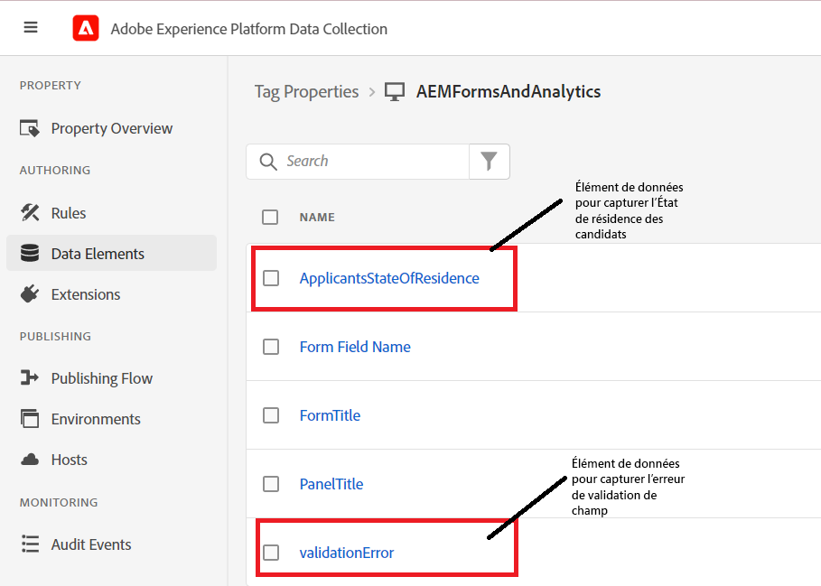
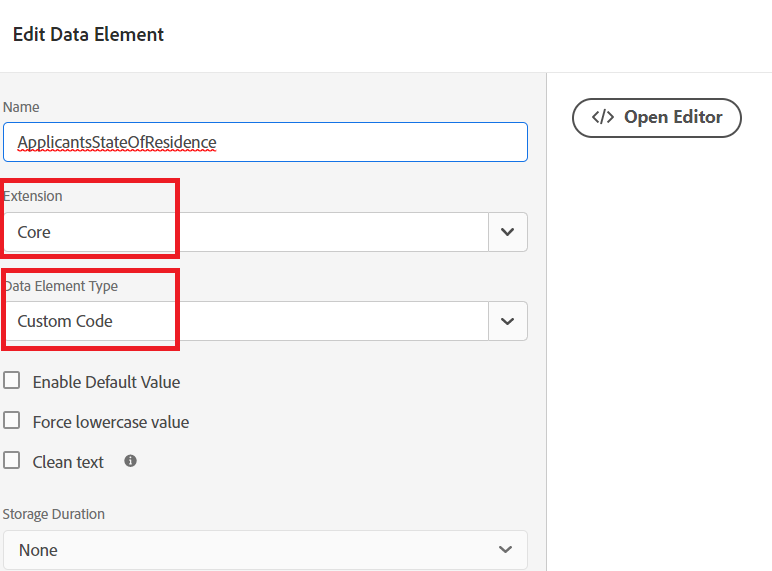

# Création d’éléments de données

Dans la propriété Tags, nous avons ajouté deux nouveaux éléments de données (applicantStateOfReference et validationError).



## ApplicantStateOfRésidence

Le **ApplicantStateOfRésidence** l’élément de données a été configuré en sélectionnant **Core** dans la liste déroulante d’extension et **Code personnalisé** pour le type d’élément de données, comme illustré dans la capture d’écran ci-dessous.


Le code personnalisé suivant a été utilisé pour capturer la valeur de la variable **_state_** champ de formulaire adaptatif.

```javascript
// use the GuideBridge API to access adaptive form elements
//The state field's SOM expression is used to access the state field
var ApplicantsStateOfResidence = guideBridge.resolveNode("guide[0].guide1[0].guideRootPanel[0].state[0]").value;
_satellite.logger.log("Returning  Applicants State Of Residence is "+ApplicantsStateOfResidence);
return ApplicantsStateOfResidence;
```

## validationError

Le **ValidationError** l’élément de données a été configuré en sélectionnant **Core** dans la liste déroulante d’extension et **Code personnalisé** pour le type d’élément de données, comme illustré dans la capture d’écran ci-dessous.


Le code personnalisé suivant a été écrit pour définir la variable `validationError` valeur de l’élément de données.

```javascript
var validationError = "";
// Using GuideBridge API to access adaptive forms fields using the fields SOM expression
var tel = guideBridge.resolveNode("guide[0].guide1[0].guideRootPanel[0].telephone[0]");
var email = guideBridge.resolveNode("guide[0].guide1[0].guideRootPanel[0].email[0]");

_satellite.logger.log("Got tel in Tags custom script "+tel.isValid)
_satellite.logger.log("Got email in Tags custom script "+email.isValid)

if (tel.isValid == false) {  
  validationError = "error: telephone number";
  _satellite.logger.log("Validation error is "+ validationError);
}

if (email.isValid == false) {  
  validationError = "error: invalid email";
  _satellite.logger.log("Validation error is "+ validationError);
}

return validationError;
```

## Étapes suivantes

[Création de règles](./rules.md)