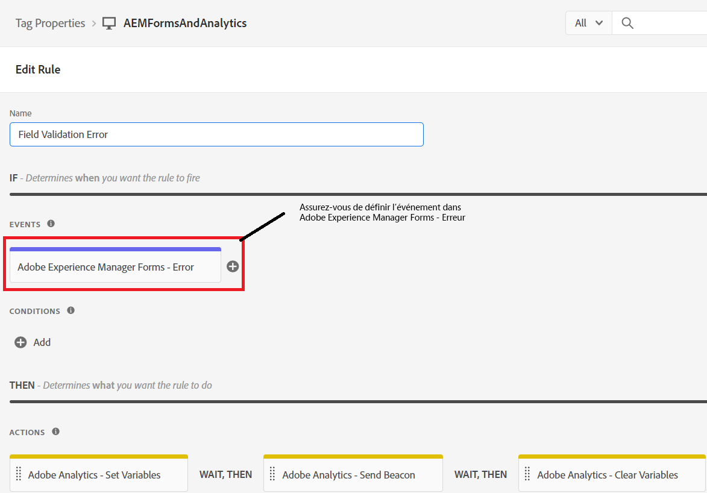

# Définir la règle

Dans la propriété Balises, nous avons créé 2 nouvelles [règles](https://experienceleague.adobe.com/docs/platform-learn/implement-in-websites/configure-tags/add-data-elements-rules.html?lang=fr) (**Erreur de validation du champ et Envoi de formulaire**).

## Erreur de validation du champ

La règle **Erreur de validation du champ** est déclenchée chaque fois qu’une erreur de validation se produit dans le champ du formulaire adaptatif. Par exemple, dans notre formulaire, si le numéro de téléphone ou l’e-mail n’est pas au format attendu, un message d’erreur de validation s’affiche.

La règle Erreur de validation du champ est configurée en définissant l’événement sur _**Adobe Experience Manager Forms-Error**_ comme illustré dans la copie d’écran.

La définition des variables Adobe Analytics est configurée comme suit :

## Règle d’envoi de formulaire

La règle Envoi de formulaire est déclenchée chaque fois qu’un formulaire adaptatif est envoyé avec succès.

La règle Envoi de formulaire est configurée à l’aide de l’événement _**Adobe Experience Manager Forms - Submit**_.

Dans la règle Envoi de formulaire, la valeur de l’élément de données _**ApplicantsStateOfResidence**_ est mappée sur prop5 et celle de l’élément de données FormTitle sur prop8.

La définition des variables Adobe Analytics est configurée comme suit :

Lorsque vous êtes prêt ou prête à tester votre code de balises, [publiez les modifications apportées aux balises](https://experienceleague.adobe.com/docs/experience-platform/tags/publish/publishing-flow.html?lang=fr) à l’aide du flux de publication.

## Étapes suivantes

[Tester la solution](./test.md)