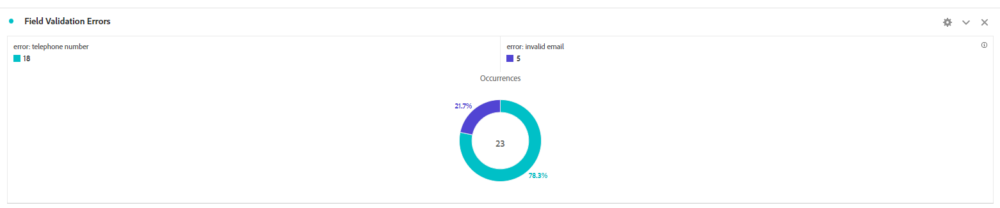
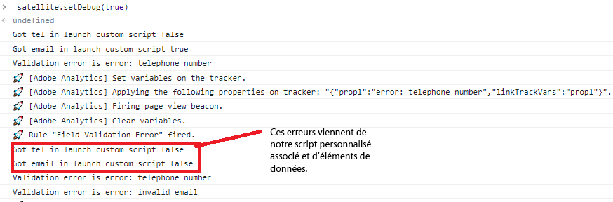

# Tester votre solution

Prévisualisez et envoyez votre formulaire en utilisant plusieurs combinaisons de valeurs de formulaire. L’affichage de vos données dans les rapports Adobe Analytics peut prendre jusqu’à 30 minutes. Les données définies sur des props s’affichent plus rapidement dans les rapports que leurs homologues eVars.

## Suite de rapports

Les données de formulaire capturées dans Adobe Analytics sont présentées au format en anneau.

**Envois par État**


Erreurs de validation de champ



## Débogage

Assurez-vous que le formulaire adaptatif utilise le même conteneur de configuration que celui qui contient la configuration Adobe Launch.

Pour confirmer que le formulaire envoie des données à Adobe Analytics, procédez comme suit :

* Ouvrez les outils de développement du navigateur.
* Saisissez le texte suivant dans le panneau Console.

```javascript
_satellite.setDebug(true)
```

Interagissez avec votre formulaire tout en gardant la fenêtre de console ouverte. Vous devriez voir quelque chose comme ceci.



## Utiliser Adobe Experience Platform Debugger

Ajoutez l’[extension AEP Debugger](https://experienceleague.adobe.com/docs/experience-platform/debugger/home.html?lang=fr) à votre navigateur (vous devez vous connecter) pour obtenir plus d’informations de débogage.


## Félicitations.

Vous avez correctement intégré AEM Forms as a Cloud Service à Adobe Analytics pour créer des rapports sur les champs de données de formulaire.