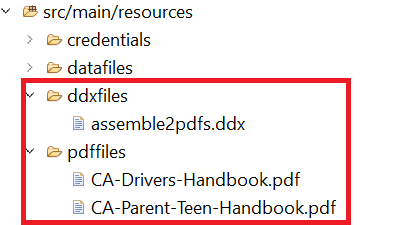

# Importer un projet Eclipse

* Téléchargez et décompressez le fichier [fichier zip](./assets/pdf-manipulation.zip)
* Lancez Eclipse et importez le projet dans Eclipse.
* Le projet comprend les dossiers suivants dans le dossier des ressources :
   * ddxFiles : ce dossier contient le fichier ddx pour décrire la sortie que vous souhaitez générer.
   * pdffiles - Ce dossier contient les fichiers pdf que vous souhaitez assembler et les fichiers pdf pour tester les outils PDFA.
   * informations d’identification : ce dossier contient le fichier pdfa-options.json .

## Test de l’assemblage de fichiers PDF

* Copiez et collez vos informations d’identification du service dans le fichier de ressources service_token.json du projet.
* Ouvrez le fichier AssemblePDFFiles.java et spécifiez le dossier dans lequel vous souhaitez enregistrer les fichiers de PDF générés.
* Ouvrez ExecuteAssemblerService.java. Définir la valeur de la variable _AEM_FORMS_CS_ pour pointer vers votre instance.
* Décommentez les lignes appropriées pour tester l’assemblage de deux fichiers PDF ou plus.
* Exécutez ExecuteAssemblerService.java en tant qu’application java

### Test des utilitaires PDFA

* Copiez et collez vos informations d’identification du service dans le fichier de ressources service_token.json du projet.
* Ouvrez le fichier PDFAUtilities.java et spécifiez le dossier dans lequel vous souhaitez enregistrer les fichiers de PDF générés.
* Ouvrez ExecuteAssemblerService.java. Définir la valeur de la variable _AEM_FORMS_CS_ pour pointer vers votre instance.
* Décommentez les lignes appropriées pour tester les opérations PDFA.
* Exécutez ExecuteAssemblerService.java en tant qu’application Java.

>[!NOTE]
> La toute première fois que vous exécutez le programme java, vous obtenez une erreur HTTP 403. Pour passer à l’étape suivante, assurez-vous que vous avez envoyé la variable [autorisations appropriées pour l’utilisateur du compte technique dans AEM](https://experienceleague.adobe.com/docs/experience-manager-learn/getting-started-with-aem-headless/authentication/service-credentials.html?lang=en#configure-access-in-aem).

**Utilisateurs d’AEM Forms** est le rôle que j&#39;ai utilisé pour ce cours.
