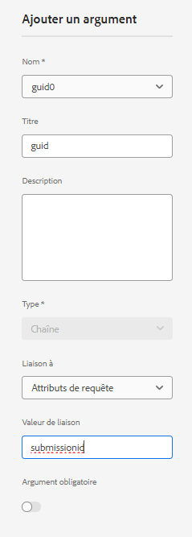
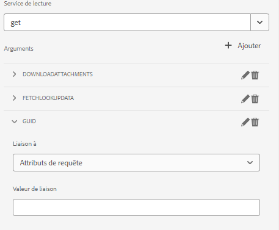
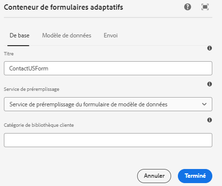

# Préremplir le formulaire adaptatif avec les données de liste de points de partage

Dans la version précédente d’AEM Form (6.5), du code personnalisé devait être écrit pour préremplir le modèle de données de formulaire avec support de formulaire adaptatif à l’aide de l’attribut de requête. Dans AEM Forms as a Cloud Service, la nécessité d’écrire du code personnalisé n’est plus nécessaire.

Cet article explique les étapes requises pour préremplir/préremplir un formulaire adaptatif avec des données récupérées de la liste sharepoint à l’aide du service de préremplissage du modèle de données de formulaire.

Cet article suppose que vous avez [formulaire adaptatif correctement configuré pour envoyer des données à la liste sharepoint.](https://experienceleague.adobe.com/docs/experience-manager-cloud-service/content/forms/adaptive-forms-authoring/authoring-adaptive-forms-core-components/create-an-adaptive-form-on-forms-cs/configure-submit-actions-core-components.html?lang=en#connect-af-sharepoint-list)

Voici les données de la liste sharepoint :


Pour préremplir un formulaire adaptatif avec les données associées à un guide spécifique, les étapes suivantes doivent être exécutées :

## Configuration du service get

* Créez un service get pour l’objet de niveau supérieur du modèle de données de formulaire à l’aide de l’attribut guid .
  

Dans cette capture d’écran, la colonne guid est liée via un attribut de requête appelé `submissionid`.

Le service get entièrement configuré ressemble à ceci :



## Configurer le formulaire adaptatif pour utiliser le service de préremplissage de modèle de données de formulaire

* Ouvrez un formulaire adaptatif basé sur le modèle de données de formulaire de liste de points de partage. Associer le service Form Data Model Prefill
  

## Tester le formulaire

Prévisualisez le formulaire en incluant la variable `submissionid` dans l’URL, comme illustré ci-dessous.

```html
http://localhost:4502/content/dam/formsanddocuments/contactusform/jcr:content?wcmmode=disabled&submissionid=57e12249-751a-4a38-a81f-0a4422b24412
```


