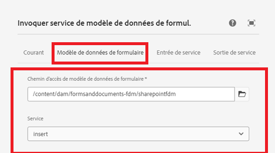

# Insérer des données dans une liste SharePoint à l’aide de l’étape de workflow d’appel FDM


Cet article explique les étapes requises pour insérer des données dans une liste SharePoint à l’aide de l’étape d’appel FDM dans un workflow AEM.

Cet article suppose que vous avez [configuré le formulaire adaptatif pour envoyer des données à une liste SharePoint.](https://experienceleague.adobe.com/docs/experience-manager-cloud-service/content/forms/adaptive-forms-authoring/authoring-adaptive-forms-core-components/create-an-adaptive-form-on-forms-cs/configure-submit-actions-core-components.html?lang=fr#connect-af-sharepoint-list)


## Créer un modèle de données de formulaire basé sur la source de données « liste SharePoint »

* Créez un nouveau modèle de données de formulaire basé sur la source de données « liste SharePoint ».
* Ajoutez le modèle approprié et le service Get du modèle de données de formulaire.
* Configurez le service Insert pour insérer l’objet de modèle du niveau supérieur.
* Testez le service Insert.


## Créer un workflow

* Créez un workflow simple à l’aide de l’étape d’appel FDM.
* Configurez l’étape d’appel FDM pour utiliser le modèle de données de formulaire créé lors de l’étape précédente.
* 

## Formulaire adaptatif basé sur des composants principaux

Les données envoyées sont au format suivant. Nous devons extraire l’objet ContactUS à l’aide de la notation par points à l’étape de workflow d’appel du service de modèle de données de formulaire, comme illustré dans la copie d’écran.

```json
{
  "ContactUS": {
    "Title": "Mr",
    "Products": "Photoshop",
    "HighNetWorth": "1",
    "SubmitterName": "John Does"
  }
}
```


* 


## Formulaire adaptatif basé sur des composants de base

Les données envoyées sont au format suivant. Extrayez l’objet JSON ContactUS à l’aide de la notation par point dans l’étape de workflow d’appel du service de modèle de données de formulaire.

```json
{
    "afData": {
        "afUnboundData": {
            "data": {}
        },
        "afBoundData": {
            "data": {
                "ContactUS": {
                    "Title": "Lord",
                    "HighNetWorth": "true",
                    "SubmitterName": "John Doe",
                    "Products": "Forms"
                }
            }
        },
        "afSubmissionInfo": {
            "lastFocusItem": "guide[0].guide1[0].guideRootPanel[0].afJsonSchemaRoot[0]",
            "stateOverrides": {},
            "signers": {},
            "afPath": "/content/dam/formsanddocuments/foundationform",
            "afSubmissionTime": "20240517100126"
        }
    }
}
```


## Configurer un formulaire adaptatif pour déclencher un workflow AEM

* Créez un formulaire adaptatif basé sur le modèle de données de formulaire créé lors de l’étape précédente.
* Faites glisser certains champs depuis la source de données vers votre formulaire.
* Configurer l’action d’envoi du formulaire comme illustré ci-dessous
* 


## Tester le formulaire

Prévisualisez le formulaire créé lors de l’étape précédente. Remplissez le formulaire et envoyez-le. Les données du formulaire doivent être insérées dans la liste SharePoint.
