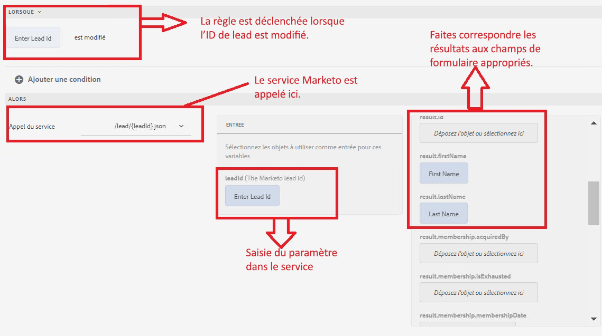

# Test de l’intégration

Nous allons tester l’intégration en créant une simple récupération de formulaire et en affichant un objet Lead à partir de Market.
>[!NOTE]
>
>Cette fonctionnalité a été testée sur un formulaire basé sur des composants de base.

## Création d’un formulaire adaptatif

1. Créez un formulaire adaptatif, basez-le sur « Modèle de formulaire vierge », et associez-le au modèle de données de formulaire créé à l’étape précédente.
1. Ouvrez le formulaire en mode d’édition.
1. Faites glisser et déposez un composant TextField et un composant Panel sur le formulaire adaptatif. Définissez le titre du composant TextField « Enter Lead Id » et définissez son nom sur « LeadId ».
1. Faites glisser et déposez 2 composants TextField sur le composant Panel.
1. Définissez le nom et le titre des 2 composants de TextField sur FirstName (Prénom) et LastName (Nom).
1. Configurez le composant Panel pour qu’il soit un composant répétable en définissant Minimum sur 1 et Maximum sur -1. Cela est nécessaire, car le service Marketo renvoie un tableau d’objets lead et vous devez disposer d’un composant répétable pour afficher les résultats. Cependant, dans ce cas, nous ne récupérons qu’un seul objet lead, car nous recherchons les objets lead selon leur ID.
1. Créez une règle sur le champ LeadId comme illustré dans l’image ci-dessous.
1. Prévisualisez le formulaire, saisissez un ID de lead valide dans le champ LeadID et quittez le formulaire. Les champs Prénom et Nom doivent être renseignés avec les résultats de l’appel de service.

La capture d’écran suivante explique les paramètres de l’éditeur de règles.

## Félicitations.

Vous avez correctement intégré AEM Forms à Marketo à l’aide du modèle de données de formulaire AEM Forms.