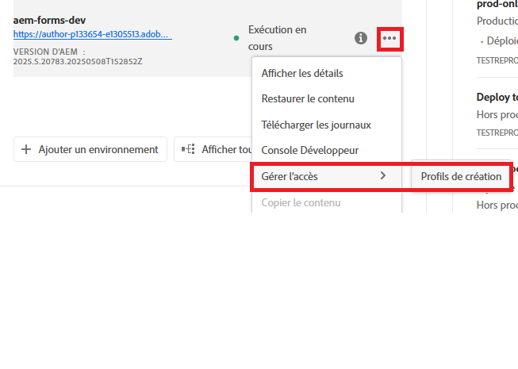
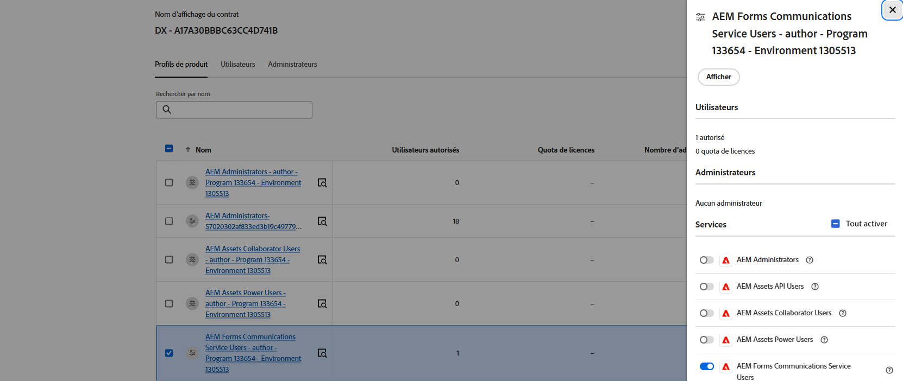

# Configurer des API de communication AEM Forms basées sur OpenAPI sur AEM Forms as a Cloud Service

## Prérequis

* Dernière instance d’AEM Forms as a Cloud Service.
* Tous les [profils de produit nécessaires sont ajoutés à l’environnement.](https://experienceleague.adobe.com/fr/docs/experience-manager-learn/cloud-service/aem-apis/invoke-openapi-based-aem-apis)

* Activez l’accès de l’API AEM au profil de produit comme illustré ci-dessous.
  
  

## Créer un projet Adobe Developer Console

Connectez-vous à [Adobe Developer Console](https://developer.adobe.com/console/) à l’aide de votre Adobe ID.
Créer un projet en cliquant sur l’icône appropriée.

Attribuez un nom significatif au projet et cliquez sur l’icône Ajouter une API.

Sélectionnez Experience Cloud.

Sélectionnez l’API de communication AEM Forms et cliquez sur Suivant.

Vérifiez que vous avez sélectionné l’authentification serveur à serveur, puis cliquez sur Suivant.

Sélectionnez les profils et cliquez sur le bouton Enregistrer l’API configurée pour enregistrer vos paramètres.

Cliquez sur OAuth serveur à serveur.

Copiez l’ID client, le secret client et les portées.

## Configurer l’instance AEM pour activer la communication du projet ADC

Si vous disposez déjà d’un projet AEM Forms, [suivez ces instructions](https://experienceleague.adobe.com/fr/docs/experience-manager-learn/cloud-service/aem-apis/invoke-openapi-based-aem-apis) pour permettre à l’ID client des informations d’identification OAuth serveur à serveur du projet Adobe Developer Console de communiquer avec l’instance AEM.

Si vous ne disposez pas d’un projet AEM Forms, créez un [projet AEM Forms en suivant cette documentation.](https://experienceleague.adobe.com/fr/docs/experience-manager-learn/cloud-service/forms/developing-for-cloud-service/getting-started), puis activez l’ID client des informations d’identification OAuth serveur à serveur du projet Adobe Developer Console pour qu’il communique avec l’instance AEM [à l’aide de cette documentation](https://experienceleague.adobe.com/fr/docs/experience-manager-learn/cloud-service/aem-apis/invoke-openapi-based-aem-apis).

## Étapes suivantes

[Générer un jeton d’accès](./generate-access-token.md)
