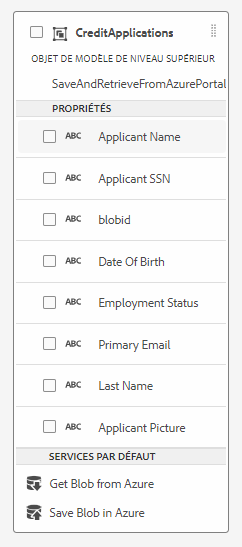

# Créer l’intégration à Azure Storage

L’étape suivante consiste à créer l’intégration entre AEM Forms CS et Azure Storage à l’aide du modèle de données de formulaire.
La vidéo suivante vous guide tout au long des étapes nécessaires à la création de l’intégration.

>[!VIDEO](https://video.tv.adobe.com/v/335385?quality=12&learn=on)

Pour les besoins de ce tutoriel, un modèle de données de formulaire appelé SaveAndRetrieveFromAzurePortal a été créé avec une entité appelée CreditApplications.

## Étapes suivantes

[Créer un formulaire adaptatif](./create-af.md)
