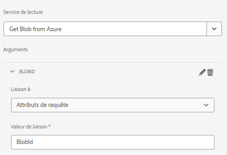

# Composant de page

Un composant de page est un composant normal responsable du rendu d’une page. Nous allons créer un composant de page et nous allons associer ce composant de page à un nouveau modèle de formulaire adaptatif. Cela garantit que notre code ne sera exécuté que lorsqu’un formulaire adaptatif est basé sur ce modèle particulier.

## Créer un composant de page

Connectez-vous à votre instance AEM Forms locale prête pour le cloud. Créez la structure suivante sous le dossier des applications


1. Cliquez avec le bouton droit sur le dossier de page et créez un noeud appelé storeandfetch de type cq:Component .
1. Enregistrez les modifications
1. Ajoutez les propriétés suivantes au `storeandfetch` noeud et enregistrement

| **Nom de la propriété** | **Type de propriété** | **Valeur de la propriété** |
|-------------------------|-------------------|----------------------------------------|
| componentGroup | Chaîne | masqué |
| jcr:description | Chaîne | Type de page de modèle de formulaire adaptatif |
| jcr:title | Chaîne | Page de modèle de formulaire adaptatif |
| sling:resourceSuperType | Chaîne | `fd/af/components/page2/aftemplatedpage` |

Copiez le `/libs/fd/af/components/page2/aftemplatedpage/aftemplatedpage.jsp` et collez-le sous le `storeandfetch` noeud . Renommez la variable `aftemplatedpage.jsp` to `storeandfetch.jsp`.

Ouvrir `storeandfetch.jsp` et ajoutez la ligne suivante :

```jsp
<cq:include script="azureportal.jsp"/>
```

sous le

```jsp
<cq:include script="fallbackLibrary.jsp"/>
```

Le code final doit ressembler à ce qui suit :

```jsp
<cq:include script="fallbackLibrary.jsp"/>
<cq:include script="azureportal.jsp"/>
```

Créez un fichier appelé azureportal.jsp sous le noeud storeandfetch, copiez le code suivant dans le fichier azureportal.jsp et enregistrez les modifications.

```jsp
<%@page session="false" %>
<%@include file="/libs/fd/af/components/guidesglobal.jsp" %>
<%@ page import="org.apache.commons.logging.Log" %>
<%@ page import="org.apache.commons.logging.LogFactory" %>
<%
    if(request.getParameter("guid")!=null) {
            logger.debug( "Got Guid in the request" );
            String BlobId = request.getParameter("guid");
            java.util.Map paraMap = new java.util.HashMap();
            paraMap.put("BlobId",BlobId);
            slingRequest.setAttribute("paramMap",paraMap);
    } else {
            logger.debug( "There is no Guid in the request " );
    }            
%>
```

Dans ce code, nous obtenons la valeur du paramètre de requête **guid** et stockez-le dans une variable appelée BlobId. Ce BlobId est ensuite transmis dans la requête sling à l’aide de l’attribut paramMap . Pour que ce code fonctionne, il est supposé que vous disposez d’un formulaire basé sur un modèle de données de formulaire pris en charge par Azure Storage et que le service de lecture du modèle de données de formulaire est lié à un attribut de requête appelé BlobId comme illustré dans la capture d’écran ci-dessous.



### Étapes suivantes

[Associer le composant de page au modèle](./associate-page-component.md)

