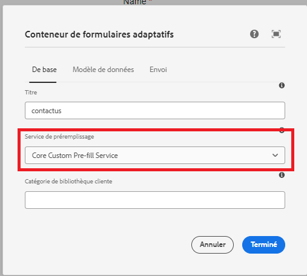

# Tester la solution

Une fois le code déployé, créez un formulaire adaptatif basé sur les composants principaux. Associez le formulaire adaptatif au service de préremplissage comme illustré dans la capture d’écran ci-dessous.


Chaque fois que le formulaire est généré, le service de préremplissage associé est exécuté et le formulaire est renseigné avec les données renvoyées par le service de préremplissage.

Par exemple, pour préremplir le formulaire avec les données associées au guid **d815a2b3-5f4c-4422-8197-d0b73479bf0e**, l’URL suivante est utilisée.
Le code du service de préremplissage extrait la valeur du paramètre guid et récupère les données associées au guid de la source de données.

```html
http://localhost:4502/content/dam/formsanddocuments/contactus/jcr:content?wcmmode=disabled&guid=d815a2b3-5f4c-4422-8197-d0b73479bf0e
```
