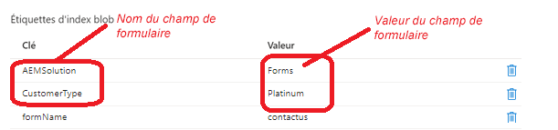

# Ajout de balises d’index de blob

À mesure que les jeux de données s’agrandissent, il peut s’avérer difficile de trouver un objet spécifique dans une mer de données. Les balises d’index Blob offrent des fonctionnalités de gestion et de découverte de données à l’aide d’attributs de balise d’index de valeur clé. Vous pouvez classer et rechercher des objets dans un seul conteneur ou dans tous les conteneurs de votre compte de stockage. Par exemple, la balise d’index blob _**CustomerType=Platinum**_, où Platine est la valeur du champ CustomerType.


Le code suivant crée la chaîne de balises de données de l’index blob avec ses valeurs correspondantes à partir des données envoyées.

```java
@Override
    public String getMetaDataTags(String submittedFormName,String formPath,Session session,String formData) {

        JsonObject jsonObject = JsonParser.parseString(formData).getAsJsonObject();
        List<String>metaDataTags = new ArrayList<String>();
        metaDataTags.add("formName="+submittedFormName);
        Map< String, String > map = new HashMap< String, String >();
        map.put("path", formPath);
        map.put("1_property", "Searchable");
        map.put("1_property.value","true");
        Query query = queryBuilder.createQuery(PredicateGroup.create(map),session);
        query.setStart(0);
        query.setHitsPerPage(20);
        SearchResult result = query.getResult();
        logger.debug("Get result hits " + result.getHits().size());
        for (Hit hit: result.getHits()) {
            try {
                    logger.debug(hit.getPath());
                    String jsonElementName = (String) hit.getProperties().get("name");
                    String fieldName = hit.getProperties().get("name").toString();
                    if(jsonObject.get(jsonElementName).isJsonArray())
                    {
                        
                        JsonArray arrayOfValues = jsonObject.get(jsonElementName).getAsJsonArray();
                        StringBuilder valuesString = new StringBuilder();
                        for(int j=0;j<arrayOfValues.size();j++)
                        {
                            valuesString.append(arrayOfValues.get(j).getAsString());
                            if(j < arrayOfValues.size() -1)
                            {
                                valuesString.append(" and ");
                            }
                        }

                        
                        metaDataTags.add(fieldName + "=" + valuesString.toString());

                    }
                    else
                    {
                        logger.debug("The searchable field name is " + fieldName + "the json element name is " + jsonElementName);
                        metaDataTags.add(fieldName + "=" + jsonObject.get(jsonElementName).getAsString());
                    }

            } catch (RepositoryException e) {
                throw new RuntimeException(e);
            }
        }
        return String.join("&",metaDataTags);
    }
```

## Étapes suivantes

[Créer un gestionnaire d’envoi personnalisé](./create-custom-submit.md)


