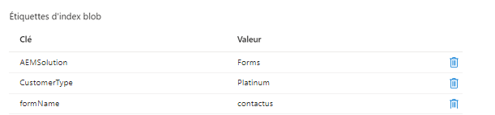

# Présentation

Dans ce tutoriel, vous découvrez comment mettre en œuvre un cas d’utilisation simple pour le stockage des envois de formulaire dans le stockage Azure avec des balises d’index blob. Les balises d’index d’objet blob offrent des fonctionnalités de gestion et de découverte de données à l’aide d’attributs de balise d’index clé-valeur. Vous pouvez classer et rechercher des objets dans un seul conteneur ou dans tous les conteneurs de votre compte de stockage.

## Prérequis

* Experience avec AEM Forms CS.
* Expérience du déploiement du code à l’aide de Cloud Manager.
* Accès à l’instance compatible avec le cloud d’AEM Forms CS.

Pour mettre en œuvre le cas d’utilisation ci-dessus dans AEM Forms CS, vous aurez besoin des éléments suivants :

* [Instance compatible avec le cloud AEM Forms CS](https://experienceleague.adobe.com/docs/experience-manager-learn/cloud-service/forms/developing-for-cloud-service/intellij-and-aem-sync.html?lang=fr#set-up-aem-author-instance)
* [Compte de portail Azure](https://portal.azure.com/)

### Étapes suivantes

[extend-choice-group-components](./extend-choice-group-components.md)
