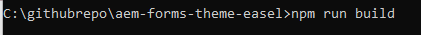

# Test des modifications

Créez un formulaire adaptatif basé sur le modèle **« Vierge avec composants principaux »**. Faites glisser et déposez 3 boutons sur le formulaire et étiquetez-les « Corporate », « Marketing » et « Default».
Attribuez les variantes de style appropriées aux boutons Entreprise et Marketing en sélectionnant le pinceau comme indiqué ci-dessous.

Le style par défaut est appliqué au troisième bouton.

## Création du projet de thème

L’étape suivante consiste à créer le projet de thème. Accédez au dossier racine de votre projet de thème et exécutez la commande _**npm run build**_ comme illustré dans la copie d’écran ci-dessous.

Une fois le projet de thème créé, vous pouvez tester les modifications.

## Méthode simple et rapide pour tester votre CSS

* Ouvrez le fichier theme.css situé sous le dossier dist de votre projet de thème. Sélectionnez et copiez l’intégralité du contenu du fichier.
* Prévisualisez le formulaire créé à l’étape précédente.
* Cliquez avec le bouton droit de la souris sur l’un des boutons et sélectionnez Inspecter pour ouvrir la Developer Console.
* Dans la Developer Console, cliquez sur theme.css pour ouvrir theme.css.
* Sélectionnez et supprimez l’intégralité du contenu de theme.css à l’aide de CTR+A et appuyez sur le bouton Supprimer.
* Copiez et collez le contenu de theme.css que vous avez créé à l’étape précédente.
* Les boutons doivent être mis à jour avec les styles appropriés, comme illustré ci-dessous.

