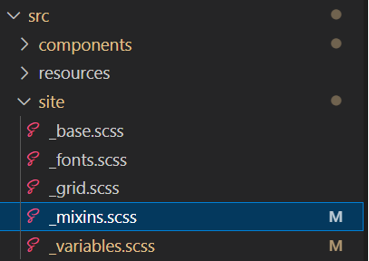

# Création de variations pour le composant de bouton

Une fois le thème cloné, ouvrez le projet à l’aide du code visuel du studio. Vous devriez voir une vue similaire.
dans le code visuel studio


Ouvrez le fichier src->components->button->_button.scss . Nous définirons nos variations personnalisées dans ce fichier.

## Variation de l’entreprise

```css
.cmp-adaptiveform-button-corporate {
  @include container;
  .cmp-adaptiveform-button {
    &__widget {
      @include primary-button;
      background: $brand-red;
      text-transform: uppercase;
      border-radius: 0px;
      color: yellow;
    }
  }
}
```

## Explication

* **cmp-adaptiveform-button—enterprise** : il s’agit de la classe wrapper ou de conteneur principale pour le composant &quot;cmp-adaptiveform-button—enterprise&quot;.
Tous les styles ou mixins de ce bloc s’appliquent aux éléments de cette classe.
* **@include container** : utilise un mixin appelé container, défini dans le fichier _mixins.scss. Le conteneur de mixins applique généralement des styles liés à la mise en page, tels que la configuration des marges, la marge intérieure ou d’autres styles structurels, pour s’assurer que le conteneur se comporte de manière cohérente.
* **.cmp-adaptiveform-button** : dans le bloc de style entreprise-button, vous ciblez l’élément enfant avec la classe .cmp-adaptiveform-button.
* **&amp;__widget** : le symbole &amp; fait référence au sélecteur parent, qui dans ce cas est .cmp-adaptiveform-button.
Cela signifie que la classe finale ciblée sera .cmp-adaptiveform-button__widget, une classe de style BEM (Block Element Modifier) qui représente un sous-composant (l’élément __widget) à l’intérieur du bloc .cmp-adaptiveform-button.
* **@include primary-button** : Cela inclut un mixin de bouton principal, qui est défini dans le fichier _mixin.scss et ajoute des styles liés au bouton (comme la marge intérieure, les couleurs, les effets de survol, etc.). Les propriétés background,text-transform,border-radius,color définies dans le bouton principal du mixin sont remplacées.

Le fichier _mixins.scss est défini sous src->site comme illustré dans la capture d’écran ci-dessous.



## Variation marketing

```css
.cmp-adaptiveform-button--marketing {
  
  @include container;
  .cmp-adaptiveform-button {
  &__widget {
    @include primary-button;
    background-color: #3498db;
    color: white;
    font-weight: bold;
    border: none;
    border-radius: 50px;
    box-shadow: 0 4px 6px rgba(0, 0, 0, 0.1);
    cursor: pointer;
    transition: all 0.3s ease;
    outline: none;
    text-transform: uppercase;
    letter-spacing: 0.05em;
    &:hover:not([disabled]) {
      position: relative;
      scale: 102%;
      transition: box-shadow 0.1s ease-out, transform 0.1s ease-out;
      background-color: #2980b9;
      box-shadow: 0 8px 15px rgba(0, 0, 0, 0.2);
      transform: translateY(-3px);
    }
  }
}
  
}
```

## Étapes suivantes

[Test des variations](./build.md)


