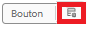
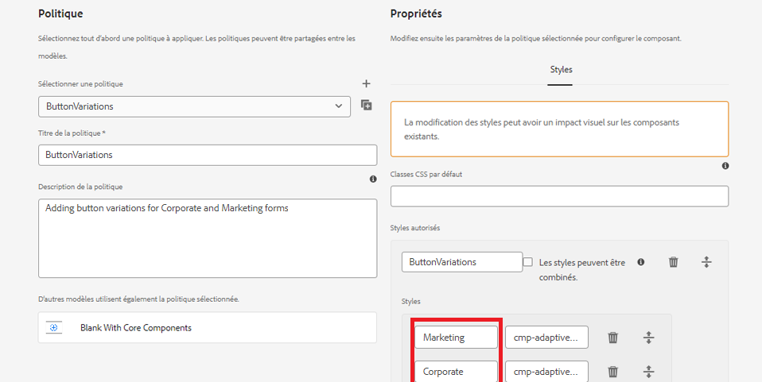

# Définition du style de la politique pour le composant

* Connectez-vous à votre instance AEM locale prête pour le cloud et accédez à Outils | Général | Modèles | Nom de votre projet.

* Sélectionnez et ouvrez le modèle **Vierge avec composants principaux** en mode d’édition.
* Cliquez sur l’icône de politique du composant de bouton pour ouvrir l’éditeur de politique.

* 

Définissez la politique comme illustré ci-dessous.

Nous avons défini 2 styles/variations appelés Marketing et Corporate. Ces variations sont associées aux classes CSS correspondantes.**Assurez-vous qu’il n’y a pas d’espace avant et après les noms de classe CSS**.
Enregistrez vos modifications.

| Style | Classe CSS |
|-----------|------------------------------------|
| Marketing | cmp-adaptiveform-button--marketing |
| Corporate | cmp-adaptiveform-button--corporate |

Ces classes CSS seront définies dans le fichier scss du composant (_button.scss).

## Étapes suivantes

[Définition des classes CSS](./create-variations.md)
