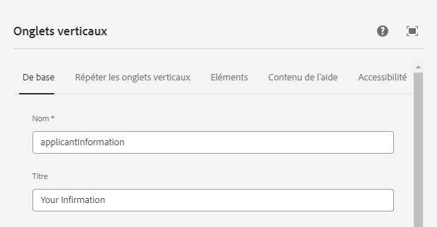
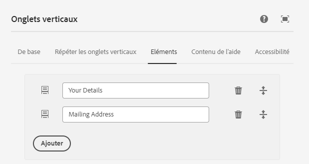
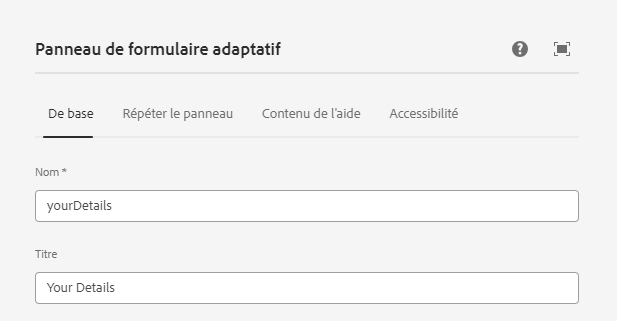
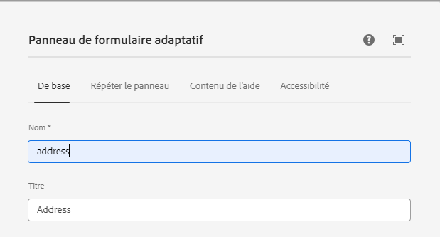
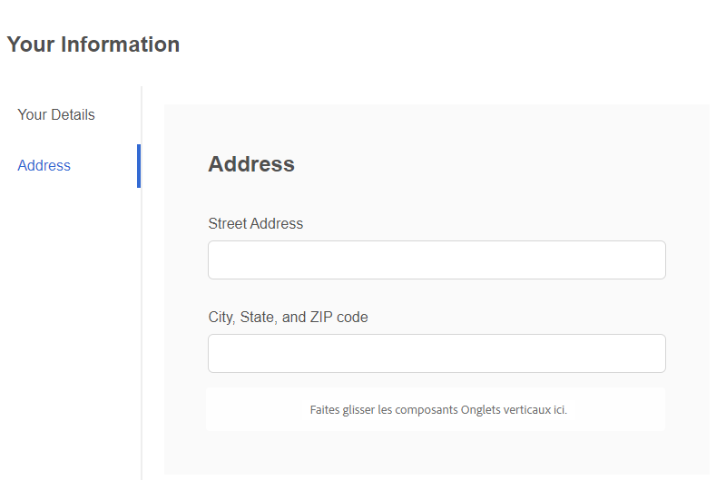

# Création d’un formulaire adaptatif

Créez un formulaire adaptatif basé sur des composants principaux et insérez un composant d’onglet vertical sur votre formulaire.

## Configuration du composant d’onglet vertical

Cliquez sur le composant des onglets verticaux pour ouvrir la feuille de propriétés de configuration. Configurez les onglets suivants :

1. De base : attribuez un nom et un titre significatifs au composant d’onglet vertical comme illustré ci-dessous.
   
1. Éléments : l’onglet Éléments vous permet d’ajouter des éléments au composant d’onglet vertical. En règle générale, vous ajoutez un panneau en tant qu’élément, puis vos éléments de formulaire au panneau. L’onglet vertical comporte par défaut deux éléments et vous pouvez les nommer selon vos besoins, comme illustré ci-dessous.
   

## Configuration des panneaux individuels

1. Vos détails : sélectionnez l’élément 1 sous le nœud **Vos informations** et ouvrez la feuille de propriétés de configuration. Donnez un nom et un titre significatifs, comme illustré ci-dessous.
   

Ajoutez les champs suivants au panneau Vos détails, comme illustré ci-dessous.

1. Adresse : sélectionnez l’élément 2 sous le nœud **Vos informations** et ouvrez la feuille de propriétés de configuration. Donnez un nom et un titre significatifs, comme illustré ci-dessous.
   

Ajoutez les deux champs de texte suivants au panneau Adresse, comme illustré ci-dessous.

