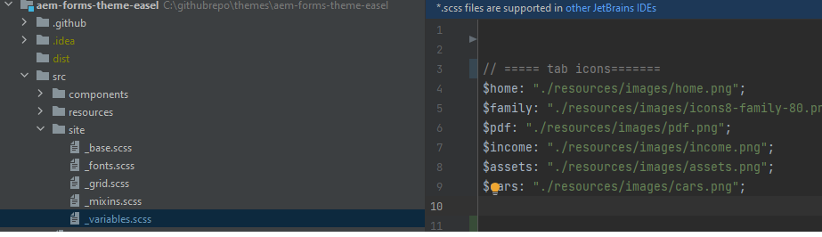

# Ajout d’icônes personnalisées

L’ajout d’icônes personnalisées aux onglets peut améliorer l’expérience utilisateur et l’attrait visuel de plusieurs façons :

* Amélioration de l’utilisation : les icônes peuvent rapidement indiquer l’objectif de chaque onglet, ce qui facilite la recherche rapide de ce qu’ils recherchent. Les repères visuels tels que les icônes aident les utilisateurs à naviguer de manière plus intuitive.

* Hiérarchie visuelle et Mise au point : les icônes créent une séparation plus distincte entre les onglets, ce qui améliore la hiérarchie visuelle. Cela peut aider les onglets importants à se distinguer et à guider plus efficacement l’attention des utilisateurs.
En suivant cet article, vous devriez pouvoir placer les icônes comme illustré ci-dessous.


## Conditions préalables

Pour suivre cet article, vous devez vous familiariser avec Git, la création et le déploiement d’un projet AEM à l’aide de Cloud Manager, la configuration d’un pipeline frontal dans AEM cloud manager et un peu de CSS. Si vous ne connaissez pas les sujets mentionnés ci-dessus, suivez l&#39;article [Utilisation de thèmes pour styliser les composants principaux](https://experienceleague.adobe.com/en/docs/experience-manager-cloud-service/content/forms/adaptive-forms-authoring/authoring-adaptive-forms-core-components/create-an-adaptive-form-on-forms-cs/using-themes-in-core-components#rename-env-file-theme-folder) .

## Ajout d’icônes au thème

Ouvrez le projet de thème dans le code visuel Studio ou tout autre éditeur de votre choix.
Ajoutez les icônes de votre choix au dossier images.
Les icônes marquées en rouge sont les nouvelles icônes ajoutées.


## Créer une icône-map pour stocker les icônes

Créez le icon-map dans le fichier _variable.scss . Le mappage SCSS $icon-map est un ensemble de paires clé-valeur, où chaque clé représente un nom d’icône (comme la maison, la famille, etc.), et chaque valeur est le chemin d’accès au fichier image associé à cette icône.



```css
$icon-map: (
    home: "./resources/images/home.png",
    family: "./resources/images/icons8-family-80.png",
    pdf: "./resources/images/pdf.png",
    income: "./resources/images/income.png",
    assets: "./resources/images/assets.png",
    cars: "./resources/images/cars.png"
);
```

## Ajout d’un mixin

Ajoutez le code suivant au fichier _mixin.scss.

```css
@mixin add-icon-to-vertical-tab($image-url) {
  display: inline-flex;
  align-self: center;
  &::before {
    content: "";
    display:inline-block;
    background: url($image-url) left center / cover no-repeat;
    margin-right: 8px; /* Space between icon and text */
    height:40px;
    width:40px;
    vertical-align:middle;
    
  }
  
}
```

Le mixin add-icon-to-vertical-tab est conçu pour ajouter une icône personnalisée en regard du texte sur un onglet vertical. Il vous permet d’inclure facilement une image en tant qu’icône sur les onglets, de la positionner à côté du texte et de la mettre en forme pour garantir cohérence et alignement.

Répartition du mixin
Voici ce que fait chaque partie du mixin :

Paramètres:

* $image-url : URL de l’icône ou de l’image à afficher en regard du texte de l’onglet. La transmission de ce paramètre rend le mixin polyvalent, car il permet d’ajouter différentes icônes à différents onglets, selon les besoins.

* Styles appliqués :

   * display : inline-flex : fait de l’élément un conteneur flex, alignant tout contenu imbriqué (comme l’icône et le texte) horizontalement.
   * align-self : center : garantit que l’élément est centré verticalement dans son conteneur.
   * Pseudo-élément (::before) :
   * content : &quot;&quot; : initialise le pseudo-élément ::before , utilisé pour afficher l’icône en tant qu’image d’arrière-plan.
   * display : inline-block : définit le pseudo-élément sur inline-block, ce qui lui permet de se comporter comme une icône insérée avec le texte.
   * background : url($image-url) left center/cover no-repeat; : ajoute l’image d’arrière-plan à l’aide de l’URL fournie via $image-url. L’icône est alignée à gauche et centrée verticalement.

## Mettre à jour le fichier _verticaltabs.scss

Pour les besoins de l’article , j’ai créé une nouvelle classe css (cmp-verticaltabs—marketing) pour afficher les icônes des onglets. Dans cette nouvelle classe, nous étendons l’élément tab en ajoutant les icônes. La liste complète de la classe css est la suivante :

```css
.cmp-verticaltabs--marketing
{
  .cmp-verticaltabs
    {
      &__tab 
        {
          cursor:pointer;
            @each $name, $url in $icon-map {
            &[data-icon-name="#{$name}"]
              {
                  @include add-icon-to-vertical-tab($url);
              }
            }
        }
    }
}
```

## Modification du composant Onglets verticaux

Copiez le fichier verticaltabs.html de ```/apps/core/fd/components/form/verticaltabs/v1/verticaltabs/verticaltabs.html``` et collez-le sous le composant verticaltabs de votre projet. Ajoutez la ligne suivante ```data-icon-name="${tab.name}"``` au fichier copié sous le rôle li , comme illustré dans l’image ci-dessous.

nous définissons un attribut de données personnalisé appelé data-icon-name avec la valeur du nom de l’onglet. Si le nom de l’onglet correspond à un nom d’image dans la carte de l’icône, l’image correspondante est associée à l’onglet.


## Test du code

Déployez le composant Onglets verticaux mis à jour sur votre instance cloud.
Déployez le thème mis à jour à l’aide du pipeline frontal.
Créez une variation de style pour les composants de l’onglet vertical comme illustré ci-dessous.

Nous avons créé une variation de style appelée Marketing qui est associée à la classe css _**cmp-verticaltabs—marketing**_.
Créez un formulaire adaptatif avec un composant de tabulation vertical. Associez le composant d’onglet vertical à la variation de style marketing.
Ajoutez quelques onglets aux onglets verticaux et nommez-les pour qu’ils correspondent aux images définies dans la carte des icônes, telles que home, family.


Prévisualisez le formulaire. Les icônes correspondantes doivent s’afficher dans l’onglet
