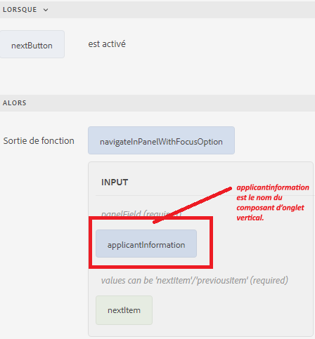
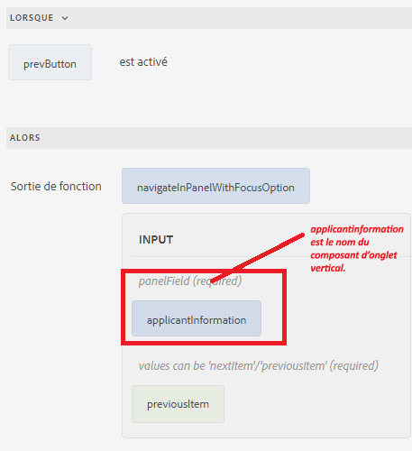

# Navigation entre les onglets

Vous pouvez naviguer entre les onglets en cliquant sur les onglets individuels ou en utilisant les boutons précédent et suivant du formulaire.
Pour naviguer à l’aide des boutons, ajoutez deux boutons à votre formulaire et nommez-les Précédent et Suivant. Associez la fonction personnalisée suivante à l’événement click du bouton pour naviguer entre les onglets.

Voici la fonction personnalisée pour naviguer entre les onglets.


```javascript
/**
 * Navigate in panel with focusOption
 * @name navigateInPanelWithFocusOption
 * @param {object} panelField
 * @param {string} focusOption - values can be 'nextItem'/'previousItem'
 * @param {scope} globals
 */
function navigateInPanelWithFocusOption(panelField, focusOption, globals)
{
    globals.functions.setFocus(panelField, focusOption);
}
```

Voici l’éditeur de règles pour les boutons Suivant et Précédent

**Bouton Suivant**



**Bouton précédent**


