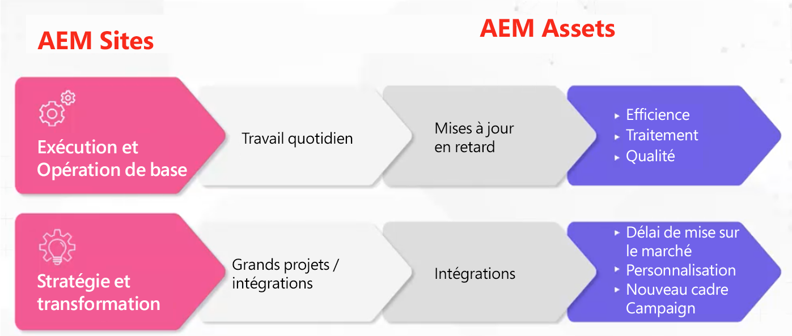

# Adobe Experience Manager (AEM) - Modèles et archétypes de gouvernance et de dotation en personnel

En tant que chef de file de l’expérience client, Adobe comprend à quel point il peut être difficile pour vous de vous assurer que vous disposez des personnes et du cadre de gouvernance adéquats pour accroître votre efficacité opérationnelle. Grâce aux modèles de gouvernance et de dotation en personnel éprouvés d’Adobe, vous disposez des outils et des connaissances nécessaires pour créer une base solide de gestion de contenu et de ressources. Dans cet article, nous discuterons des moyens de rendre opérationnelle votre plateforme Adobe Experience Manager (AEM) et de tirer le meilleur parti de vos efforts.

## Créer un cadre opérationnel supérieur

Pour pouvoir exécuter et faire fonctionner AEM, tenez compte des éléments suivants :

* Suivez des jalons stratégiques : ces derniers sont nombreux (personnalisation, intégration multicanale, etc.) et ne peuvent pas être exécutés si vous n’avez pas mis en place le modèle de dotation en personnel approprié.
* Créez les fondations d’une transformation numérique : AEM est souvent utilisé comme la première étape du processus de modernisation d’une organisation. La définition de bases vous permet d’exploiter AEM à sa pleine capacité.
* Interaction client : mettez une équipe en place pour exécuter des tâches tactiques (mise à jour des workflows, autorisations, CSS, etc.). Plus il y a d’écart entre ce que veulent les utilisateurs et utilisatrices et ce qu’ils reçoivent, plus ils sont frustrés. Il est important que les utilisateurs et utilisatrices restent investis dans le système et dans la solution. Vous devez pour cela mettre le bon modèle opérationnel en place.

Mais quel est le bon modèle ? Quelle est la bonne matrice de rôles à créer ?

Il n’existe pas de réponse spécifique unique. En effet, tout comme les organisations varient considérablement, une configuration AEM peut également varier grandement, ce qui entraîne la nécessité de différents rôles de soutien. Tous les secteurs industriels verticaux et toutes les structures d’équipe nécessitent une implémentation différente. Vous pouvez toutefois créer une ligne de base en établissant des archétypes.

## Archétypes

Les archétypes sont des idées de rôle spécifiques et de haut niveau, qui correspondent à des attributs spécifiques. Vous pouvez ainsi les utiliser pour créer un postulat fondamental qui aide à alimenter le modèle dont vous avez vraiment besoin. Il est important de noter que les archétypes ne sont pas limités à une personne par archétype. Par exemple, un ou une bibliothécaire de la gestion des ressources numériques (DAM) peut avoir une expérience technique.

### Flux de mise en œuvre

Il existe deux modes de mise en œuvre pour [!DNL AEM Sites] et [!DNL AEM Assets] :

1. Exécution et fonctionnement de base au quotidien (mise à jour des métadonnées).

1. Travail de stratégie et de transformation, comme les grands projets interorganisationnels.

### Rôles de haut niveau d’AEM Assets

**Écart général :** cette ligne de base soutient des modèles centralisés et décentralisés. Si vous avez un modèle décentralisé, AEM peut être utilisé de manière abstraite. Notez que le rôle de Propriétaire de produit doit être utilisé de manière créative, mais vous devez également disposer d’un ou d’une Propriétaire de produit qui possède les différents styles pour un type de ressource et d’un ou d’une autre qui supervise l’ensemble de l’organisation.

1. Rôles d’exécution et de fonctionnement de base

   * Ressource technique : une personne qui a de l’expérience avec AEM comprend les autorisations et peut mettre à jour le schéma de métadonnées.
   * Gestionnaire de version
   * Propriétaire de produit : il s’agit d’un rôle aligné sur la solution. Certains ou certaines propriétaires de produit peuvent avoir un rôle dans les analyses.
   * Bibliothécaire en gestion des ressources numérique (DAM) : personne qui peut aider à piloter les processus de structure intégrative. Ce rôle créatif peut se chevaucher avec d’autres rôles. (Remarque : ce rôle a connu une explosion de popularité ces cinq dernières années.)
   * Contenu créatif

1. Stratégie et transformation

   * Équipe de développement : cette équipe est nécessaire lorsque vous franchissez une étape stratégique majeure.
   * Architecte d’entreprise : cette personne développe les exigences pour faciliter les étapes techniques et les initiatives stratégiques. Elle peut être épaulée par un Propriétaire de produit supplémentaire.
   * Architecte technique : personne maîtrisant le niveau d’entreprise et ayant une présence constante au sein de l’organisation. Ce rôle sert de « point de vérité » pour la gestion des ressources numériques (DAM).

**Exemples de scénarios**

1. **Exécuter et exploiter :**

Vous trouverez ci-dessous des exemples de rôles pour un scénario léger (entreprise de vêtements de sport) et lourd (entreprise de cosmétiques) :

1. Léger - Rôles d’entreprise de vêtements de sport :

   * 2 développeurs ou développeuses à temps partiel - Temps partiel, hors site.
   * 1 propriétaire de produit - Temps plein, sur site.
   * 1 bibliothécaire en gestion des ressources numériques (DAM) - Temps plein, sur site.
   * 1 architecte technique - Temps partiel, sur site.
   * 1 gestionnaire de version - Temps partiel, sur site.

1. Lourd - Entreprise de cosmétique (multi-marque) :

   * 3 développeurs ou développeuses à plein temps - Temps plein, hors site.
   * 4 propriétaires de produit - 3 spécifiques à une marque, 1 principal(e).
   * 1 bibliothécaire en gestion des ressources numériques (DAM) - Temps plein, sur site.
   * 4 administrateurs principaux ou administratrices principales de PME par marque.
   * 1 architecte technique.

### Rôles [!DNL AEM Sites] de haut niveau

1. Exécution et fonctionnement de base

   **Écart général :** les développeurs et développeuses CSS créent de nouveaux habillages pour les composants. Joseph Van Buskirk, conseiller senior en affaires Adobe, recommande d’« obtenir des composants et des systèmes de style non bouchés. C’est le rôle qui entraîne les économies de coûts. 80 % des expériences créées doivent être effectuées à l’aide de composants principaux ou déjà créés ». L’objectif est de réutiliser les composants principaux ou personnalisés avec de nouveaux styles à l’aide d’un développeur ou d’une développeuse CSS (ou d’une équipe de développement front-end).

   Exemples de rôles :

   * Développement CSS : crée des artefacts d’expérience en redéfinissant l’objectif des composants avec de nouveaux styles.
   * Développement back-end : crée de nouveaux composants ou peut étendre un composant principal. Si cette opération est effectuée correctement, ce rôle ne doit pas comporter plus d’une personne, sauf s’il est nécessaire d’effectuer des tâches d’animation volumineuses.
   * Gestion de version : supervise le déploiement du code et fait office d’équipe Adobe en charge des comptes.
   * Propriétaire de produit : collabore avec l’unité opérationnelle sur l’alliance des visions techniques et stratégiques ; crée des tâches de maintenance et des améliorations, tout en faisant office de propriétaire de solution.
   * Administrateur ou administratrice de création : met à jour l’habillage CSS et fournit des conseils aux auteurs et autrices qui mettent à jour et appliquent du contenu. Ce rôle fonctionne sur les configurations de workflow et crée une documentation d’orientation à destination des créateurs et créatrices de contenu. REMARQUE : dans la version 6.5, Adobe recommande d’utiliser des modèles modifiables.
   * Créateurs ou créatrices de contenu : appliquent le contenu et la propriété à plusieurs niveaux, tout en faisant part des problèmes de communication et des préoccupations au fur et à mesure qu’ils surviennent avec votre CSM.

1. Stratégie et transformation

   Exemples de rôles :

   * Équipe de développement : fournit des connaissances AEM et exécute de nouveaux jalons de transformation avec l’architecte technique.
   * Architecte technique : fournit des connaissances sur l’intégration, travaille avec le ou la propriétaire de produit pour planifier les jalons techniques et fournit des connaissances techniques approfondies sur AEM.
   * Architecte d’entreprise : crée des tâches pour les articles d’utilisateurs et d’utilisatrices et aide le propriétaire de produit à gérer les jalons techniques et commerciaux.

### Exemples de scénarios

Voici des exemples de rôles pour un scénario client léger et lourd :

1. Léger

   * 2 développeurs ou développeuses CSS - sur site.
   * 1 propriétaire de produit - Temps plein, sur site.
   * 1 développeur ou développeuse back-end - Hors site.
   * 1 architecte technique - Sur site.
   * 1 gestionnaire de version - Temps partiel, sur site.

1. Lourd (axé sur la campagne)

   * 4 développeurs ou développeuses CSS - Temps plein, sur site.
   * 2 développeurs ou développeuses back-end - Temps complet, sur site.
   * 1 architecte technique - Sur site.
   * 1 propriétaire de produit.
   * 2 architectes d’entreprise - Hors site.

### Points clés

**Présentation des archétypes** - Démarrez lentement, comprenez et analysez les archétypes. Faites preuve de créativité et de flexibilité, en gardant à l’esprit qu’il n’existe pas un seul modèle correct à suivre.

**Présentation de votre feuille de route** - Certaines organisations comptent de nombreux jalons qu’elles souhaitent exécuter. Préparez-vous à allouer plus de ressources techniques que prévu.

**Exploiter les ressources internes** - Les écarts peuvent survenir de manière inattendue. Vous pouvez les combler plus rapidement en vous adressant aux membres de l’équipe interne plutôt qu’en effectuant des recherches en dehors de votre organisation.

Pour une discussion plus approfondie sur les modèles et archétypes de gouvernance et de dotation en personnel, écoutez cette table ronde d’une heure : [Archétypes des rôles et création d’un cadre opérationnel pour  [!DNL AEM Assets]  et  [!DNL Sites]](https://adobecustomersuccess.adobeconnect.com/p8ml5nmy0758mp4/).

Pour en savoir plus sur la stratégie et le leadership de la pensée, voir le hub [Succès client](https://experienceleague.adobe.com/docs/customer-success/customer-success/overview.html?lang=fr).
