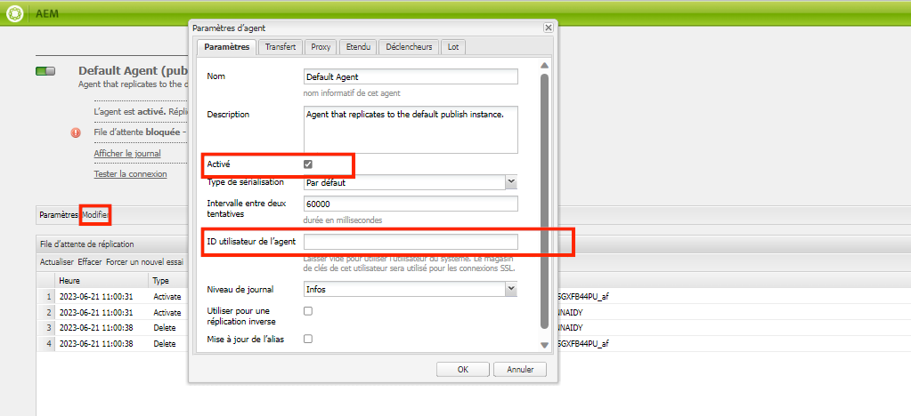
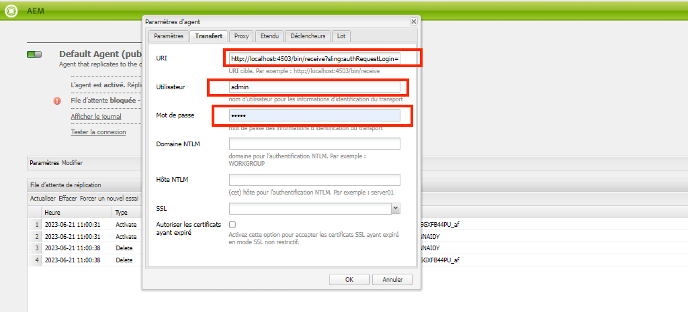
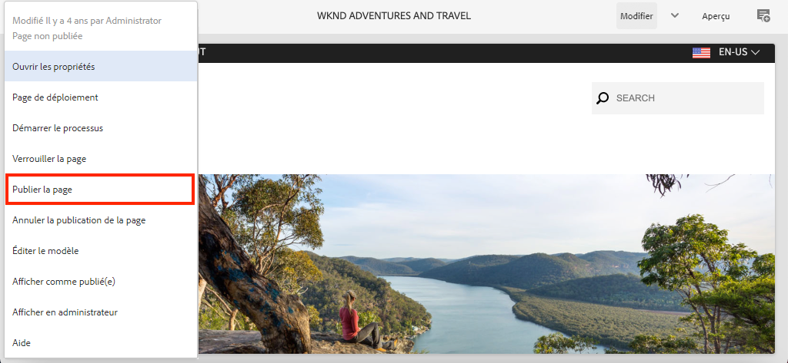

# Configuration du SDK d’AEM local {#set-up-local-aem-sdk}

>[!CONTEXTUALHELP]
>id="aemcloud_localdev_aemruntime"
>title="Exécution locale d’AEM"
>abstract="Il est possible d&#39;exécuter localement Adobe Experience Manager (AEM) à l&#39;aide du SDK d&#39;AEM as a Cloud Service Quickstart Jar. Cela permet aux développeurs de déployer et de tester du code personnalisé, des configurations et du contenu avant de le soumettre à un contrôle de sources et de le déployer dans un environnement AEM as a Cloud Service."
>additional-url="https://experienceleague.adobe.com/docs/experience-manager-cloud-service/implementing/developing/aem-as-a-cloud-service-sdk.html?lang=fr" text="SDK AEM as a Cloud Service"
>additional-url="https://experience.adobe.com/#/downloads/content/software-distribution/en/aemcloud.html?lang=fr" text="Télécharger le SDK AEM as a Cloud Service"

Il est possible d&#39;exécuter localement Adobe Experience Manager (AEM) à l&#39;aide du SDK d&#39;AEM as a Cloud Service Quickstart Jar. Cela permet aux développeurs de déployer et de tester du code personnalisé, des configurations et du contenu avant de le soumettre à un contrôle de sources et de le déployer dans un environnement AEM as a Cloud Service.

Notez que `~` est utilisé comme abrégé pour le répertoire de l’utilisateur. Sous Windows, cela équivaut à `%HOMEPATH%`.

## Installer Java

Experience Manager est une application Java qui requiert donc le SDK Java d’Oracle pour prendre en charge l’outil de développement.

1. [Télécharger et installer le dernier SDK Java 11](https://experience.adobe.com/#/downloads/content/software-distribution/en/general.html?1_group.propertyvalues.property=.%2Fjcr%3Acontent%2Fmetadata%2Fdc%3AsoftwareType&amp;1_group.propertyvalues.operation=equals&amp;1_group.propertyvalues.0_values=software-type%3Atooling&amp;fulltext=Oracle%7E+JDK%7E+11%7E&amp;orderby=%40jcr%3Acontent%2Fjcr%3AlastModified&amp;orderby.sort=desc&amp;layout=list&amp;p.offset=0&amp;p.limit=14)
1. Vérifiez que le SDK Oracle Java 11 est installé en exécutant la commande :

>[!BEGINTABS]

>[!TAB macOS]

```shell
$ java --version
```

>[!TAB Windows]


```shell
$ java -version
```

>[!TAB Linux]

```shell
$ java --version
```

>[!ENDTABS]


## Téléchargement du SDK as a Cloud Service AEM

Le SDK as a Cloud Service AEM, ou SDK AEM, contient le fichier Quickstart Jar utilisé pour exécuter l’instance de création et de publication d’Adobe en local pour le développement, ainsi que la version compatible des outils de Dispatcher.

1. Connexion à [https://experience.adobe.com/#/downloads](https://experience.adobe.com/#/downloads) avec votre Adobe ID
   + Notez que votre organisation Adobe __must__ être configuré pour AEM as a Cloud Service pour télécharger le SDK as a Cloud Service AEM.
1. Accédez à l’onglet __AEM as a Cloud Service__
1. Tri par __Date de publication__ in __Descendant__ order
1. Cliquez sur la dernière __AEM SDK__ ligne de résultat
1. Vérifiez et acceptez le CLUF, puis appuyez sur la __Télécharger__ button

## Extrayez le fichier Jar de démarrage rapide du fichier zip du SDK AEM

1. Décompressez le fichier téléchargé. `aem-sdk-XXX.zip` fichier

## Configuration du service d’auteur d’AEM local{#set-up-local-aem-author-service}

Le service de création d’AEM local fournit aux développeurs une expérience locale que les spécialistes du marketing numérique/auteurs de contenu vont partager pour créer et gérer du contenu.  Le service de création d’AEM est conçu comme un environnement de création et de prévisualisation. Il permet d’effectuer la plupart des validations du développement de fonctionnalités, ce qui en fait un élément essentiel du processus de développement local.

1. Création du dossier `~/aem-sdk/author`
1. Copiez le __Quickstart JAR__ vers  `~/aem-sdk/author` et renommez-le en `aem-author-p4502.jar`
1. Démarrez le service d’auteur d’AEM local en exécutant ce qui suit à partir de la ligne de commande :
   + `java -jar aem-author-p4502.jar`
      + Indiquez le mot de passe administrateur en tant que `admin`. Tout mot de passe administrateur est acceptable, mais il est recommandé d’utiliser la valeur par défaut pour le développement local afin de réduire la nécessité de reconfigurer.

   You *cannot* Démarrez l’AEM en tant que fichier Jar de démarrage rapide Cloud Service [en double-cliquant](#troubleshooting-double-click).
1. Accédez au service d’auteur d’AEM local à l’adresse [http://localhost:4502](http://localhost:4502) dans un navigateur Web

>[!BEGINTABS]

>[!TAB macOS]

```shell
$ mkdir -p ~/aem-sdk/author
$ cp aem-sdk-Quickstart-XXX.jar ~/aem-sdk/author/aem-author-p4502.jar
$ cd ~/aem-sdk/author
$ java -jar aem-author-p4502.jar
```

>[!TAB Windows]


```shell
$ mkdir -p c:\Users\<My User>\aem-sdk\author
$ copy aem-sdk-Quickstart-XXX.jar c:\Users\<My User>\aem-sdk\author\aem-author-p4502.jar
$ cd c:\Users\<My User>\aem-sdk\author
$ java -jar aem-author-p4502.jar
```

>[!TAB Linux]

```shell
$ mkdir -p ~/aem-sdk/author
$ cp aem-sdk-Quickstart-XXX.jar ~/aem-sdk/author/aem-author-p4502.jar
$ cd ~/aem-sdk/author
$ java -jar aem-author-p4502.jar
```

>[!ENDTABS]


## Configuration du service de publication d’AEM local

Le service de publication d’AEM local fournit aux développeurs l’expérience locale que les utilisateurs finaux de l’AEM auront, comme la navigation sur le site Web hébergé sur l’. Un service de publication d’AEM local est important, car il s’intègre aux SDK d’AEM [Outils de Dispatcher](./dispatcher-tools.md) et permet aux développeurs de tester et d’affiner l’expérience de contact de l’utilisateur final.

1. Création du dossier `~/aem-sdk/publish`
1. Copiez le __Quickstart JAR__ vers  `~/aem-sdk/publish` et renommez-le en `aem-publish-p4503.jar`
1. Démarrez le service de publication d’AEM local en exécutant ce qui suit à partir de la ligne de commande :
   + `java -jar aem-publish-p4503.jar`
      + Indiquez le mot de passe administrateur en tant que `admin`. Tout mot de passe administrateur est acceptable, mais il est recommandé d’utiliser la valeur par défaut pour le développement local afin de réduire la nécessité de reconfigurer.

   You *cannot* Démarrez l’AEM en tant que fichier Jar de démarrage rapide Cloud Service [en double-cliquant](#troubleshooting-double-click).
1. Accédez au service de publication AEM local à l’adresse [http://localhost:4503](http://localhost:4503) dans un navigateur Web

>[!BEGINTABS]

>[!TAB macOS]

```shell
$ mkdir -p ~/aem-sdk/publish
$ cp aem-sdk-Quickstart-XXX.jar ~/aem-sdk/publish/aem-publish-p4503.jar
$ cd ~/aem-sdk/publish
$ java -jar aem-publish-p4503.jar
```

>[!TAB Windows]


```shell
$ mkdir -p c:\Users\<My User>\aem-sdk\publish
$ copy aem-sdk-Quickstart-XXX.jar c:\Users\<My User>\aem-sdk\publish\aem-publish-p4503.jar
$ cd c:\Users\<My User>\aem-sdk\publish
$ java -jar aem-publish-p4503.jar
```

>[!TAB Linux]

```shell
$ mkdir -p ~/aem-sdk/publish
$ cp aem-sdk-Quickstart-XXX.jar ~/aem-sdk/publish/aem-publish-p4503.jar
$ cd ~/aem-sdk/publish
$ java -jar aem-publish-p4503.jar
```

>[!ENDTABS]


## Configuration des services d’AEM locaux en mode bêta

L’exécution AEM locale peut être démarrée dans [mode bêta](https://experienceleague.adobe.com/docs/experience-manager-cloud-service/content/release-notes/prerelease.html?lang=fr) permettant à un développeur de se positionner par rapport aux fonctionnalités de la prochaine version d’AEM as a Cloud Service. La version préliminaire est activée en transmettant le `-r prerelease` sur le premier démarrage de l’exécution AEM locale. Vous pouvez l’utiliser avec les services d’auteur AEM local et de publication AEM.


>[!BEGINTABS]

>[!TAB macOS]

```shell
# For AEM Author service in prerelease mode
$ java -jar aem-author-p4502.jar -r prerelease

# For AEM Publish service in prerelease mode
$ java -jar aem-publish-p4503.jar -r prerelease
```

>[!TAB Windows]


```shell
# For AEM Author service in prerelease mode
$ java -jar aem-author-p4502.jar -r prerelease

# For AEM Publish service in prerelease mode
$ java -jar aem-publish-p4503.jar -r prerelease
```

>[!TAB Linux]

```shell
# For AEM Author service in prerelease mode
$ java -jar aem-author-p4502.jar -r prerelease

# For AEM Publish service in prerelease mode
$ java -jar aem-publish-p4503.jar -r prerelease
```

>[!ENDTABS]

## Simulation de la distribution de contenu {#content-distribution}

Dans un environnement de Cloud Service réel, le contenu est distribué du service de création au service de publication à l’aide de [Distribution de contenu Sling](https://sling.apache.org/documentation/bundles/content-distribution.html) et le pipeline d’Adobe. La variable [Adobe de pipeline](https://experienceleague.adobe.com/docs/experience-manager-cloud-service/core-concepts/architecture.html?lang=en#content-distribution) est un microservice isolé disponible uniquement dans l’environnement cloud.

Pendant le développement, il peut être souhaitable de simuler la distribution du contenu à l’aide du service local Auteur et Publication. Pour ce faire, activez les agents de réplication hérités.

>[!NOTE]
>
> Les agents de réplication ne peuvent être utilisés que dans le fichier JAR Quickstart local et ne fournissent qu’une simulation de la distribution de contenu.

1. Connectez-vous au **Auteur** et accédez à [http://localhost:4502/etc/replication/agents.author.html](http://localhost:4502/etc/replication/agents.author.html).
1. Cliquez sur **Agent par défaut (publication)** pour ouvrir l’agent de réplication par défaut.
1. Cliquez sur **Modifier** pour ouvrir la configuration de l’agent.
1. Sous , **Paramètres** , mettez à jour les champs suivants :

   + **Activé** - vérifier true
   + **Agent User Id** - Laissez ce champ vide

   

1. Sous , **Transport** , mettez à jour les champs suivants :

   + **URI** - `http://localhost:4503/bin/receive?sling:authRequestLogin=1`
   + **Utilisateur** - `admin`
   + **Password** - `admin`

   

1. Cliquez sur **Ok** pour enregistrer la configuration et activer la fonction **Par défaut** Agent de réplication.
1. Vous pouvez maintenant apporter des modifications au contenu sur le service Auteur et les publier sur le service Publication.



## Modes de démarrage rapide de Jar

Le nom du fichier Quickstart Jar, `aem-<tier>_<environment>-p<port number>.jar` indique comment il va démarrer. Une fois qu’AEM a commencé dans un niveau, un auteur ou une publication spécifique, il ne peut pas être modifié dans un autre niveau. Pour ce faire, la variable `crx-Quickstart` Le dossier généré lors de la première exécution doit être supprimé et Quickstart Jar doit être exécuté à nouveau. L’environnement et les ports peuvent être modifiés, mais ils nécessitent l’arrêt/le démarrage de l’instance d’AEM locale.

Changement d&#39;environnement, `dev`, `stage` et `prod`, peut s’avérer utile pour les développeurs afin de s’assurer que les configurations spécifiques à un environnement sont correctement définies et résolues par AEM. Il est recommandé d’effectuer principalement le développement local par rapport à la valeur par défaut. `dev` le mode d’exécution d’environnement.

Les permutations disponibles sont les suivantes :

| Nom de fichier Jar de démarrage rapide | Description du mode |
|------------------------------|-----------------------------------------------------------------------------|
| `aem-author-p4502.jar` | En tant qu’auteur en mode Exécution de développement sur le port 4502 |
| `aem-author_dev-p4502.jar` | Comme auteur en mode d’exécution de développement sur le port 4502 (identique à `aem-author-p4502.jar`) |
| `aem-author_stage-p4502.jar` | En tant qu’auteur en mode d’exécution intermédiaire sur le port 4502 |
| `aem-author_prod-p4502.jar` | Comme auteur en mode d’exécution Production sur le port 4502 |
| `aem-publish-p4503.jar` | Comme publication en mode d’exécution de développement sur le port 4503 |
| `aem-publish_dev-p4503.jar` | En tant que publication en mode d’exécution de développement sur le port 4503 (identique à `aem-publish-p4503.jar`) |
| `aem-publish_stage-p4503.jar` | Comme publication en mode d’exécution intermédiaire sur le port 4503 |
| `aem-publish_prod-p4503.jar` | Comme publication en mode d’exécution Production sur le port 4503 |

Notez que le numéro de port peut être n’importe quel port disponible sur la machine de développement locale, par convention :

+ Port __4502__ est utilisé pour la variable __service d’auteur d’AEM local__
+ Port __4503__ est utilisé pour la variable __service de publication d’AEM local__

Pour les modifier, il peut être nécessaire d’apporter des modifications aux configurations AEM SDK.

## Arrêt d’une exécution d’AEM locale

Pour arrêter une exécution d’AEM locale, qu’il s’agisse d’AEM Author ou de service Publish, ouvrez la fenêtre de ligne de commande qui a été utilisée pour démarrer l’exécution d’AEM, puis appuyez sur `Ctrl-C`. Attendez la fermeture de AEM. Une fois le processus d’arrêt terminé, l’invite de ligne de commande est disponible.

## Tâches facultatives de configuration de l’exécution d’AEM locale

+ __Variables d’environnement de configuration OSGi et variables secrètes__ are [spécialement défini pour l’exécution locale AEM](https://experienceleague.adobe.com/docs/experience-manager-cloud-service/implementing/deploying/configuring-osgi.html?lang=fr#local-development), plutôt que de les gérer à l’aide de l’interface de ligne de commande aio.

## Quand mettre à jour le fichier Quickstart Jar

Mettez à jour le SDK AEM au moins une fois par mois ou peu après le dernier jeudi de chaque mois, qui correspond à la date de publication des &quot;versions de fonctionnalités&quot; as a Cloud Service AEM.

>[!WARNING]
>
> La mise à jour du fichier Quickstart Jar vers une nouvelle version nécessite de remplacer l’ensemble de l’environnement de développement local, ce qui entraîne la perte de tout le code, la configuration et le contenu dans les référentiels d’AEM locaux. Assurez-vous que tout code, configuration ou contenu qui ne doit pas être détruit est validé en toute sécurité dans Git ou exporté depuis l’instance d’AEM locale en tant que modules AEM.

### Comment éviter la perte de contenu lors de la mise à niveau du SDK AEM

La mise à niveau du SDK AEM crée effectivement un nouveau runtime AEM, y compris un nouveau référentiel, ce qui signifie que toutes les modifications apportées au référentiel d’un SDK d’AEM précédent sont perdues. Vous trouverez ci-dessous des stratégies viables pour faciliter la conservation du contenu entre les mises à niveau AEM SDK et peuvent être utilisées séparément ou de concert :

1. Créez un module de contenu dédié à contenir des &quot;exemples&quot; de contenu pour faciliter le développement et conservez-le dans Git. Tout contenu qui doit être conservé lors des mises à niveau AEM SDK est conservé dans ce module et redéployé après la mise à niveau du SDK AEM.
1. Utilisation [oak-upgrade](https://jackrabbit.apache.org/oak/docs/migration.html) avec la propriété `includepaths` pour copier le contenu du référentiel SDK AEM précédent vers le nouveau référentiel SDK AEM.
1. Sauvegardez tout contenu à l’aide d’AEM Package Manager et des packages de contenu sur le kit SDK AEM précédent, puis réinstallez-les sur le nouveau SDK d’AEM.

N’oubliez pas que l’utilisation des approches ci-dessus pour conserver le code entre les mises à niveau AEM SDK indique un anti-modèle de développement. Le code non disponible doit provenir de votre IDE de développement et être transmis dans AEM SDK via des déploiements.

## Résolution des problèmes

### Un double-clic sur le fichier Jar de démarrage rapide entraîne une erreur.{#troubleshooting-double-click}

Lorsque vous double-cliquez sur le fichier Quickstart Jar pour démarrer, un modal d’erreur s’affiche pour empêcher AEM de démarrer localement.


Cela est dû au fait qu’AEM fichier Jar de démarrage rapide as a Cloud Service ne prend pas en charge le double-clic sur le fichier Jar de démarrage rapide pour commencer AEM localement. Vous devez plutôt exécuter le fichier Jar à partir de cette ligne de commande.

Pour démarrer AEM service Auteur, `cd` dans le répertoire contenant le fichier Quickstart Jar et exécutez la commande :

>[!BEGINTABS]

>[!TAB macOS]

```shell
$ java -jar aem-author-p4502.jar
```

>[!TAB Windows]


```shell
$ java -jar aem-author-p4502.jar
```

>[!TAB Linux]

```shell
$ java -jar aem-author-p4502.jar
```

>[!ENDTABS]

ou pour lancer AEM service de publication, `cd` dans le répertoire contenant le fichier Quickstart Jar et exécutez la commande :

>[!BEGINTABS]

>[!TAB macOS]

```shell
$ java -jar aem-author-p4503.jar
```

>[!TAB Windows]


```shell
$ java -jar aem-author-p4503.jar
```

>[!TAB Linux]

```shell
$ java -jar aem-author-p4503.jar
```

>[!ENDTABS]

### Le démarrage du fichier Quickstart Jar à partir de la ligne de commande annule immédiatement.{#troubleshooting-java-8}

Lors du démarrage du fichier Quickstart Jar à partir de la ligne de commande, le processus s’arrête immédiatement et le service AEM ne démarre pas, avec l’erreur suivante :

```shell
➜  ~/aem-sdk/author: java -jar aem-author-p4502.jar
Loading quickstart properties: default
Loading quickstart properties: instance
java.lang.Exception: Quickstart requires a Java Specification 11 VM, but your VM (Java HotSpot(TM) 64-Bit Server VM / Oracle Corporation) reports java.specification.version=1.8
  at com.adobe.granite.quickstart.base.impl.Main.checkEnvironment(Main.java:1046)
  at com.adobe.granite.quickstart.base.impl.Main.<init>(Main.java:646)
  at com.adobe.granite.quickstart.base.impl.Main.main(Main.java:981)
Quickstart: aborting
```

En effet, AEM as a Cloud Service nécessite Java SDK 11 et vous exécutez une version différente, probablement Java 8. Pour résoudre ce problème, téléchargez et installez [Oracle Java SDK 11](https://experience.adobe.com/#/downloads/content/software-distribution/en/general.html?1_group.propertyvalues.property=.%2Fjcr%3Acontent%2Fmetadata%2Fdc%3AsoftwareType&amp;1_group.propertyvalues.operation=equals&amp;1_group.propertyvalues.0_values=software-type%3Atooling&amp;fulltext=Oracle%7E+JDK%7E+11%7E&amp;orderby=%40jcr%3Acontent%2Fjcr%3AlastModified&amp;orderby.sort=desc&amp;layout=list&amp;p.offset=0&amp;p.limit=14).

Une fois le SDK Java 11 Oracle installé, vérifiez qu’il s’agit de la version active en exécutant la commande à partir de la ligne de commande :

>[!BEGINTABS]

>[!TAB macOS]

```shell
$ java --version
```

>[!TAB Windows]


```shell
$ java -version
```

>[!TAB Linux]

```shell
$ java --version
```

>[!ENDTABS]

## Ressources supplémentaires

+ [Télécharger AEM SDK](https://experience.adobe.com/#/downloads)
+ [Adobe Cloud Manager](https://my.cloudmanager.adobe.com/)
+ [Télécharger Docker](https://www.docker.com/)
+ [Documentation du Dispatcher Experience Manager](https://experienceleague.adobe.com/docs/experience-manager-dispatcher/using/dispatcher.html?lang=fr)
