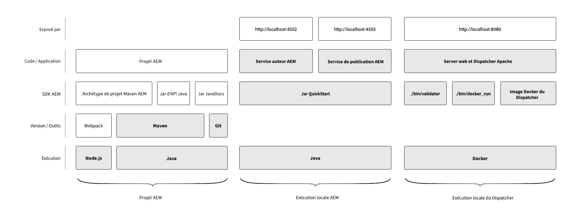

# Configuration de l&#39;Environnement de développement local

Ce didacticiel explique comment configurer un environnement de développement local pour Adobe Experience Manager (AEM) en utilisant l’AEM comme SDK Cloud Service. Les outils de développement requis pour développer, créer et compiler des projets AEM, ainsi que les délais d’exécution locaux permettent aux développeurs de valider rapidement les nouvelles fonctionnalités localement avant de les déployer sur AEM en tant qu’Cloud Service via Adobe Cloud Manager.

>[!VIDEO](https://video.tv.adobe.com/v/32565/?quality=12&learn=on)

L&#39;environnement de développement local pour l&#39;AEM peut être divisé en trois groupes logiques :

+ Le projet __AEM__ contient le code, la configuration et le contenu personnalisés correspondant à l&#39;application AEM personnalisée.
+ Exécution __de l’AEM__ local qui exécute une version locale des services AEM Author et Publish en local.
+ Exécution __du répartiteur__ local qui exécute une version locale du serveur Web et du répartiteur HTTP Apache.

Ce tutoriel explique comment installer et configurer les éléments mis en évidence dans le diagramme ci-dessus, fournissant un environnement de développement local stable pour le développement AEM.

## Organisation du système de fichiers

Ce didacticiel a établi l’emplacement de l’AEM en tant qu’artefacts SDK Cloud Service et code AEM Project comme suit :

+ `~/aem-sdk` est un dossier d’organisation contenant les différents outils fournis par l’AEM en tant que SDK Cloud Service.
+ `~/aem-sdk/author` contient le service AEM Author
+ `~/aem-sdk/publish` contient le service de publication AEM
+ `~/aem-sdk/dispatcher` contient les outils du répartiteur
+ `~/code/<project name>` contient le code source AEM projet personnalisé

Notez qu’ `~` il s’agit d’un raccourci pour le Répertoire d’utilisateurs. Sous Windows, il s’agit de l’équivalent de `%HOMEPATH%`;

## Outils de développement pour les projets AEM

Le projet AEM est la base de code personnalisée contenant le code, la configuration et le contenu qui est déployé via Cloud Manager pour AEM en tant que Cloud Service. La structure du projet de base est générée par l&#39;archétype AEM Project Maven.

Cette section du didacticiel explique comment :

+ Installation de la version [!DNL Java]
+ Installer [!DNL Node.js] (et npm)
+ Installation de la version [!DNL Maven]
+ Installation de la version [!DNL Git]

[Configuration des outils de développement pour les projets AEM](./development-tools.md)

## Exécution AEM locale

L’AEM en tant que Cloud Service SDK fournit une version [!DNL QuickStart Jar] qui exécute une version locale d’AEM. Il [!DNL QuickStart Jar] peut être utilisé pour exécuter localement le service AEM Author ou AEM Publish. Notez que bien que le [!DNL QuickStart Jar] offre une expérience de développement local, toutes les fonctionnalités disponibles dans AEM en tant que Cloud Service ne sont pas incluses dans le [!DNL QuickStart Jar].

Cette section du didacticiel explique comment :

+ Installation de la version [!DNL Java]
+ Téléchargement du SDK AEM
+ Run the [!DNL AEM Author Service]
+ Run the [!DNL AEM Publish Service]

[Configuration de l’exécution AEM locale](./aem-runtime.md)

## Exécution locale [!DNL Dispatcher]

aem en tant qu’outil de répartiteur du kit SDK Cloud Service fournit tout ce qui est nécessaire pour configurer l’ [!DNL Dispatcher] exécution locale. [!DNL Dispatcher] Les outils sont [!DNL Docker]basés sur la ligne de commande et fournissent des outils de ligne de commande permettant de transférer [!DNL Apache HTTP] Web Server et [!DNL Dispatcher] les fichiers de configuration dans des formats compatibles et de les déployer pour les [!DNL Dispatcher] exécuter dans le [!DNL Docker] conteneur.

Cette section du didacticiel explique comment :

+ Téléchargement du SDK AEM
+ Installation [!DNL Dispatcher] des outils
+ Exécution de l’ [!DNL Dispatcher] exécution locale

[Configuration de [!DNL Dispatcher] LocalRuntime](./dispatcher-tools.md)
