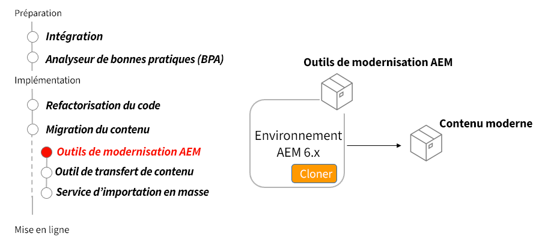

# Outils de modernisation d’AEM

Découvrez comment les outils de modernisation d’AEM sont utilisés pour mettre à niveau le contenu existant des sites AEM afin d’être compatible avec AEM as a Cloud Service et de s’aligner sur les bonnes pratiques.

## Convertisseur tout-en-un

>[!VIDEO](https://video.tv.adobe.com/v/338802?quality=12&learn=on)

## Conversion de page

>[!VIDEO](https://video.tv.adobe.com/v/338799?quality=12&learn=on)

## Conversion des composants

>[!VIDEO](https://video.tv.adobe.com/v/338788?quality=12&learn=on)

## Import de politique

>[!VIDEO](https://video.tv.adobe.com/v/338797?quality=12&learn=on)

## Utiliser les outils de modernisation d’AEM

Les outils de modernisation d’AEM convertissent automatiquement les pages AEM existantes composées de modèles statiques hérités, de composants de base et le parsys, afin d’utiliser des approches modernes telles que les modèles modifiables, les composants principaux de la gestion des conteneurs AEM et les conteneurs de disposition.

## Activités clés

+ Cloner la production AEM 6.x pour y exécuter les outils de modernisation AEM
+ Téléchargez et installez les [derniers outils de modernisation AEM](https://github.com/adobe/aem-modernize-tools/releases/latest) sur le clone de production AEM 6.x via le gestionnaire de packages.

+ Le [Convertisseur de structure de page](https://opensource.adobe.com/aem-modernize-tools/pages/structure/about.html) met à jour le contenu d’une page existante d’un modèle statique à un modèle modifiable mappé à l’aide de conteneurs de disposition.
   + Définir des règles de conversion à l’aide de la configuration OSGi
   + Exécuter le convertisseur de structure de page par rapport aux pages existantes

+ Le [Convertisseur de composants](https://opensource.adobe.com/aem-modernize-tools/pages/component/about.html) met à jour le contenu d’une page existante d’un modèle statique à un modèle modifiable mappé à l’aide de conteneurs de disposition.
   + Définir des règles de conversion via des définitions de nœud JCR/XML
   + Exécuter l’outil de convertisseur de composants sur les pages existantes.

+ L’[Importateur de politiques](https://opensource.adobe.com/aem-modernize-tools/pages/policy/about.html) crée des politiques à partir de la configuration de conception.
   + Définir des règles de conversion à l’aide de définitions de nœud JCR/XML
   + Exécuter l’importateur de politiques par rapport aux définitions de conception existantes
   + Appliquer les politiques importées à des composants et des conteneurs AEM

## Exercice pratique

Mettez en pratique les connaissances que vous venez d’acquérir grâce à cet exercice.

Avant de commencer cet exercice pratique, assurez-vous d’avoir visionné et bien compris le contenu de la vidéo ci-dessus, ainsi que les documents suivants :

+ [Penser différemment AEM as a Cloud Service](./introduction.md)
+ [Modernisation du référentiel](./repository-modernization.md)
+ [Contenu mutable et non modifiable](../../developing/basics/mutable-immutable.md)
+ [Structure de projet AEM](https://experienceleague.adobe.com/docs/experience-manager-cloud-service/implementing/developing/aem-project-content-package-structure.html?lang=fr)

Assurez-vous également d’avoir terminé l’exercice pratique précédent :

+ [Exercice pratique BPA et CAM](./bpa-and-cam.md#hands-on-exercise)

<table style="border-width:0">
    <tr>
        <td style="width:150px">
                    
        </td>
        <td style="width:100%;margin-bottom:1rem;">
            
Exercice pratique avec la modernisation AEM

            

                Découvrez l’utilisation des outils de modernisation d’AEM pour mettre à jour un site WKND hérité afin de vous conformer aux bonnes pratiques d’AEM as a Cloud Service.
            

            <a  rel="noreferrer"
                target="_blank"
                href="https://github.com/adobe/aem-cloud-engineering-video-series-exercises/tree/session2-migration#bootcamp—session-2-migration-method" class="spectrum-Button spectrum-Button--primary spectrum-Button--sizeM">
Tester les outils de modernisation AEM
</a>
        </td>
    </tr>
</table>

## Autres ressources

+ [Télécharger les outils de modernisation d’AEM](https://github.com/adobe/aem-modernize-tools/releases/latest)
+ [Documentation sur les outils de modernisation d’AEM](https://opensource.adobe.com/aem-modernize-tools/)
+ [Astuces AEM - Présentation d’AEM Modernization Suite](https://helpx.adobe.com/experience-manager/kt/eseminars/gems/Introducing-the-AEM-Modernization-Suite.html)

1. Déployez le site wknd-legacy récemment modernisé sur le SDK AEM local. AEM ASK peut être téléchargé ici :
   + [Portail de distribution logicielle](https://experience.adobe.com/#/downloads/content/software-distribution/en/general.html).
