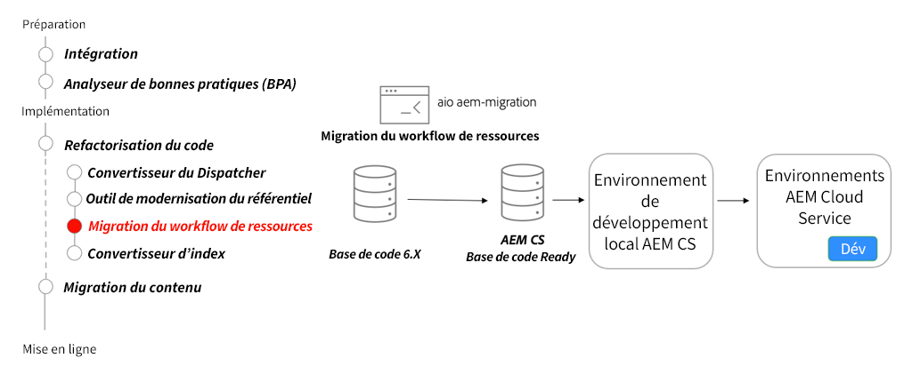

# Microservices AEM Assets - Passage à AEM as a Cloud Service

Découvrez comment les microservices d’asset compute d’AEM Assets as a Cloud Service vous permettent de générer automatiquement et efficacement n’importe quel rendu pour vos ressources, en remplaçant ce rôle de workflow d’AEM traditionnel.

>[!VIDEO](https://video.tv.adobe.com/v/336990/?quality=12&learn=on)

## Outil de migration des workflows

Dans le cadre de la refactorisation de votre base de code, utilisez le [Outil de migration des workflows de ressources](https://experienceleague.adobe.com/docs/experience-manager-cloud-service/moving/refactoring-tools/asset-workflow-migration-tool.html?lang=fr) pour migrer les workflows existants afin d&#39;utiliser les microservices Asset compute dans AEM as a Cloud Service.

## Activités clés

+ Utilisez la variable [Adobe I/O Workflow Migrator](https://github.com/adobe/aio-cli-plugin-aem-cloud-service-migration#command-aio-aem-migrationworkflow-migrator) pour migrer les workflows de traitement des ressources afin d’utiliser les microservices Asset compute.
+ Configurez une [environnement de développement local](https://experienceleague.adobe.com/docs/experience-manager-learn/cloud-service/local-development-environment-set-up/overview.html?lang=fr) et déployer les workflows mis à jour. Un ajustement manuel peut être nécessaire pour les workflows complexes.
+ Continuez à itérer dans un environnement de développement local à l’aide du SDK AEM jusqu’à ce que le workflow mis à jour corresponde à la parité des fonctionnalités.
+ Déployez la base de code mise à jour dans un environnement de développement as a Cloud Service AEM et continuez à valider.

## Exercice pratique

Appliquez vos connaissances en essayant ce que vous avez appris grâce à cet exercice pratique.

Avant d’essayer l’exercice pratique, assurez-vous d’avoir visionné et compris la vidéo ci-dessus, ainsi que les documents suivants :

+ [Penser différemment à AEM as a Cloud Service](./introduction.md)
+ [Intégration ](./onboarding.md)

Assurez-vous également que vous avez terminé l’exercice pratique précédent :

+ [Exercice pratique de recherche et d’indexation](./search-and-indexing.md#hands-on-exercise)

<table style="border-width:0">
    <tr>
        <td style="width:150px">
                    
        </td>
        <td style="width:100%;margin-bottom:1rem;">
            
Utilisation des procédures de chargement de ressources

            

                Découvrez comment définir et affecter des profils de traitement AEM Assets à des dossiers et charger des ressources vers AEM à l’aide du module d’interface de ligne de commande npm "aem-upload".
            

            <a  rel="noreferrer"
                target="_blank"
                href="https://github.com/adobe/aem-cloud-engineering-video-series-exercises/tree/session8-assets#cloud-acceleration-bootcamp---session-8-assets-and-microservices" class="spectrum-Button spectrum-Button--primary spectrum-Button--sizeM">
                Tester la gestion des ressources
            </a>
        </td>
    </tr>
</table>
