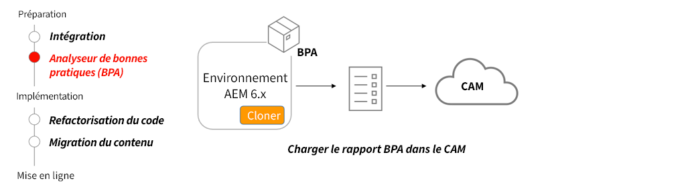

# Best Practices Analyzer et Cloud Acceleration Manager

Découvrez comment Best Practices Analyzer (BPA) et Cloud Acceleration Manager (CAM) fournissent un guide personnalisé pour la migration vers AEM as a Cloud Service. 

>[!VIDEO](https://video.tv.adobe.com/v/336957?quality=12&learn=on)

## Utiliser BPA et CAM

Le package BPA doit être installé sur un clone de l’environnement de production AEM 6.x. Le BPA va générer un rapport qui pourra ensuite être chargé dans CAM, qui fournira des conseils sur les activités clés qui doivent avoir lieu afin de migrer vers AEM as a Cloud Service.

## Activités clés

+ Clonez votre environnement de production 6.x. Lorsque vous migrez du contenu et refactorisez le code, disposer d’un clone d’environnement de production est utile pour tester divers outils et modifications.
+ Téléchargez la dernière version de l’outil BPA à partir du [Portail de distribution logicielle](https://experience.adobe.com/#/downloads/content/software-distribution/en/aemcloud.html?lang=fr), puis installez-la sur votre environnement cloné AEM 6.x.
+ Utilisez l’outil BPA pour générer un rapport qui peut être chargé sur Cloud Acceleration Manager (CAM). CAM est accessible via [https://experience.adobe.com/](https://experience.adobe.com/) > **Experience Manager** > **Cloud Acceleration Manager**.
+ Utilisez CAM pour fournir des conseils sur les mises à jour à apporter à la base de code et à l’environnement actuels afin de migrer vers AEM as a Cloud Service.

## Exercice pratique

Mettez en pratique les connaissances que vous venez d’acquérir grâce à cet exercice.

Avant de commencer cet exercice pratique, assurez-vous d’avoir visionné et bien compris le contenu de la vidéo ci-dessus, ainsi que les documents suivants :

+ [Penser différemment AEM as a Cloud Service](./introduction.md)
+ [Qu’est-ce qu’AEM as a Cloud Service ?](https://experienceleague.adobe.com/docs/experience-manager-learn/cloud-service/introduction/what-is-aem-as-a-cloud-service.html?lang=fr)
+ [Architecture d’AEM as a Cloud Service](https://experienceleague.adobe.com/docs/experience-manager-learn/cloud-service/introduction/architecture.html?lang=fr)
+ [Contenu modifiable et non modifiable](https://experienceleague.adobe.com/docs/experience-manager-learn/cloud-service/developing/basics/mutable-immutable.html?lang=fr)
+ [Différences dans le développement pour AEM as a Cloud Service et AEM 6.x](https://experienceleague.adobe.com/docs/experience-manager-cloud-service/implementing/developing/development-guidelines.html?lang=fr#developing)

<table style="border-width:0">
    <tr>
        <td style="width:150px">
                    
        </td>
        <td style="width:100%;margin-bottom:1rem;">
            
Utilisation pratique de Best Practices Analyzer

            

                Explorez Best Practices Analyzer (BPA) et passez en revue les résultats en l’exécutant sur une base de code WKND héritée qui contient des exemples de violations.
            

            <a  rel="noreferrer"
                target="_blank"
                href="https://github.com/adobe/aem-cloud-engineering-video-series-exercises/tree/session1-differently#bootcamp---session-1-introduction-and-thinking-differently" class="spectrum-Button spectrum-Button--primary spectrum-Button--sizeM">
Essayer Best Practices Analyzer
</a>
        </td>
    </tr>
</table>

## Autres ressources

+ [Téléchargement de l’analyseur des bonnes pratiques](https://experience.adobe.com/#/downloads/content/software-distribution/fr/aemcloud.html?fulltext=Best*+Practices*+Analyzer*&amp;orderby=%40jcr%3Acontent%2Fjcr%3AlastModified&amp;orderby.sort=desc&amp;layout=list&amp;p.offset=0&amp;p.limit=1)