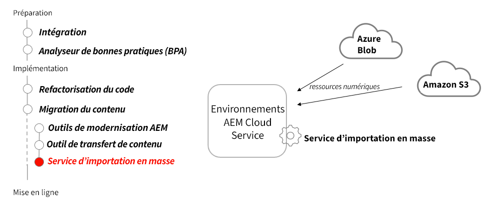

# Service d’import en bloc

Découvrez comment AEM en tant que service d’import en bloc de services cloud peut être utilisé pour importer des ressources à partir de sources non AEM.

>[!VIDEO](https://video.tv.adobe.com/v/336969?quality=12&learn=on)

## Utiliser le service d’import en bloc

Le service d’import en bloc est utilisé pour transférer des fichiers stockés dans le stockage Azure Blob ou Amazon S3 vers AEM as a Cloud Service en tant que ressources.

>[!TIP]
>
> Les sources d’entrée de cette vidéo n’affichent que Azure Blob Storage et Amazon S3 ; cependant, les sources disponibles continuent de croître au fil du temps. Pour obtenir la liste complète des sources d’entrée prises en charge, reportez-vous aux options disponibles dans le produit, ou [documentation](https://experienceleague.adobe.com/docs/experience-manager-cloud-service/content/assets/manage/add-assets.html#bulk-upload).

## Activités clés

+ Téléchargez les fichiers à importer dans votre fournisseur de stockage dans le cloud.
+ Configurez et exécutez le service d’import en bloc à partir du service de création d’AEM as a Cloud Service.
+ Exécutez l’importateur de services en bloc comme import unique ou planifiez un import périodique.

## Autres ressources

+ [Options de configuration du service d’import en bloc](https://experienceleague.adobe.com/docs/experience-manager-cloud-service/content/assets/manage/add-assets.html?lang=fr#configure-bulk-ingestor-tool)
+ [Session Adobe Developers Live sur l’ingestion des ressources](https://experienceleague.adobe.com/docs/events/adobe-developers-live-recordings/2021/feb2021/asset-bulk-ingestion.html?lang=fr)

