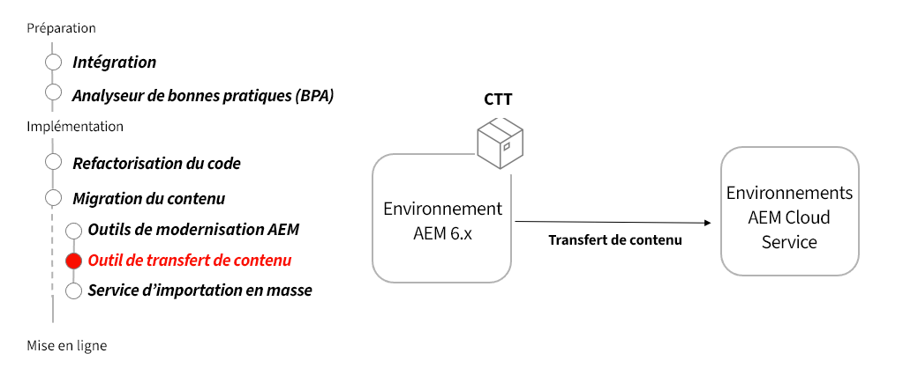

# Outil de transfert de contenu

Découvrez comment l’outil de transfert de contenu vous aide à migrer le contenu vers AEM as a Cloud Service à partir d’AEM 6.3 et ultérieure.

>[!VIDEO](https://video.tv.adobe.com/v/336970?quality=12&learn=on)

## Utiliser l’outil de transfert de contenu

L’outil de transfert de contenu est installé sur AEM 6.3 et les versions ultérieures et transfère le contenu vers AEM as a Cloud Service.

## Activités clés

+ Téléchargez le [dernier outil de transfert de contenu](https://experience.adobe.com/#/downloads/content/software-distribution/en/aemcloud.html?fulltext=Content*+Transfer*+Tool*&amp;1_group.propertyvalues.property=.%2Fjcr%3Acontent%2Fmetadata%2Fdc%3AsoftwareType&amp;1_group.propertyvalues.operation=equals&amp;1_group.propertyvalues.0_values=software-type%3Atooling&amp;orderby=%40jcr%3Acontent%2Fjcr%3AlastModified&amp;orderby.sort=desc&amp;layout=list&amp;p.offset=0&amp;p.limit=2).
+ Transférez le contenu final du service de création d’AEM 6.3 et des versions ultérieures vers le service de création d’AEM as a Cloud Service.
   + Installez l’outil de transfert de contenu sur le service de création d’AEM 6.3 et les versions ultérieures ayant le contenu final à transférer.
   + Exécutez l’outil de transfert de contenu par lots, en transférant des ensembles de contenu.
+ Transférez le contenu final du service de publication d’AEM 6.3 et les versions ultérieures vers le service de publication d’AEM as a Cloud Service.
   + Installez l’outil de transfert de contenu sur le service de publication d’AEM 6.3 et les versions ultérieures ayant le contenu final à transférer.
   + Exécutez l’outil de transfert de contenu par lots, en transférant des ensembles de contenu.
+ Éventuellement, « complétez » le contenu sur AEM as a Cloud Service, en transférant le nouveau contenu depuis le dernier transfert de contenu.

## Exercice pratique

Mettez en pratique les connaissances que vous venez d’acquérir grâce à cet exercice.

Avant de commencer cet exercice pratique, assurez-vous d’avoir visionné et bien compris le contenu de la vidéo ci-dessus, ainsi que les documents suivants :

+ [Outils de modernisation d’AEM](../aem-modernization-tools.md)
+ [Intégration](../onboarding.md)
+ [Cloud Manager](../cloud-manager.md)

Assurez-vous également d’avoir terminé l’exercice pratique précédent :

+ [Exercice pratique de Dispatcher](../dispatcher.md#hands-on-exercise)

<table style="border-width:0">
    <tr>
        <td style="width:150px">
                    
        </td>
        <td style="width:100%;margin-bottom:1rem;">
            
Utilisation pratique de l’outil de transfert de contenu

            

                Découvrez comment l’outil de transfert de contenu peut déplacer automatiquement le contenu d’AEM 6 vers AEM as a Cloud Service.
            

            <a  rel="noreferrer"
                target="_blank"
                href="https://github.com/adobe/aem-cloud-engineering-video-series-exercises/tree/session6-transfercontent#cloud-acceleration-bootcamp—session-6-content" class="spectrum-Button spectrum-Button--primary spectrum-Button--sizeM">
Essayer l’outil de transfert de contenu
</a>
        </td>
    </tr>
</table>

## Autres ressources

+ [Télécharger l’outil de transfert de contenu](https://experience.adobe.com/#/downloads/content/software-distribution/en/aemcloud.html?fulltext=Content*+Transfer*+Tool*&amp;1_group.propertyvalues.property=.%2Fjcr%3Acontent%2Fmetadata%2Fdc%3AsoftwareType&amp;1_group.propertyvalues.operation=equals&amp;1_group.propertyvalues.0_values=software-type%3Atooling&amp;orderby=%40jcr%3Acontent%2Fjcr%3AlastModified&amp;orderby.sort=desc&amp;layout=list&amp;p.offset=0&amp;p.limit=2)
+ [Vidéo pratique du service d’import en bloc](https://experienceleague.adobe.com/docs/experience-manager-learn/cloud-service/migration/bulk-import.html?lang=fr)

