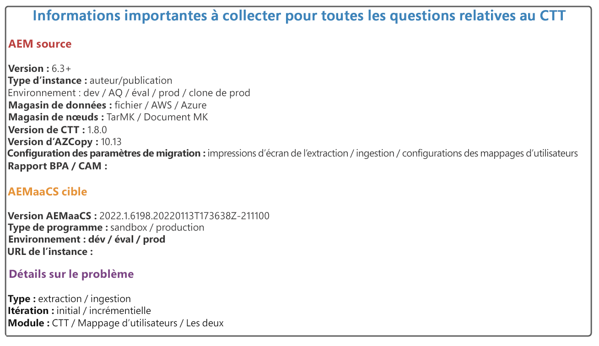
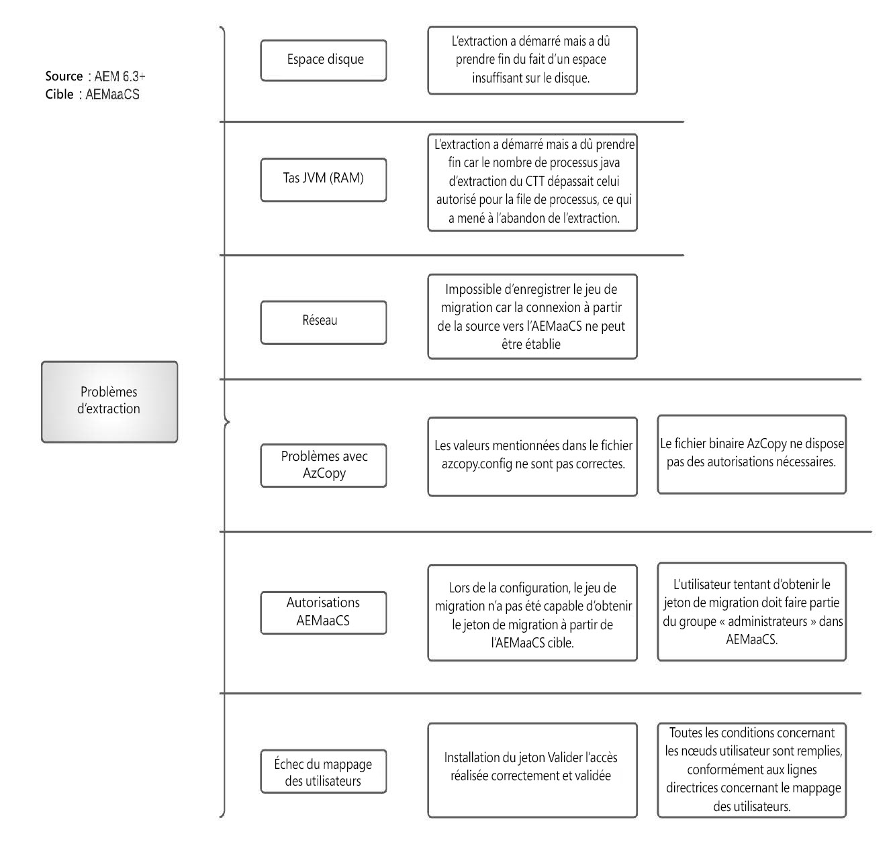
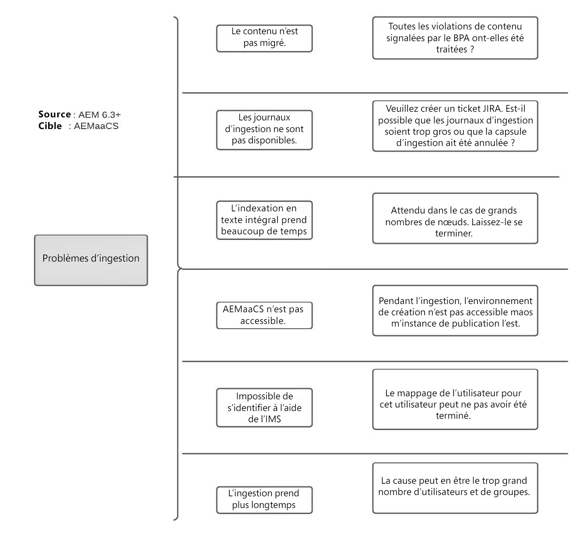

# Questions fréquentes sur la migration du contenu vers AEM as a Cloud Service

Obtenez des réponses aux questions fréquentes sur la migration de contenu vers AEM as a Cloud Service.

## Terminologie

+ **AEMaaCS** : [AEM as a Cloud Service](https://experienceleague.adobe.com/docs/experience-manager-cloud-service/content/overview/introduction.html?lang=fr)
+ **BPA** : [Analyseur des bonnes pratiques](https://experienceleague.adobe.com/docs/experience-manager-cloud-service/content/migration-journey/cloud-migration/best-practices-analyzer/overview-best-practices-analyzer.html?lang=fr)
+ **CTT** : [Outil de transfert de contenu](https://experienceleague.adobe.com/docs/experience-manager-cloud-service/content/migration-journey/cloud-migration/content-transfer-tool/overview-content-transfer-tool.html?lang=fr)
+ **CAM** : [Cloud Acceleration Manager](https://experienceleague.adobe.com/docs/experience-manager-cloud-service/content/migration-journey/cloud-acceleration-manager/using-cam/getting-started-cam.html?lang=fr)
+ **IMS** : [Identity Management System](https://experienceleague.adobe.com/docs/experience-manager-cloud-service/content/security/ims-support.html?lang=fr)
+ **DM** : [Dynamic Media](https://experienceleague.adobe.com/docs/experience-manager-cloud-service/content/assets/dynamicmedia/dm-journey/dm-journey-part1.html?lang=fr)

Veuillez utiliser le modèle ci-dessous pour fournir plus de détails lors de la soumission de tickets d’assistance Adobe liés à CTT.

 { align=&quot;center&quot; }

## Questions générales relatives à la migration de contenu

### Q : Quelles sont les différentes méthodes de migration du contenu vers AEM as a Cloud Service ?

Trois méthodes s’offrent à vous.

+ L’outil de transfert de contenu (AEM 6.3+ → AEMaaCS)
+ Via le gestionnaire de modules (AEM → AEMaaCS)
+ Service d’import en bloc prêt à l’emploi pour Assets (S3/Azure → AEMaaCS)

### Q : Existe-t-il une limite à la quantité de contenu qui peut être transférée à l’aide de CTT ?

Nombre CTT, en tant qu’outil, peut extraire des sources AEM et les ingérer dans AEMaaCS. Cependant, il existe des limites spécifiques sur la plateforme AEMaaCS qui doivent être prises en compte avant la migration.

Pour plus d’informations, consultez la section [conditions préalables à la migration vers le cloud](https://experienceleague.adobe.com/docs/experience-manager-cloud-service/content/migration-journey/cloud-migration/content-transfer-tool/prerequisites-content-transfer-tool.html?lang=fr).

### Q : J’ai le dernier rapport BPA de mon système source, que dois-je en faire ?

Exportez le rapport au format CSV, puis chargez-le sur l’outil Cloud Acceleration Manager [associé à votre organisation IMS](https://experienceleague.adobe.com/docs/experience-manager-cloud-service/content/migration-journey/cloud-acceleration-manager/using-cam/getting-started-cam.html?lang=fr). Suivez ensuite le processus de révision comme [présenté dans la phase de préparation](https://experienceleague.adobe.com/docs/experience-manager-cloud-service/content/migration-journey/cloud-acceleration-manager/using-cam/cam-readiness-phase.html?lang=fr).

Passez en revue l’évaluation de la complexité du code et du contenu fournie par l’outil et notez les éléments d’action associés qui entraînent la refactorisation du code ou l’évaluation de la migration vers le cloud.

### Q : Est-il recommandé d’extraire sur l’instance de création source et de l’ingérer dan les instances de création et de publication AEMaaCS ?

Il est toujours recommandé d’effectuer une extraction et une ingestion 1:1 entre les niveaux de création et de publication. Cela dit, il est acceptable d’extraire l’instance de création de production source et de l’ingérer dans le CS de développement, d’évaluation et de production.

### Q : Existe-t-il un moyen d’estimer le temps nécessaire à la migration du contenu d’AEM source vers AEMaaCS à l’aide du CTT ?

Étant donné que le processus de migration dépend de la largeur de bande Internet, du tas alloué pour le processus CTT, de la mémoire disponible et des E/S du disque qui sont soumis à chaque système source, il est recommandé d’exécuter la preuve des migrations rapidement et d’extrapoler les points de données pour fournir des estimations.

### Q : Dans quelles mesures les performances de mon AEM source sont-elles impactées si je lance le processus d’extraction du CTT ?

L’outil CTT s’exécute dans son propre processus Java™ qui prend jusqu’à 4 Go de tas configurable via la configuration OSGi. Ce nombre peut changer, mais vous pouvez utiliser la commande grep pour le processus Java™ et le découvrir.

Si AZCopy est installé et/ou que l’option de pré-copie/la fonction de validation est activée, le processus AZCopy consomme des cycles de processeur.

Outre jvm, l’outil utilise également les E/S de disque pour stocker les données sur un espace temporaire transitoire qui sera nettoyé après le cycle d’extraction. Outre la RAM, le processeur et les E/S de disque, l’outil CTT utilise également la largeur de bande réseau du système source pour charger des données dans le magasin Azure Blob.

La quantité de ressources nécessaire au processus d’extraction du CTT dépend du nombre de nœuds, du nombre de blobs et de leur taille agrégée. Il est difficile de fournir une formule. Il est donc recommandé d’exécuter une petite preuve de migration pour déterminer les exigences de taille du serveur source.

Si des environnements de clonage sont utilisés pour la migration, cela n’a aucune incidence sur l’utilisation des ressources du serveur de production en direct, mais présente ses propres inconvénients en ce qui concerne la synchronisation de contenu entre la production en direct et le clone.

### Q : Dans mon système de création source, nous avons configuré l’authentification unique (SSO) pour que les utilisateurs et utilisatrices s’authentifient dans l’instance de création. Dois-je utiliser la fonctionnalité de mappage des utilisateurs et utilisatrices du CTT dans ce cas ?

La réponse courte est « **Oui** ».

L’extraction et l’ingestion du CTT **sans** le mappage des utilisateurs et utilisatrices migrent uniquement le contenu, les principes associés (utilisateurs/utilisatrices, groupes) d’AEM source vers AEMaaCS. Toutefois, ces utilisateurs et utilisatrices (identités) présents dans Adobe IMS doivent avoir accès à l’instance AEMaaCS pour s’authentifier correctement. Le traitement de l’[outil de mappage des utilisateurs et utilisatrices](https://experienceleague.adobe.com/docs/experience-manager-cloud-service/content/migration-journey/cloud-migration/content-transfer-tool/legacy-user-mapping-tool/overview-user-mapping-tool-legacy.html?lang=fr) consiste à mapper l’utilisateur ou utilisatrice AEM local à l’utilisateur ou utilisatrice IMS afin que l’authentification et les autorisations fonctionnent ensemble.

Dans ce cas, le fournisseur d’identité SAML est configuré par rapport à Adobe IMS pour utiliser Federated/Enterprise ID plutôt que directement pour AEM à l’aide du gestionnaire d’authentification.

### Q : Dans mon système de création source, nous avons configuré une authentification de base pour que les utilisateurs et utilisatrices s’authentifient dans l’instance de création avec les utilisateurs et utilisatrices AEM locaux. Dois-je utiliser la fonctionnalité de mappage des utilisateurs et utilisatrices du CTT dans ce cas ?

La réponse courte est « **Oui** ».

L’extraction et l’ingestion du CTT sans mappage des utilisateurs et utilisatrices migrent le contenu, les principes associés (utilisateurs/utilisatrices, groupes) d’AEM source vers AEMaaCS. Toutefois, ces utilisateurs et utilisatrices (identités) présents dans Adobe IMS doivent avoir accès à l’instance AEMaaCS pour s’authentifier correctement. Le traitement de l’[outil de mappage des utilisateurs et utilisatrices](https://experienceleague.adobe.com/docs/experience-manager-cloud-service/content/migration-journey/cloud-migration/content-transfer-tool/legacy-user-mapping-tool/overview-user-mapping-tool-legacy.html?lang=fr) consiste à mapper l’utilisateur ou utilisatrice AEM local à l’utilisateur ou utilisatrice IMS afin que l’authentification et les autorisations fonctionnent ensemble.

Dans ce cas, les utilisateurs et utilisatrices utilisent leur Adobe ID personnel et l’Adobe ID est utilisé par l’administrateur ou administratrice IMS pour fournir l’accès à AEMaaCS.

### Q : Que signifient les termes « effacer » et « remplacer » dans le contexte du CTT ?

Dans le contexte de la [phase d’extraction](https://experienceleague.adobe.com/docs/experience-manager-cloud-service/content/migration-journey/cloud-migration/content-transfer-tool/getting-started-content-transfer-tool.html?lang=fr#extraction-setup-phase), les options sont soit de remplacer les données du conteneur d’évaluation des cycles d’extraction précédents, soit d’y ajouter la différence (ajout/mise à jour/suppression). Le conteneur d’évaluation n’est rien d’autre que le conteneur de stockage d’objets blob associé au jeu de migration. Chaque jeu de migration obtient son propre conteneur d’évaluation.

Dans le contexte de la [phase d’ingestion](https://experienceleague.adobe.com/docs/experience-manager-cloud-service/content/migration-journey/cloud-migration/content-transfer-tool/ingesting-content.html?lang=fr), les options sont + pour remplacer l’intégralité du référentiel de contenu d’AEMaaCS ou synchroniser le contenu différentiel (ajouté/mis à jour/supprimé) du conteneur de migration d’évaluation.

### Q : Il existe plusieurs sites web, ressources associées, utilisateurs, utilisatrices et groupes dans le système source. Est-il possible de les migrer par phases vers AEMaaCS ?

Oui c’est possible, mais cela nécessite une bonne planification concernant :

+ La création de jeux de migration en supposant que les sites soient des ressources dans leurs hiérarchies respectives.
   + Vérifiez s’il est acceptable de migrer toutes les ressources dans le cadre d’un jeu de migration, puis d’importer les sites qui les utilisent par phases.
+ Dans l’état actuel, le processus d’ingestion de l’instance de création la rend indisponible pour la création de contenu même si le niveau de publication peut toujours diffuser le contenu.
   + Cela signifie que jusqu’à ce que l’ingestion soit terminée dans la création, les activités de création de contenu sont gelées.

Consultez le processus d’extraction et d’ingestion de complément comme documenté avant de planifier les migrations.

### Q : Mes sites web seront-ils disponibles pour les utilisateurs et utilisatrices finaux même si l’ingestion se produit dans les instances de création ou de publication AEMaaCS ?

Oui. Le trafic des utilisateurs et utilisatrices finaux n’est pas interrompu par l’activité de migration de contenu. Cependant, l’ingestion de l’instance de création gèle la création de contenu jusqu’à ce qu’elle se termine.

### Q : Le rapport BPA affiche les éléments liés aux rendus originaux manquants. Dois-je les nettoyer à la source avant de les extraire ?

Oui. Le rendu original manquant signifie que le fichier binaire de la ressource n’est pas correctement chargé en premier lieu. Sachant qu’il s’agit de mauvaises données, veuillez les passer en revue et les sauvegarder à l’aide du gestionnaire de modules (selon les besoins) et les supprimer d’AEM source avant d’exécuter l’extraction. Les mauvaises données auront des résultats négatifs sur les étapes de traitement des ressources.

### Q : Le rapport BPA comporte des éléments liés au nœud `jcr:content` manquant pour les dossiers. Que devrais-je faire avec eux ?

Lorsque `jcr:content` est absent au niveau du dossier, toute action de propagation des paramètres tels que les traitements de profils. des parents vont rompre à ce niveau. Veuillez consulter la raison de l’absence de `jcr:content`. Même si ces dossiers peuvent être migrés, sachez qu’ils dégradent l’expérience utilisateur et finissent par provoquer des cycles de dépannage inutiles.

### Q : J’ai créé un jeu de migration. Est-il possible de vérifier sa taille ?

Oui, il existe une fonction [Vérifier la taille](https://experienceleague.adobe.com/docs/experience-manager-cloud-service/content/migration-journey/cloud-migration/content-transfer-tool/getting-started-content-transfer-tool.html?lang=fr#migration-set-size) dans le CTT.

### Q : J’effectue la migration (extraction, ingestion). Est-il possible de valider le fait que tout mon contenu extrait est ingéré dans la cible ?

Oui, il existe une fonction [validation](https://experienceleague.adobe.com/docs/experience-manager-cloud-service/content/migration-journey/cloud-migration/content-transfer-tool/validating-content-transfers.html?lang=fr) dans le CTT.

### Q : Mon client doit déplacer du contenu entre les environnements AEMaaCS tels que du développement AEMaaCS à l’évaluation AEMaaCS ou à la production AEMaaCS. Puis-je utiliser l’outil de transfert de contenu pour ces cas pratiques ?

Malheureusement, non. Le scénario d&#39;utilisation de CTT consiste à migrer le contenu d’une source AEM 6.3+ hébergée sur site/AMS vers des environnements cloud AEMaaCS. [Veuillez lire la documentation CTT](https://experienceleague.adobe.com/docs/experience-manager-cloud-service/content/migration-journey/cloud-migration/content-transfer-tool/overview-content-transfer-tool.html?lang=fr).

### Q : Quels sont les problèmes qui peuvent survenir au cours de l’extraction ?

La phase d’extraction est un processus impliqué qui nécessite que plusieurs aspects fonctionnent comme prévu. Connaître les différents types de problèmes qui peuvent survenir et savoir comment les réduire améliore la réussite globale de la migration de contenu.

La documentation publique est continuellement améliorée en fonction des enseignements tirés, mais voici quelques catégories de problèmes de haut niveau et leurs éventuelles causes.

 { align=&quot;center&quot; }

### Q : Quels sont les problèmes attendus lors de l’ingestion ?

La phase d’ingestion se déroule entièrement dans la plateforme Cloud et nécessite l’aide des ressources qui ont accès à l’infrastructure AEMaaCS. Pour obtenir de l’aide, créez un ticket d’assistance.

Voici les catégories de problèmes possibles (cette liste n’est pas exhaustive)

 { align=&quot;center&quot; }

### Q : Mon serveur source doit-il avoir une connexion Internet sortante pour que CTT fonctionne ?

La réponse courte est « **Oui** ».

Le processus CTT nécessite une connexion aux ressources suivantes :

+ L’environnement AEM as a Cloud Service cible : `author-p<program_id>-e<env_id>.adobeaemcloud.com`
+ Le service d’enregistrement blob Azure : `casstorageprod.blob.core.windows.net`
+ Le point d’entrée de l’IO de mappage des utilisateurs : `usermanagement.adobe.io`

Consultez la documentation, pour plus d’informations sur la [connectivité source](https://experienceleague.adobe.com/docs/experience-manager-cloud-service/content/migration-journey/cloud-migration/content-transfer-tool/getting-started-content-transfer-tool.html?lang=fr#source-environment-connectivity).

## Questions relatives au traitement des ressources dans Dynamic Media

### Q : Les ressources vont-elles être retraitées automatiquement après ingestion dans AEMaaCS ?

Nombre La demande de retraitement doit être lancée pour traiter les ressources.

### Q : Les ressources vont-elles être réindexées automatiquement après ingestion dans AEMaaCS ?

Oui. Les ressources sont réindexées en fonction des définitions d’index disponibles sur AEMaaCS.

### Q : AEM source dispose d’une intégration à Dynamic Media. Existe-t-il des éléments spécifiques à prendre en compte avant la migration du contenu ?

Oui, veuillez tenir compte des points suivants lorsqu’AEM source dispose de l’intégration Dynamic Media.

+ AEMaaCS prend uniquement en charge le mode Scene7 Dynamic Media. Si le système source est en mode hybride, la migration DM vers les modes Scene7 est obligatoire.
+ Si l’approche consiste à migrer à partir d’instances de clone source, on peut alors désactiver sans risque l’intégration DM sur un clone qui serait utilisé pour CTT. Cette étape est uniquement destinée à éviter toute écriture sur DM ou le chargement sur le trafic DM.
+ Notez que le CTT migre les nœuds et les métadonnées d’un ensemble de migration d’AEM source versAEMaaCS. Il n’effectue aucune opération directement sur DM.

### Q : Quelles sont les différentes approches de migration lorsque l’intégration DM est présente sur AEM source ?

Veuillez d’abord lire la question et la réponse ci-dessus.

(Il s’agit de deux options possibles, mais il en existe d’autres). Cela dépend de la manière dont le client ou la cliente souhaite aborder l’UAT, les tests de performance, l’environnement disponible et l’utilisation ou non d’un clone pour la migration. Veuillez considérer ces deux options comme un point de départ pour la discussion.

**Option 1**

Si le nombre de ressources/nœuds dans l’environnement source est bas (~100 K), en supposant qu’ils puissent être migrés sur une période de 24 + 72 heures incluant l’extraction et l’ingestion, la meilleure approche consiste à

+ Effectuer directement la migration depuis la production
+ Exécuter une extraction et une ingestion initiales dans AEMaaCS avec `wipe=true`
   + Cette étape migre tous les nœuds et les fichiers binaires.
+ Continuer à travailler sur site/l’instance de création de production AMS
+ Désormais, exécutez tous les autres tests de cycle de migration avec `wipe=true`.
   + Notez que cette opération migre l’ensemble du magasin de nœuds, mais uniquement les objets blob modifiés, et non les objets blob entiers. L’ensemble précédent d’objets blob se trouve dans le magasin Azure Blob de l’instance AEMaaCS cible.
   + Utilisez cette preuve de migrations pour mesurer la durée de la migration, le mappage utilisateur, les tests et la validation de toutes les autres fonctionnalités.
+ Enfin, avant la semaine de mise en service, effectuez une migration wipe=true.
   + Connexion de Dynamic Media à AEMaaCS
   + Déconnecter la configuration DM de la source sur site AEM

Avec cette option, vous pouvez exécuter la migration une à une, c’est-à-dire Dev sur site → Dev AEMaaCS, etc. et déplacer les configurations DM des environnements respectifs.

(Si la migration va être effectuée à partir d’un clone)

**Option 2**

+ Créer un clone de l’instance de création de production, supprimer la configuration DM du clone
+ Migrer le clone sur site → Dév/évaluation AEMaaCS
   + Connecter brièvement la société DM de production à Dev/évaluation AEMaaCS à des fins de validation
   + Lorsque la connexion DM est active, évitez l’ingestion des ressources dans AEMaaCS.
   + Cela leur permet de valider des validations spécifiques CTT et DM.
+ Une fois le test terminé sur AEMaaCS :
   + Exécutez une migration wipe de l’instance d’évaluation sur site vers l’instance d’évalution AEMaaCS.

Exécutez une migration wipe depuis l’instance de développement sur site vers l’instance de développement AEMaaCS.

L’approche ci-dessus peut être utilisée uniquement pour mesurer la durée de la migration, mais elle doit être nettoyée ultérieurement.

## Ressources supplémentaires

+ [Conseils et astuces pour migrer vers Experience Manager en mode cloud (Summit 2022)](https://business.adobe.com/fr/summit/2022/sessions/tips-and-tricks-for-migrating-to-experience-manage-tw109.html)

+ [Vidéo de séries d’experts CTT](https://experienceleague.adobe.com/docs/experience-manager-learn/cloud-service/migration/moving-to-aem-as-a-cloud-service/content-migration/content-transfer-tool.html?lang=fr)

+ [Vidéos de séries d’experts sur d’autres sujets relatifs à AEMaaCS](https://experienceleague.adobe.com/docs/experience-manager-learn/cloud-service/expert-resources/aem-experts-series.html?lang=fr)
