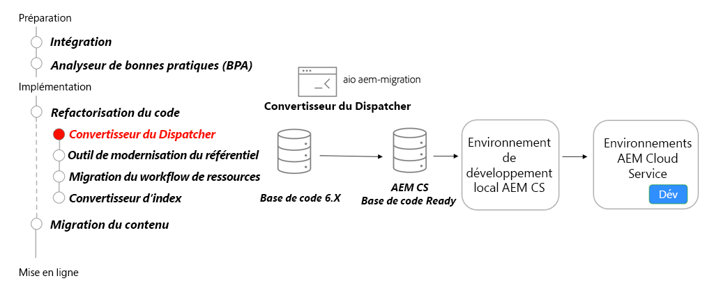

# Dispatcher

Découvrez AEM Dispatcher pour AEM as a Cloud Service en vous concentrant sur les principales différences par rapport au Dispatcher pour AEM 6, sur l’outil de conversion du Dispatcher et sur l’utilisation du SDK des outils du Dispatcher.

>[!VIDEO](https://video.tv.adobe.com/v/336962?quality=12&learn=on)

## Convertisseur du Dispatcher

Dans le cadre de la refactorisation de votre base de code, utilisez le [Convertisseur du Dispatcher AEM](https://experienceleague.adobe.com/docs/experience-manager-cloud-service/moving/refactoring-tools/dispatcher-transformation-utility-tools.html?lang=fr) pour refactoriser les configurations Dispatcher On-Premise ou Adobe Managed Services existantes sur la configuration du Dispatcher compatible AEM as a Cloud Service.

## Activités clés

+ Utilisez l’[Outil convertisseur du Dispatcher Adobe I/O](https://github.com/adobe/aio-cli-plugin-aem-cloud-service-migration#aio-aem-migrationdispatcher-converter) pour migrer une configuration du Dispatcher existante.
+ Référencez le module du Dispatcher à partir de l’[Archétype de projet AEM](https://github.com/adobe/aem-project-archetype/tree/develop/src/main/archetype/dispatcher.cloud) en tant que bonne pratique.
+ [Configurez les outils du Dispatcher local](https://experienceleague.adobe.com/docs/experience-manager-learn/cloud-service/local-development-environment-set-up/dispatcher-tools.html?lang=fr) pour valider le Dispatcher, avant de le tester dans un environnement de service cloud.

## Exercice pratique

Mettez en pratique les connaissances que vous venez d’acquérir grâce à cet exercice.

Avant de commencer cet exercice pratique, assurez-vous d’avoir visionné et bien compris le contenu de la vidéo ci-dessus, ainsi que les documents suivants :

+ [Outils de modernisation d’AEM](./aem-modernization-tools.md)
+ [Intégration](./onboarding.md)
+ [Cloud Manager](./cloud-manager.md)

Assurez-vous également d’avoir terminé l’exercice pratique précédent :

+ [Exercice pratique sur Cloud Manager](./cloud-manager.md#hands-on-exercise)

<table style="border-width:0">
    <tr>
        <td style="width:150px">
                    
        </td>
        <td style="width:100%;margin-bottom:1rem;">
            
Exercice pratique sur les outils du Dispatcher

            

                Explorez l’utilisation des outils du Dispatcher du SDK AEM pour valider les configurations du Dispatcher et exécuter AEM Dispatcher localement à l’aide de Docker.
            

            <a  rel="noreferrer"
                target="_blank"
                href="https://github.com/adobe/aem-cloud-engineering-video-series-exercises/tree/session5-dispatcher#cloud-acceleration-bootcamp---session-5-dispatcher" class="spectrum-Button spectrum-Button--primary spectrum-Button--sizeM">
Essayer les outils du Dispatcher
</a>
        </td>
    </tr>
</table>
