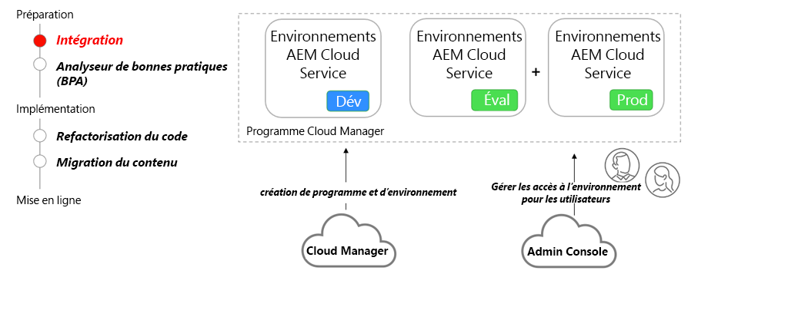

# Intégration à AEM as a Cloud Service

Découvrez comment intégrer AEM as a Cloud Service, de la phase d’établissement du contrat à la configuration des environnements à l’aide de Cloud Manager.

>[!VIDEO](https://video.tv.adobe.com/v/336959?quality=12&learn=on)

## Cloud Manager et Admin Console

L’intégration requiert notamment la création de programmes AEM as a Cloud Service et l’approvisionnement de différents environnements à l’aide d’Adobe Cloud Manager. L’[Admin Console](https://adminconsole.adobe.com/) est utilisée pour attribuer des rôles et fournir aux utilisateurs et utilisatrices de votre entreprise un accès aux environnements AEM.

## Activités clés

+ Un administrateur ou une administratrice système utilise l’[Admin Console](https://adminconsole.adobe.com/) pour attribuer un ou plusieurs utilisateurs ou utilisatrices au profil de produit [Cloud Manager - Personne propriétaire de l’entreprise](https://experienceleague.adobe.com/docs/experience-manager-cloud-manager/using/requirements/setting-up-users-and-roles.html?lang=fr).
+ Les utilisateurs et utilisatrices affectés au profil de produit de la personne propriétaire de l’entreprise utilisent les fonctionnalités en libre-service de [Cloud Manager](https://experienceleague.adobe.com/docs/experience-manager-cloud-manager/using/introduction-to-cloud-manager.html?lang=fr) pour [créer des programmes](https://experienceleague.adobe.com/docs/experience-manager-cloud-service/implementing/using-cloud-manager/production-programs/creating-production-program.html?lang=fr) et [ajouter des environnements](https://experienceleague.adobe.com/docs/experience-manager-cloud-service/implementing/using-cloud-manager/manage-environments.html?lang=fr).
+ Utilisez l’[Admin Console](https://adminconsole.adobe.com/) pour attribuer des développeurs et developpeuses ainsi que des utilisateurs et utilisatrices à divers [rôles Cloud Manager](https://experienceleague.adobe.com/docs/experience-manager-cloud-manager/using/requirements/setting-up-users-and-roles.html?lang=fr) et accorder des autorisations à différents environnements AEM.

## Exercice pratique

Mettez en pratique les connaissances que vous venez d’acquérir grâce à cet exercice.

Avant de commencer cet exercice pratique, assurez-vous d’avoir visionné et bien compris le contenu de la vidéo ci-dessus, ainsi que les documents suivants :

+ [Penser différemment AEM as a Cloud Service](./introduction.md)
+ [Cloud Manager](./cloud-manager.md)

Assurez-vous également d’avoir terminé l’exercice pratique précédent :

+ [Exercice pratique des outils de modernisation d’AEM](./aem-modernization-tools.md#hands-on-exercise)

<table style="border-width:0">
    <tr>
        <td style="width:150px">
                    
        </td>
        <td style="width:100%;margin-bottom:1rem;">
            
Utilisation pratique de l’intégration

            

                Découvrez le processus d’intégration d’AEM as a Cloud Service et comment déployer une application AEM sur le SDK d’Adobe.
            

            <a  rel="noreferrer"
                target="_blank"
                href="https://github.com/adobe/aem-cloud-engineering-video-series-exercises/tree/session3-onboarding#bootcamp---session-3-on-boarding" class="spectrum-Button spectrum-Button--primary spectrum-Button--sizeM">
Essayer l’intégration
</a>
        </td>
    </tr>
</table>
