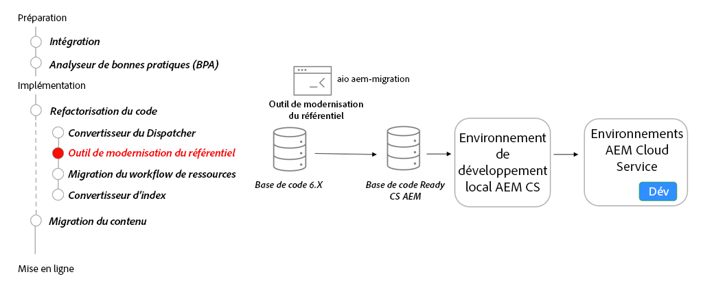

# Modernisation du référentiel

Découvrez la modernisation du référentiel, le contenu modifiable et non modifiable, la structure du package et l’outil d’interface de ligne de commande de l’outil de modernisation du référentiel.

>[!VIDEO](https://video.tv.adobe.com/v/336958/?quality=12&learn=on)

## Outil Repository Modernizer

Dans le cadre de la refactorisation de votre base de code, utilisez le [Outil Repository Modernizer](https://experienceleague.adobe.com/docs/experience-manager-cloud-service/moving/refactoring-tools/repo-modernizer.html?lang=fr) pour restructurer une base de code 6.x en une structure plus moderne.

## Activités clés

* Utilisez la variable [Adobe I/O Repository Modernizer](https://github.com/adobe/aio-cli-plugin-aem-cloud-service-migration#command-aio-aem-migrationrepository-modernizer) pour restructurer un projet en fonction de la structure attendue d’un projet as a Cloud Service AEM.
* Ajustez et corrigez manuellement les erreurs de génération dans la base de code mise à jour.
* Configurez une [environnement de développement local](https://experienceleague.adobe.com/docs/experience-manager-learn/cloud-service/local-development-environment-set-up/overview.html?lang=fr) et déployez la base de code mise à jour. Répétez jusqu’à ce que le projet soit dans un état stable.
* Déployez la base de code mise à jour dans un environnement de développement as a Cloud Service AEM et continuez à valider.
