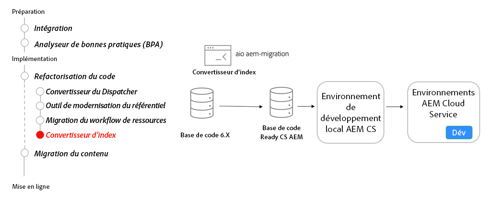

# Recherche et indexation

Découvrez les index de recherche d’AEM as a Cloud Service, comment convertir AEM 6 définitions d’index pour qu’elles soient compatibles avec l’as a Cloud Service et comment déployer les index vers l’as a Cloud Service.

>[!VIDEO](https://video.tv.adobe.com/v/336963?quality=12&learn=on)

## Outil convertisseur d’index

Dans le cadre de la refactorisation de votre base de code, utilisez le [Outil convertisseur d’index](https://github.com/adobe/aio-cli-plugin-aem-cloud-service-migration#command-aio-aem-migrationindex-converter) pour convertir des définitions d’index Oak personnalisées en définitions d’index compatibles AEM.

Consultez la section [documentation du convertisseur d’index](https://experienceleague.adobe.com/docs/experience-manager-cloud-service/content/migration-journey/refactoring-tools/index-converter.html) pour l’ensemble complet et actuel des fonctionnalités du convertisseur d’index.

## Activités clés

+ Utilisez la variable [Adobe I/O Workflow Migrator](https://github.com/adobe/aio-cli-plugin-aem-cloud-service-migration#command-aio-aem-migrationindex-converter) pour migrer les workflows de traitement des ressources afin d’utiliser les microservices Asset compute.
+ Configurez une [environnement de développement local](https://experienceleague.adobe.com/docs/experience-manager-learn/cloud-service/local-development-environment-set-up/overview.html?lang=fr) et déployez les index personnalisés. Vérifiez que les index mis à jour sont à jour.
+ Déployez la base de code mise à jour dans un environnement de développement as a Cloud Service AEM et continuez à valider.
+ Si vous modifiez un index prêt à l’emploi **TOUJOURS** copiez la dernière définition d’index à partir d’un environnement as a Cloud Service AEM s’exécutant sur la dernière version. Modifiez la définition d’index copiée selon vos besoins.

## Exercice pratique

Appliquez vos connaissances en essayant ce que vous avez appris grâce à cet exercice pratique.

Avant d’essayer l’exercice pratique, assurez-vous d’avoir visionné et compris la vidéo ci-dessus, ainsi que les documents suivants :

+ [Penser différemment à AEM as a Cloud Service](./introduction.md)
+ [Modernisation du référentiel](./repository-modernization.md)

Assurez-vous également que vous avez terminé l’exercice pratique précédent :

+ [Exercice pratique de l’outil de transfert de contenu](./content-migration/content-transfer-tool.md#hands-on-exercise)

<table style="border-width:0">
    <tr>
        <td style="width:150px">
                    
        </td>
        <td style="width:100%;margin-bottom:1rem;">
            
Utilisation des index

            

                Explorez la définition et le déploiement des index Oak pour AEM as a Cloud Service.
            

            <a  rel="noreferrer"
                target="_blank"
                href="https://github.com/adobe/aem-cloud-engineering-video-series-exercises/tree/session7-indexes#cloud-acceleration-bootcamp---session-7-search-and-indexing" class="spectrum-Button spectrum-Button--primary spectrum-Button--sizeM">
                Tester l’indexation
            </a>
        </td>
    </tr>
</table>
