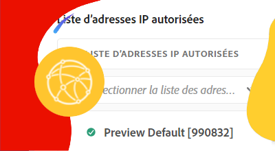

# Réseau privé virtuel (VPN)

Découvrez comment connecter AEM as a Cloud Service à votre VPN pour créer des canaux de communication sécurisés entre AEM et les services internes.

## Qu’est-ce que le réseau privé virtuel ?

Le réseau privé virtuel (VPN) permet à un client as a Cloud Service AEM de se connecter. **les environnements AEM** dans un programme Cloud Manager à un programme existant, [pris en charge](https://experienceleague.adobe.com/docs/experience-manager-cloud-service/content/security/configuring-advanced-networking.html#vpn) VPN. Cela permet des connexions sécurisées et contrôlées entre AEM as a Cloud Service et les services au sein du réseau du client.

Un programme Cloud Manager ne peut avoir qu’une __single__ type d’infrastructure réseau. S’assurer que le réseau privé virtuel est le plus performant [type approprié d’infrastructure réseau](https://experienceleague.adobe.com/docs/experience-manager-cloud-service/content/security/configuring-advanced-networking.html#general-vpn-considerations) pour votre AEM as a Cloud Service avant d’exécuter les commandes suivantes.

>[!NOTE]
>
>Notez que la connexion de l’environnement de génération de Cloud Manager à un VPN n’est pas prise en charge. Si vous devez accéder aux artefacts binaires d’un référentiel privé, vous devez configurer un référentiel sécurisé et protégé par mot de passe avec une URL disponible sur l’Internet public. [comme décrit ici](https://experienceleague.adobe.com/docs/experience-manager-cloud-service/content/implementing/using-cloud-manager/create-application-project/setting-up-project.html#password-protected-maven-repositories).

>[!MORELIKETHIS]
>
> Lisez l’AEM as a Cloud Service [documentation sur la configuration réseau avancée](https://experienceleague.adobe.com/docs/experience-manager-cloud-service/content/security/configuring-advanced-networking.html#vpn) pour plus d’informations sur le réseau privé virtuel.

## Prérequis

Les éléments suivants sont requis lors de la configuration du réseau privé virtuel :

+ Compte Adobe avec [Autorisations du propriétaire commercial Cloud Manager](https://developer.adobe.com/experience-cloud/cloud-manager/guides/getting-started/permissions/)
+ Accès à [Informations d’identification d’authentification de l’API Cloud Manager](https://developer.adobe.com/experience-cloud/cloud-manager/guides/getting-started/authentication/)
   + ID d’organisation (alias ID d’organisation IMS)
   + ID client (alias clé API)
   + Jeton d’accès (ou jeton porteur)
+ ID de programme Cloud Manager
+ ID d’environnement de Cloud Manager
+ Un réseau privé virtuel, avec accès à tous les paramètres de connexion nécessaires.

Pour plus d’informations, consultez la présentation suivante pour savoir comment configurer, configurer et obtenir les informations d’identification de l’API Cloud Manager, et comment les utiliser pour effectuer un appel de l’API Cloud Manager.

>[!VIDEO](https://video.tv.adobe.com/v/342235/?quality=12&learn=on)

Ce tutoriel utilise `curl` pour créer les configurations de l’API Cloud Manager. Le `curl` supposent une syntaxe Linux/macOS. Si vous utilisez l’invite de commande Windows, remplacez la variable `\` caractère de saut de ligne avec `^`.

## Activer le réseau privé virtuel par programme

Commencez par activer le réseau privé virtuel sur AEM as a Cloud Service.

1. Tout d’abord, déterminez la région dans laquelle le réseau avancé est nécessaire à l’aide de l’API Cloud Manager. [listRegion](https://developer.adobe.com/experience-cloud/cloud-manager/reference/api/) opération. Le `region name` est nécessaire pour effectuer les appels d’API Cloud Manager suivants. En règle générale, la région dans laquelle réside l’environnement de production est utilisée.

   Recherchez la région de votre environnement as a Cloud Service AEM dans [Cloud Manager](https://my.cloudmanager.adobe.com) sous le [détails de l’environnement](https://experienceleague.adobe.com/docs/experience-manager-cloud-service/content/implementing/using-cloud-manager/manage-environments.html?lang=en#viewing-environment). Le nom de région affiché dans Cloud Manager peut être [mappé au code de région](https://developer.adobe.com/experience-cloud/cloud-manager/guides/api-usage/creating-programs-and-environments/#creating-aem-cloud-service-environments) utilisé dans l’API Cloud Manager.

   __requête HTTP listRegion__

   ```shell
   $ curl -X GET https://cloudmanager.adobe.io/api/program/{programId}/regions \
       -H 'x-gw-ims-org-id: <ORGANIZATION_ID>' \
       -H 'x-api-key: <CLIENT_ID>' \
       -H 'Authorization: Bearer <ACCESS_TOKEN>' \
       -H 'Content-Type: application/json'
   ```

1. Activation du réseau privé virtuel pour un programme Cloud Manager à l’aide des API Cloud Manager [createNetworkInfrastructure](https://developer.adobe.com/experience-cloud/cloud-manager/reference/api/) opération. Utilisez les `region` code obtenu à partir de l’API Cloud Manager `listRegions` opération.

   __requête HTTP createNetworkInfrastructure__

   ```shell
   $ curl -X POST https://cloudmanager.adobe.io/api/program/{programId}/networkInfrastructures \
       -H 'x-gw-ims-org-id: <ORGANIZATION_ID>' \
       -H 'x-api-key: <CLIENT_ID>' \
       -H 'Authorization: Bearer <ACCESS_TOKEN>' \
       -H 'Content-Type: application/json'
       -d @./vpn-create.json
   ```

   Définition des paramètres JSON dans une `vpn-create.json` et fourni à curl via `... -d @./vpn-create.json`.

   [Téléchargez l’exemple vpn-create.json](./assets/vpn-create.json).  Ce fichier n’est qu’un exemple. Configurez votre fichier selon les besoins en fonction des champs facultatifs/obligatoires documentés à l’adresse [enableEnvironmentAdvancedNetworkingConfiguration](https://developer.adobe.com/experience-cloud/cloud-manager/reference/api/).

   ```json
   {
       "kind": "vpn",
       "region": "va7",
       "addressSpace": [
           "10.104.182.64/26"
       ],
       "dns": {
           "resolvers": [
               "10.151.201.22",
               "10.151.202.22",
               "10.154.155.22"
           ],
           "domains": [
               "wknd.site",
               "wknd.com"
           ]
       },
       "connections": [{
           "name": "connection-1",
           "gateway": {
               "address": "195.231.212.78",
               "addressSpace": [
                   "10.151.0.0/16",
                   "10.152.0.0/16",
                   "10.153.0.0/16",
                   "10.154.0.0/16",
                   "10.142.0.0/16",
                   "10.143.0.0/16",
                   "10.124.128.0/17"
               ]
           },
           "sharedKey": "<secret_shared_key>",
           "ipsecPolicy": {
               "dhGroup": "ECP256",
               "ikeEncryption": "AES256",
               "ikeIntegrity": "SHA256",
               "ipsecEncryption": "AES256",
               "ipsecIntegrity": "SHA256",
               "pfsGroup": "ECP256",
               "saDatasize": 102400000,
               "saLifetime": 3600
           }
       }]
   }
   ```

   Patientez 45 à 60 minutes pendant que le programme Cloud Manager approvisionne l’infrastructure réseau.

1. Vérifier que l&#39;environnement est terminé __Réseau privé virtuel__ configuration à l’aide de l’API Cloud Manager [getNetworkInfrastructure](https://developer.adobe.com/experience-cloud/cloud-manager/reference/api/#operation/getNetworkInfrastructure) , à l’aide de la fonction `id` renvoyée par la requête HTTP createNetworkInfrastructure de l’étape précédente.

   __requête HTTP getNetworkInfrastructure__

   ```shell
   $ curl -X GET https://cloudmanager.adobe.io/api/program/{programId}/networkInfrastructure/{networkInfrastructureId} \
       -H 'x-gw-ims-org-id: <ORGANIZATION_ID>' \
       -H 'x-api-key: <CLIENT_ID>' \
       -H 'Authorization: <YOUR_BEARER_TOKEN>' \
       -H 'Content-Type: application/json'
   ```

   Vérifiez que la réponse HTTP contient une __status__ de __ready__. Si vous n’êtes pas encore prêt, vérifiez l’état toutes les quelques minutes.

## Configuration de proxys de réseau privé virtuel par environnement

1. Activez et configurez les __Réseau privé virtuel__ configuration sur chaque environnement as a Cloud Service AEM à l’aide de l’API Cloud Manager [enableEnvironmentAdvancedNetworkingConfiguration](https://developer.adobe.com/experience-cloud/cloud-manager/reference/api/) opération.

   __requête HTTP enableEnvironmentAdvancedNetworkingConfiguration__

   ```shell
   $ curl -X PUT https://cloudmanager.adobe.io/api/program/{programId}/environment/{environmentId}/advancedNetworking \
       -H 'x-gw-ims-org-id: <ORGANIZATION_ID>' \
       -H 'x-api-key: <CLIENT_ID>' \
       -H 'Authorization: Bearer <ACCESS_TOKEN>' \
       -H 'Content-Type: application/json' \
       -d @./vpn-configure.json
   ```

   Définition des paramètres JSON dans une `vpn-configure.json` et fourni à curl via `... -d @./vpn-configure.json`.

[Téléchargez l’exemple vpn-configure.json](./assets/vpn-configure.json)

   ```json
   {
       "nonProxyHosts": [
           "example.net",
           "*.example.org"
       ],
       "portForwards": [
           {
               "name": "mysql.example.com",
               "portDest": 3306,
               "portOrig": 30001
           },
           {
               "name": "smtp.sendgrid.com",
               "portDest": 465,
               "portOrig": 30002
           }
       ]
   }
   ```

   `nonProxyHosts` déclare un ensemble d’hôtes pour lequel le port 80 ou 443 doit être acheminé par les plages d’adresses IP partagées par défaut plutôt que par l’adresse IP sortante dédiée. `nonProxyHosts` peut s’avérer utile, car le trafic passant par les adresses IP partagées peut être optimisé automatiquement par Adobe.

   Pour chaque `portForwards` , la mise en réseau avancée définit la règle de transfert suivante :

   | Hôte du proxy | Port du proxy |  | Hôte externe | Port externe |
   |---------------------------------|----------|----------------|------------------|----------|
   | `AEM_PROXY_HOST` | `portForwards.portOrig` | → | `portForwards.name` | `portForwards.portDest` |

   Si votre déploiement AEM __only__ nécessite des connexions HTTP/HTTPS à un service externe ; laissez la variable `portForwards` vide, car ces règles ne sont requises que pour les requêtes non HTTP/HTTPS.


1. Pour chaque environnement, validez les règles de routage vpn en vigueur à l’aide de l’API Cloud Manager. [getEnvironmentAdvancedNetworkingConfiguration](https://developer.adobe.com/experience-cloud/cloud-manager/reference/api/) opération.

   __requête HTTP getEnvironmentAdvancedNetworkingConfiguration__

   ```shell
   $ curl -X GET https://cloudmanager.adobe.io/api/program/{programId}/environment/{environmentId}/advancedNetworking \
       -H 'x-gw-ims-org-id: <ORGANIZATION_ID>' \
       -H 'x-api-key: <CLIENT_ID>' \
       -H 'Authorization: Bearer <ACCESS_TOKEN>' \
       -H 'Content-Type: application/json'
   ```

1. Les configurations de proxy de réseau privé virtuel peuvent être mises à jour à l’aide de l’API Cloud Manager. [enableEnvironmentAdvancedNetworkingConfiguration](https://developer.adobe.com/experience-cloud/cloud-manager/reference/api/) opération. Mémoriser `enableEnvironmentAdvancedNetworkingConfiguration` est un `PUT` toutes les règles doivent donc être fournies avec chaque appel de cette opération.

1. Vous pouvez désormais utiliser la configuration de sortie de réseau privé virtuel dans votre code d’AEM personnalisé et dans votre configuration.

## Connexion à des services externes via le réseau privé virtuel

Lorsque le réseau privé virtuel est activé, le code AEM et la configuration peuvent les utiliser pour lancer des appels à des services externes via le VPN. Il existe deux types d’appels externes qui AEM traitent différemment :

1. Appels HTTP/HTTPS aux services externes
   + Inclut les appels HTTP/HTTPS effectués aux services s’exécutant sur des ports autres que les ports 80 ou 443 standard.
1. Appels non HTTP/HTTPS aux services externes
   + Inclut tous les appels non HTTP, tels que les connexions aux serveurs de messagerie, aux bases de données SQL ou aux services qui s’exécutent sur d’autres protocoles non HTTP/HTTPS.

Les requêtes HTTP/HTTPS provenant d’AEM sur les ports standard (80/443) sont autorisées par défaut, mais elles n’utiliseront pas la connexion VPN si elles ne sont pas configurées correctement comme décrit ci-dessous.

### HTTP/HTTPS

Lors de la création de connexions HTTP/HTTPS à partir d’AEM, lors de l’utilisation de VPN, les connexions HTTP/HTTPS sont automatiquement traitées par proxy hors d’AEM. Aucun code ou configuration supplémentaire n’est requis pour la prise en charge des connexions HTTP/HTTPS.

>[!TIP]
>
> Voir la documentation d’AEM sur le réseau privé virtuel d’as a Cloud Service pour [l’ensemble complet des règles de routage](https://experienceleague.adobe.com/docs/experience-manager-cloud-service/content/security/configuring-advanced-networking.html#vpn-traffic-routing).

#### Exemples de code

<table>
<tr>
<td>
    <a  href="./examples/http-dedicated-egress-ip-vpn.md"></a>
    <div><strong><a href="./examples/http-dedicated-egress-ip-vpn.md">HTTP/HTTPS</a></strong></div>
    <p>
        Exemple de code Java™ permettant d’établir une connexion HTTP/HTTPS d’AEM as a Cloud Service à un service externe à l’aide du protocole HTTP/HTTPS.
    </p>
</td>
<td></td>
<td></td>
</tr>
</table>

### Exemples de code de connexions non HTTP/HTTPS

Lors de la création de connexions non HTTP/HTTPS (ex. SQL, SMTP, etc.) depuis AEM, la connexion doit être établie par un nom d’hôte spécial fourni par AEM.

| Nom de variable | Utilisation | Code Java™ | Configuration OSGi | | - | - | - | - | | `AEM_PROXY_HOST` | Hôte proxy pour les connexions non HTTP/HTTPS | `System.getenv("AEM_PROXY_HOST")` | `$[env:AEM_PROXY_HOST]` |


Les connexions à des services externes sont ensuite appelées par l’intermédiaire de la fonction `AEM_PROXY_HOST` et le port mappé (`portForwards.portOrig`), qui AEM ensuite achemine vers le nom d’hôte externe mappé (`portForwards.name`) et port (`portForwards.portDest`).

| Hôte du proxy | Port du proxy |  | Hôte externe | Port externe |
|---------------------------------|----------|----------------|------------------|----------|
| `AEM_PROXY_HOST` | `portForwards.portOrig` | → | `portForwards.name` | `portForwards.portDest` |


#### Exemples de code

<table><tr>
   <td>
      <a  href="./examples/sql-datasourcepool.md"></a>
      <div><strong><a href="./examples/sql-datasourcepool.md">Connexion SQL à l’aide de JDBC DataSourcePool</a></strong></div>
      <p>
            Exemple de code Java™ se connectant à des bases de données SQL externes en configurant AEM pool de sources de données JDBC.
      </p>
    </td>
   <td>
      <a  href="./examples/sql-java-apis.md"></a>
      <div><strong><a href="./examples/sql-java-apis.md">Connexion SQL à l’aide des API Java™</a></strong></div>
      <p>
            Exemple de code Java™ se connectant à des bases de données SQL externes à l’aide des API SQL de Java™.
      </p>
    </td>
   <td>
      <a  href="./examples/email-service.md"></a>
      <div><strong><a href="./examples/email-service.md">Service de messagerie électronique</a></strong></div>
      <p>
        Exemple de configuration OSGi utilisant AEM pour se connecter à des services de messagerie externes.
      </p>
    </td>
</tr></table>

### Limiter l&#39;accès à AEM as a Cloud Service via VPN

La configuration du réseau privé virtuel limite l’accès à AEM environnements as a Cloud Service à un VPN.

#### Exemples de configuration

<table><tr>
   <td>
      <a href="https://experienceleague.adobe.com/docs/experience-manager-cloud-service/content/implementing/using-cloud-manager/ip-allow-lists/apply-allow-list.html"></a>
      <div><strong><a href="https://experienceleague.adobe.com/docs/experience-manager-cloud-service/content/implementing/using-cloud-manager/ip-allow-lists/apply-allow-list.html">Application d’une liste autorisée IP</a></strong></div>
      <p>
            Configurez une liste autorisée IP de sorte que seul le trafic VPN puisse accéder à AEM.
      </p>
    </td>
   <td>
      <a  href="https://experienceleague.adobe.com/docs/experience-manager-cloud-service/content/security/configuring-advanced-networking.html#restrict-vpn-to-ingress-connections"></a>
      <div><strong><a href="https://experienceleague.adobe.com/docs/experience-manager-cloud-service/content/security/configuring-advanced-networking.html#restrict-vpn-to-ingress-connections">Restrictions d’accès VPN basées sur un chemin d’accès à AEM Publish</a></strong></div>
      <p>
            Nécessite un accès VPN pour des chemins spécifiques sur AEM Publish.
      </p>
    </td>
   <td></td>
</tr></table>
