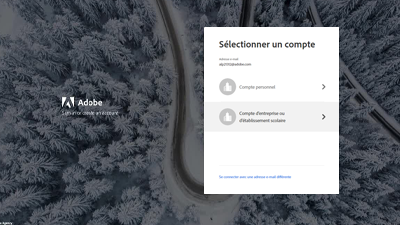

# Présentation {#overview}

Adobe Experience Manager (AEM) est désormais disponible en tant que Cloud Service. AEM as a Cloud Service présente la nouvelle génération de la gamme de produits Experience Manager, en s’appuyant sur les investissements et les innovations passés, en préservant et en étendant tous les cas d’utilisation et fonctionnalités.

>[!VIDEO](https://video.tv.adobe.com/v/31085/?quality=12&learn=on)

## Nouveautés

* **[Authentification basée sur les jetons (tutoriel)](https://experienceleague.adobe.com/docs/experience-manager-learn/getting-started-with-aem-headless/authentication/overview.html)**

   *Découvrez comment utiliser l’authentification par jeton pour interagir avec AEM en tant que Cloud Service sur HTTP*

* **[GraphQL sans tête (tutoriel)](https://experienceleague.adobe.com/docs/experience-manager-learn/getting-started-with-aem-headless/graphql/overview.html)**

   *Découvrez comment utiliser AEM API GraphQL pour alimenter des expériences dans une application externe.*

* **[Importation en bloc (vidéo)](./migration/bulk-import.md)**

   *Découvrez comment importer en masse des ressources dans AEM à partir d’Azure Blob Storage ou d’Amazon S3*

* **[asset compute metadata Worker (tutoriel)](./asset-compute/advanced/metadata.md)**

   *Découvrez comment réécrire des métadonnées de ressource dans AEM à partir de collaborateurs d’un Asset compute*

* **[Extensibilité des microservices Asset compute (tutoriel)](./asset-compute/overview.md)**

   *Découvrez comment développer des objets Worker Asset compute pour générer des rendus de ressources personnalisés*

## Sélections du personnel

<table>
   <td>
      
      

         <a href="./accessing/overview.md">
         <strong>Configuration de l’accès à AEM tutoriel</strong>
         </a>
      

      

         <em>Configurez les utilisateurs IMS dans Adobe Admin Console pour accéder à AEM.</em>
      

   </td>   
   <td>
      
      

         <a href="./local-development-environment/overview.md">
         <strong>Tutoriel sur la configuration de l’environnement de développement local</strong>
         </a>
      

      

         <em>Préparez votre machine de développement locale à AEM en tant que développement de Cloud Service !</em>
      

   </td>   
   <td>
      
      

         <a href="./debugging/aem-sdk-local-quickstart/overview.md">
         <strong>Débogage AEM SDK</strong>
         </a>
      

      

         <em>Explorez les outils utilisés pour déboguer votre application sur le démarrage rapide local du SDK AEM as a Cloud Service.</em>
      

   </td>
</table>

## Ressources supplémentaires

* [Experience League - Explorer Adobe Experience Manager](https://experienceleague.adobe.com/#recommended/solutions/experience-manager)
* [Documentation d’Adobe Experience Manager as a Cloud Service](https://docs.adobe.com/content/help/fr-FR/experience-manager-cloud-service/landing/home.html)
