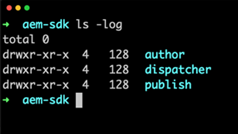

# Vidéos et tutoriels AEM as a Cloud Service {#overview}

{{edge-delivery-services}}

Adobe Experience Manager (AEM) est désormais disponible as a Cloud Service. AEM as a Cloud Service représente la nouvelle génération de la gamme de produits Experience Manager, qui s’appuie sur les investissements et les innovations passés, tout en préservant et en étendant tous les cas d’utilisation et fonctionnalités.

>[!VIDEO](https://video.tv.adobe.com/v/31085?quality=12&learn=on)

## Nouveautés

* **[Protection des sites web avec des règles de filtrage du trafic y compris des règles WAF (tutoriel)](https://experienceleague.adobe.com/docs/experience-manager-learn/cloud-service/security/traffic-filter-and-waf-rules/overview.html)**
  *Découvrez comment utiliser les règles de filtrage du trafic y compris les règles WAF pour protéger les sites web*

* **[Authentification basée sur les jetons (tutoriel)](https://experienceleague.adobe.com/docs/experience-manager-learn/getting-started-with-aem-headless/authentication/overview.html?lang=fr)**
  *Découvrez comment utiliser l’authentification basée sur les jetons pour interagir avec AEM as a Cloud Service sur HTTP*.

* **[GraphQL découplé (tutoriel)](https://experienceleague.adobe.com/docs/experience-manager-learn/getting-started-with-aem-headless/graphql/overview.html?lang=fr)**
  *Découvrez comment utiliser les API GraphQL d’AEM pour alimenter des expériences dans une application externe.*

* **[Programme de travail de métadonnées Asset Compute (tutoriel)](./asset-compute/advanced/metadata.md)**
  *Découvrez comment écrire des métadonnées de ressource pour les renvoyer à AEM à partir d’un programme de travail d’Asset Compute*.

* **[Extensibilité des microservices d’Asset Compute (tutoriel)](./asset-compute/overview.md)**
  *Découvrez comment développer des programmes de travail d’Asset Compute pour générer des rendus de ressources personnalisés*.

## Sélections du personnel

<table>
   <td>
      
      

         <a href="./accessing/overview.md">
<strong>Configurer l’accès à AEM (tutoriel)</strong>
</a>
      

      

         <em>Configurez les utilisateurs et utilisatrices IMS dans Adobe Admin Console pour accéder à AEM.</em>
      

   </td>   
   <td>
      
      

         <a href="./local-development-environment/overview.md">
<strong>Tutoriel sur la configuration de l’environnement de développement local</strong>
</a>
      

      

         <em>Préparez votre machine de développement local au développement avec AEM as a Cloud Service.</em>
      

   </td>   
   <td>
      
      

         <a href="./debugging/aem-sdk-local-quickstart/overview.md">
<strong>Déboguer le SDK d’AEM</strong>
</a>
      

      

         <em>Explorez les outils utilisés pour déboguer votre application sur le démarrage rapide local du SDK d’AEM as a Cloud Service.</em>
      

   </td>
</table>

## Ressources supplémentaires

* [Documentation Adobe Experience Manager as a Cloud Service](https://experienceleague.adobe.com/docs/experience-manager-cloud-service/landing/home.html?lang=fr)
