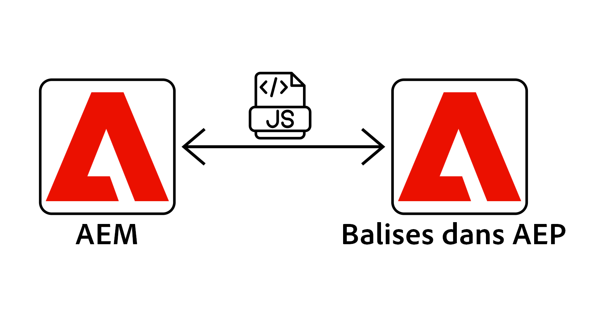
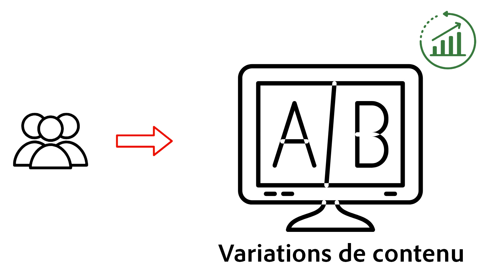

# Présentation de la personnalisation

Découvrez comment AEM as a Cloud Service (AEMCS) s’intègre à Adobe Target et Adobe Experience Platform (AEP). Découvrez comment offrir des expériences personnalisées à l’aide de tests A/B, en ciblant les utilisateurs en fonction de leur comportement ou en personnalisant le contenu à l’aide de profils client.

## Prérequis

Pour démontrer divers scénarios de personnalisation, ce tutoriel utilise l’exemple de projet [AEM WKND](https://github.com/adobe/aem-guides-wknd/). Pour suivre, vous avez besoin de :

- Une organisation Adobe ayant accès à :
   - **environnement AEM as a Cloud Service** - pour créer et gérer du contenu
   - **Adobe Target** - pour composer et diffuser des expériences personnalisées
   - **Applications Adobe Experience Platform** - pour gérer les profils et audiences de clients
   - **Balises (anciennement Launch) dans AEP** - pour déployer le SDK Web et le JavaScript personnalisé pour la collecte de données et la personnalisation

- Compréhension de base des composants AEM et des fragments d’expérience

- Le projet [AEM WKND](https://github.com/adobe/aem-guides-wknd/) déployé dans votre environnement AEM as a Cloud Service.

## Commencer

Avant d’explorer des cas d’utilisation spécifiques, vous devez d’abord configurer AEM as a Cloud Service pour la personnalisation. Commencez par intégrer Adobe Target et les balises pour activer la personnalisation côté client à l’aide de la SDK web AEP. Ces étapes fondamentales permettent à vos pages AEM de prendre en charge l’expérimentation, le ciblage des audiences et la personnalisation en temps réel.

<!-- CARDS
{target = _self}

* ./setup/integrate-adobe-target.md
  {title = Integrate Adobe Target}
  {description = Integrate AEMCS with Adobe Target to activate personalized content as Adobe Target offers.}
  {image = ./assets/setup/integrate-target.png}
  {cta = Integrate Target}

* ./setup/integrate-adobe-tags.md
  {title = Integrate Tags}
  {description = Integrate AEMCS with Tags to inject the Web SDK and custom JavaScript for data collection and personalization.}
  {image = ./assets/setup/integrate-tags.png}
  {cta = Integrate Tags}
-->
<!-- START CARDS HTML - DO NOT MODIFY BY HAND -->

    

        

            

                <figure class="image x-is-16by9">
                    
                </figure>
            

            

                

                    

                        <a href="./setup/integrate-adobe-target.md" target="_self" rel="referrer" title="Intégrer Adobe Target">Intégrer Adobe Target</a>
                    

                    
Intégrez AEMCS à Adobe Target pour activer le contenu personnalisé en tant qu’offres Adobe Target.

                

                <a href="./setup/integrate-adobe-target.md" target="_self" rel="referrer" class="spectrum-Button spectrum-Button--outline spectrum-Button--primary spectrum-Button--sizeM" style="align-self: flex-start; margin-top: 1rem;">
                    Intégrer Target
                </a>
            

        

    

    

        

            

                <figure class="image x-is-16by9">
                    
                </figure>
            

            

                

                    

                        <a href="./setup/integrate-adobe-tags.md" target="_self" rel="referrer" title="Intégration de balises">Intégrer des balises</a>
                    

                    
Intégrez AEM CS aux balises pour injecter le SDK web et le JavaScript personnalisé pour la collecte de données et la personnalisation.

                

                <a href="./setup/integrate-adobe-tags.md" target="_self" rel="referrer" class="spectrum-Button spectrum-Button--outline spectrum-Button--primary spectrum-Button--sizeM" style="align-self: flex-start; margin-top: 1rem;">
                    Intégrer des balises
                </a>
            

        

    

<!-- END CARDS HTML - DO NOT MODIFY BY HAND -->

## Cas d’utilisation

Explorez les cas d’utilisation courants de la personnalisation ci-dessous pris en charge par AEMCS, Adobe Target et Adobe Experience Platform.

<!-- CARDS
{target = _self}

* ./use-cases/experimentation.md
  {title = Experimentation (A/B Testing)}
  {description = Learn how to test different content variations in AEMCS using Adobe Target for A/B testing.}
  {image = ./assets/use-cases/experiment/experimentation.png}
  {cta = Learn Experimentation}
-->
<!-- START CARDS HTML - DO NOT MODIFY BY HAND -->

    

        

            

                <figure class="image x-is-16by9">
                    
                </figure>
            

            

                

                    

                        <a href="./use-cases/experimentation.md" target="_self" rel="referrer" title="Expérimentation (Test A/B)">Expérimentation (Tests A/B)</a>
                    

                    
Découvrez comment tester différentes variations de contenu dans AEM CS à l’aide d’Adobe Target pour les tests A/B.

                

                <a href="./use-cases/experimentation.md" target="_self" rel="referrer" class="spectrum-Button spectrum-Button--outline spectrum-Button--primary spectrum-Button--sizeM" style="align-self: flex-start; margin-top: 1rem;">
                    Apprendre l’expérimentation
                </a>
            

        

    

<!-- END CARDS HTML - DO NOT MODIFY BY HAND -->

