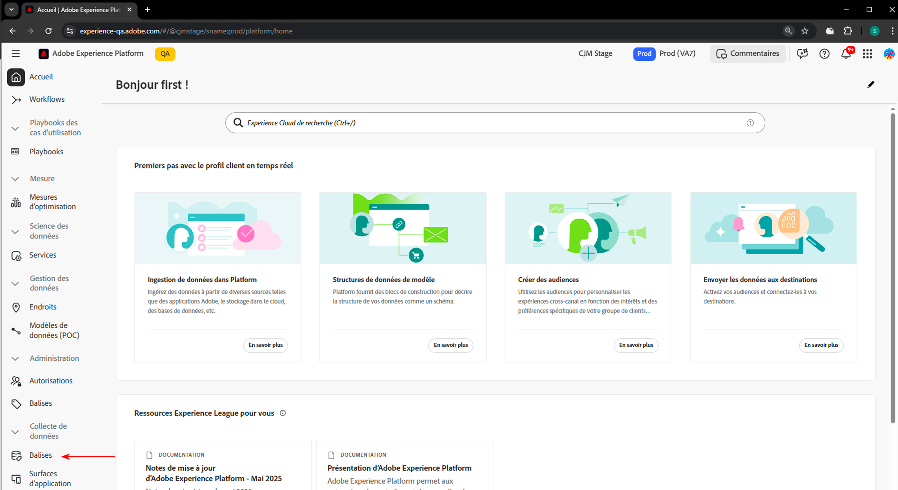
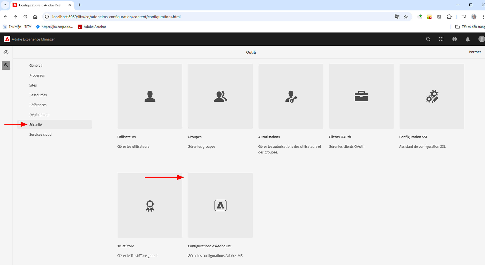
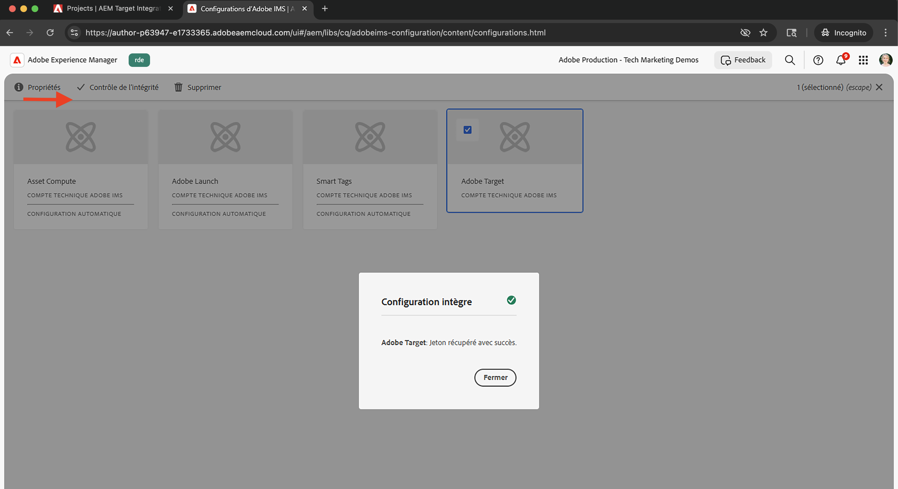
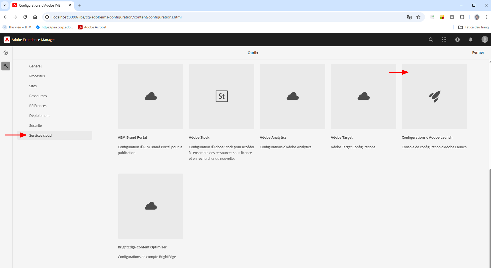
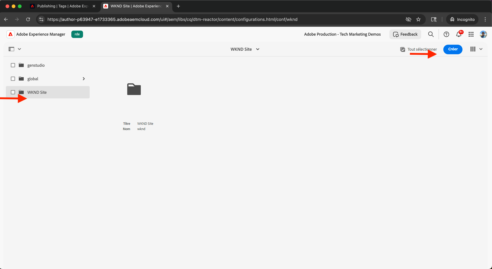
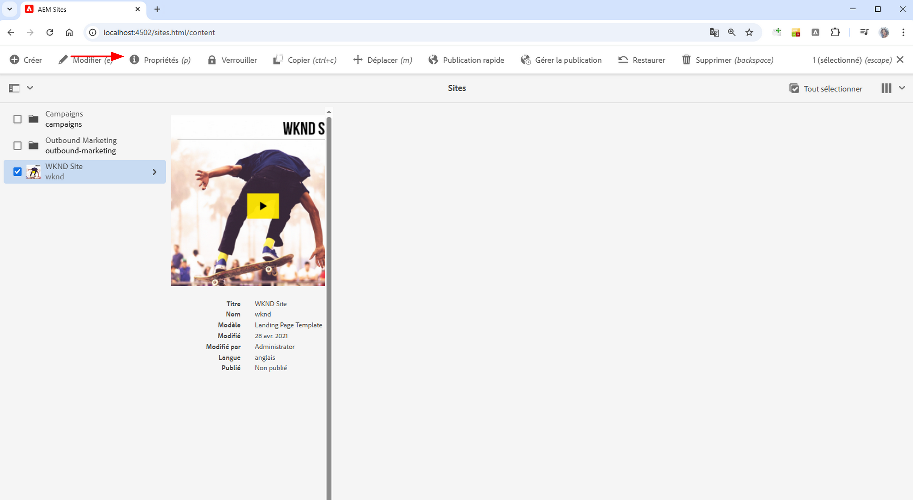
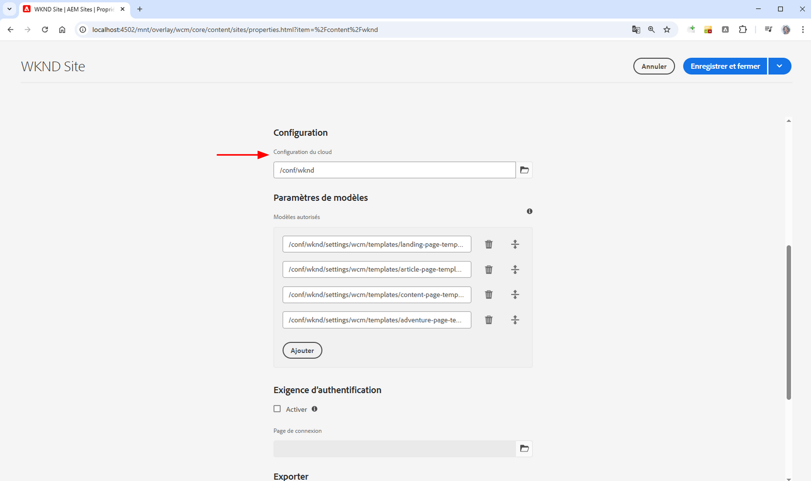

# Intégrer Tags à Adobe Experience Platform

Découvrez comment intégrer AEM as a Cloud Service (AEMCS) à Tags dans Adobe Experience Platform. L’intégration de Tags (alias Launch) vous permet de déployer le SDK web d’Adobe et d’injecter du JavaScript personnalisé pour la collecte de données et la personnalisation dans vos pages AEM.

L’intégration permet à votre équipe marketing ou de développement de gérer et de déployer du JavaScript pour la personnalisation et la collecte de données, sans avoir à redéployer de code AEM.

## Étapes avancées

Le processus d’intégration comprend quatre étapes principales qui permettent d’établir la connexion entre AEM et Tags :

1. **Créer, configurer et publier une propriété Tags dans Adobe Experience Platform**
2. **Vérifier une configuration d’Adobe IMS pour Tags dans AEM**
3. **Créer une configuration de Tags dans AEM**
4. **Appliquer la configuration de Tags à vos pages AEM**

## Créer, configurer et publier une propriété Tags dans Adobe Experience Platform

Commencez par créer une propriété Tags dans Adobe Experience Platform. Cette propriété vous aide à gérer le déploiement du SDK Adobe Web et de tout JavaScript personnalisé requis pour la personnalisation et la collecte de données.

1. Accédez à [Adobe Experience Platform](https://experience.adobe.com/platform), connectez-vous avec votre Adobe ID, puis accédez à **Tags** à partir du menu de gauche.\
   

2. Cliquez sur **Nouvelle propriété** pour créer une propriété Tags.\
   

3. Dans la fenêtre **Créer une propriété**, saisissez les informations suivantes :
   - **Nom de la propriété** : nom de votre propriété Tags.
   - **Type de propriété** : sélectionnez **Web**.
   - **Domaine** : domaine dans lequel vous déployez la propriété (par exemple, `.adobeaemcloud.com`).

   Cliquez sur **Enregistrer**.

   

4. Ouvrez la nouvelle propriété. L’extension **Core** doit déjà être incluse. Vous ajouterez ultérieurement l’extension **SDK web** lors de la configuration du cas d’utilisation Expérimentation, car il requiert une configuration supplémentaire telle que l’**ID de flux de données**.\
   

5. Publiez la propriété Tags en accédant à **Flux de publication** et en cliquant sur **Ajouter une bibliothèque** pour créer une bibliothèque de déploiements.
   

6. Dans la boîte de dialogue **Créer une bibliothèque**, fournissez les informations suivantes :
   - **Nom** : nom de votre bibliothèque.
   - **Environnement** : sélectionnez **Développement**.
   - **Modifications des ressources** : choisissez **Ajouter toutes les ressources modifiées**.

   Cliquez sur **Enregistrer et créer pour le développement**.

   

7. Pour publier la bibliothèque en production, cliquez sur **Approuver et publier en production**. Une fois la publication terminée, la propriété est prête à être utilisée dans AEM.\
   

## Vérifier une configuration d’Adobe IMS pour Tags dans AEM

Lorsqu’un environnement AEMCS est configuré, il inclut automatiquement une configuration d’Adobe IMS pour Tags, ainsi qu’un projet Adobe Developer Console correspondant. Cette configuration garantit la sécurité de la communication de l’API entre AEM et Tags.

1. Dans AEM, accédez à **Outils** > **Sécurité** > **Configurations d’Adobe IMS**.\
   

2. Recherchez la configuration d’**Adobe Launch**. Le cas échéant, sélectionnez-la et cliquez sur **Contrôler l’intégrité** pour vérifier la connexion. Vous devriez voir une réponse de succès.\
   

## Créer une configuration de Tags dans AEM

Créez une configuration de Tags dans AEM pour spécifier la propriété et les paramètres nécessaires pour les pages de votre site.

1. Dans AEM, accédez à **Outils** > **Services cloud** > **Configurations d’Adobe Launch**.\
   

2. Sélectionnez le dossier racine de votre site (par exemple, WKND Site) et cliquez sur **Créer**.\
   

3. Dans la boîte de dialogue, saisissez les informations suivantes :
   - **Titre** : par exemple, « Adobe Tags ».
   - **Configuration d’IMS** : sélectionnez la configuration d’**Adobe Launch** IMS vérifiée.
   - **Société** : sélectionnez la société liée à votre propriété Tags.
   - **Propriété** : choisissez la propriété Tags créée précédemment.

   Cliquez sur **Suivant**.

   

4. Pour la démonstration, conservez les valeurs par défaut pour les environnements **Évaluation** et **Production**. Cliquez sur **Créer**.\
   

5. Sélectionnez la configuration que vous venez de créer et cliquez sur **Publier** pour la rendre disponible pour les pages de votre site.\
   

## Appliquer la configuration de Tags à votre site AEM

Appliquez la configuration de Tags pour injecter le SDK web et la logique de personnalisation dans les pages de votre site.

1. Dans AEM, accédez à **Sites**, sélectionnez le dossier racine de votre site (par exemple, WKND Site), puis cliquez sur **Propriétés**.\
   

2. Dans la boîte de dialogue **Propriétés du site**, ouvrez l’onglet **Avancé**. Sous **Configurations**, vérifiez que `/conf/wknd` est sélectionné pour **Configuration du cloud**.\
   

## Vérifier l’intégration

Pour vérifier que la configuration de Tags fonctionne correctement, vous pouvez :

1. Vérifier la source d’affichage d’une page de publication AEM ou l’inspecter à l’aide des outils de développement du navigateur
2. Utiliser [Adobe Experience Platform Debugger](https://chromewebstore.google.com/detail/adobe-experience-platform/bfnnokhpnncpkdmbokanobigaccjkpob) pour valider l’injection du SDK web et du JavaScript

## Ressources supplémentaires

- [Vue d’ensemble d’Adobe Experience Platform Debugger](https://experienceleague.adobe.com/fr/docs/experience-platform/debugger/home)
- [Vue d’ensemble de Tags](https://experienceleague.adobe.com/fr/docs/experience-platform/tags/home)
