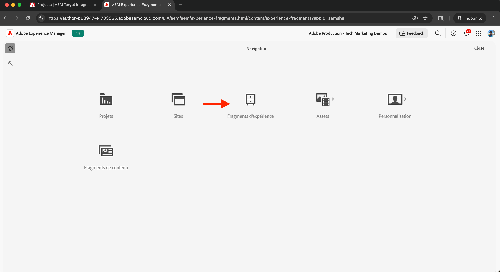

# Intégrer Adobe Target

Découvrez comment intégrer AEM as a Cloud Service (AEMCS) à Adobe Target pour activer du contenu personnalisé, tel que des fragments d’expérience, en tant qu’offres dans Adobe Target.

L’intégration permet à votre équipe marketing de créer et de gérer du contenu personnalisé de manière centralisée dans AEM. Ce contenu peut ensuite être activé de manière transparente en tant qu’offres dans Adobe Target.

>[!IMPORTANT]
>
>L’étape d’intégration est facultative si votre équipe préfère gérer les offres entièrement dans Adobe Target, sans utiliser AEM comme référentiel de contenu centralisé.

## Étapes de haut niveau

Le processus d’intégration comprend quatre étapes principales pour établir la connexion entre AEM et Adobe Target :

1. **Créer et configurer un projet Adobe Developer Console**
2. **Créer une configuration Adobe IMS pour Target dans AEM**
3. **Créer une configuration Adobe Target héritée dans AEM**
4. **Application de la configuration Adobe Target aux fragments d’expérience**

## Création et configuration d’un projet Adobe Developer Console

Pour permettre à AEM de communiquer en toute sécurité avec Adobe Target, vous devez configurer un projet Adobe Developer Console à l’aide de l’authentification serveur à serveur OAuth. Vous pouvez utiliser un projet existant ou en créer un nouveau.

1. Accédez à [Adobe Developer Console](https://developer.adobe.com/console) et connectez-vous avec votre Adobe ID.

2. Créez un projet ou sélectionnez-en un existant.\
   

3. Cliquez sur **Ajouter une API**. Dans la boîte de dialogue **Ajouter une API**, filtrez par **Experience Cloud**, sélectionnez **Adobe Target**, puis cliquez sur **Suivant**.\
   

4. Dans la boîte de dialogue **Configurer l’API**, sélectionnez la méthode d’authentification **OAuth serveur à serveur** et cliquez sur **Suivant**.\
   

5. À l’étape **Sélectionner des profils de produit**, sélectionnez le **Workspace par défaut** et cliquez sur **Enregistrer l’API configurée**.\
   

6. Dans le volet de navigation de gauche, sélectionnez **OAuth de serveur à serveur** et passez en revue les détails de la configuration. Notez l’ID client et le secret client : vous avez besoin de ces valeurs pour configurer l’intégration IMS dans AEM.
   

## Création d’une configuration Adobe IMS pour Target dans AEM

Dans AEM, créez une configuration Adobe IMS pour Target à l’aide des informations d’identification du Adobe Developer Console. Cette configuration permet à AEM de s’authentifier à l’aide des API Adobe Target.

1. Dans AEM, accédez à **Outils** > **Sécurité** et sélectionnez **Configurations d’Adobe IMS**.\
   

2. Cliquez sur **Créer**.\
   

3. Sur la page **Configuration du compte technique Adobe IMS**, saisissez ce qui suit :
   - **Solution cloud** : Adobe Target
   - **Titre** : libellé de la configuration, par exemple « Adobe Target »
   - **Serveur d’autorisation** : `https://ims-na1.adobelogin.com`
   - **Identifiant client** : à partir du Adobe Developer Console
   - **Secret client** : à partir du Adobe Developer Console
   - **Portée** : à partir du Adobe Developer Console
   - **ID d’organisation** : à partir du Adobe Developer Console

   Cliquez ensuite sur **Créer**.

   

4. Sélectionnez la configuration et cliquez sur **Vérifier l’intégrité** pour vérifier la connexion. Un message de réussite confirme qu’AEM peut se connecter à Adobe Target.\
   

## Création d’une configuration Adobe Target héritée dans AEM

Pour exporter des fragments d’expérience en tant qu’offres vers Adobe Target, créez une configuration Adobe Target héritée dans AEM.

1. Dans AEM, accédez à **Outils** > **Services cloud** et sélectionnez **Services cloud hérités**.\
   

2. Dans la section **Adobe Target**, cliquez sur **Configurer maintenant**.\
   

3. Dans la boîte de dialogue **Créer une configuration**, saisissez un nom tel que « Adobe Target hérité » et cliquez sur **Créer**.\
   

4. Sur la page **Configuration héritée d’Adobe Target**, fournissez les informations suivantes :
   - **Authentification** : IMS
   - **Code client** : votre code client Adobe Target (présent dans Adobe Target sous **Administration** > **Implémentation**).
   - **Configuration IMS** : configuration IMS que vous avez créée précédemment

   Cliquez sur **Connexion à Adobe Target** pour valider la connexion.

   

## Application de la configuration Adobe Target aux fragments d’expérience

Associez la configuration Adobe Target à vos fragments d’expérience afin qu’ils puissent être exportés et utilisés comme offres dans Target.

1. Dans AEM, accédez à **Fragments d’expérience**.\
   

2. Sélectionnez le dossier racine qui contient vos fragments d’expérience (par exemple, `WKND Site Fragments`) et cliquez sur **Propriétés**.\
   

3. Sur la page **Propriétés**, ouvrez l’onglet **Services cloud**. Dans la section **Configurations de Cloud Service**, sélectionnez votre configuration Adobe Target.\
   

4. Dans la section **Adobe Target** qui s’affiche, effectuez les opérations suivantes :
   - **Format D’Exportation Adobe Target** : HTML
   - **Adobe Target Workspace** : sélectionnez l’espace de travail à utiliser (par exemple, « Workspace par défaut »).
   - **Domaines de l’externaliseur** : renseignez les domaines pour lesquels générer des URL externes

   

5. Cliquez sur **Enregistrer et fermer** pour appliquer la configuration.

## Vérification de l’intégration

Pour vérifier que l’intégration fonctionne correctement, testez la fonctionnalité d’exportation :

1. Dans AEM, créez un fragment d’expérience ou ouvrez un fragment d’expérience existant. Cliquez sur **Exporter vers Adobe Target** dans la barre d’outils.\
   

2. Dans Adobe Target, accédez à la section **Offres** et vérifiez que le fragment d’expérience s’affiche en tant qu’offre.\
   

## Ressources supplémentaires

- [Présentation de l’API Target](https://experienceleague.adobe.com/fr/docs/target-dev/developer/api/target-api-overview)
- [Offre Target ](https://experienceleague.adobe.com/fr/docs/target/using/experiences/offers/manage-content)
- [Adobe Developer Console](https://developer.adobe.com/developer-console/docs/guides/)
- [ Fragments d’expérience dans AEM ](https://experienceleague.adobe.com/fr/docs/experience-manager-learn/sites/experience-fragments/experience-fragments-feature-video-use)