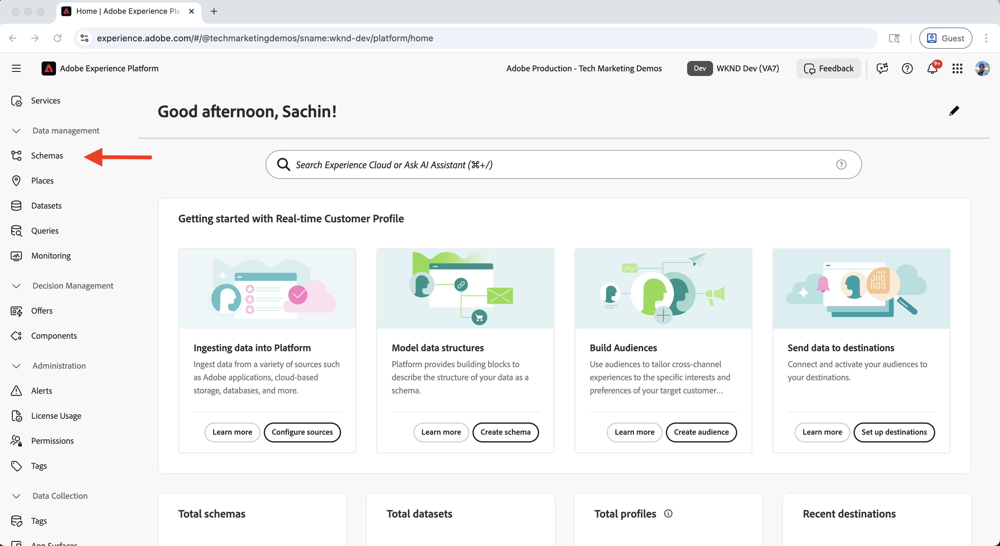
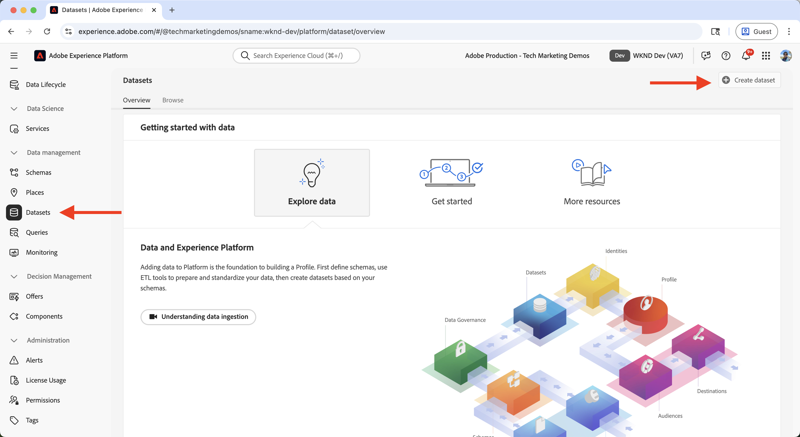
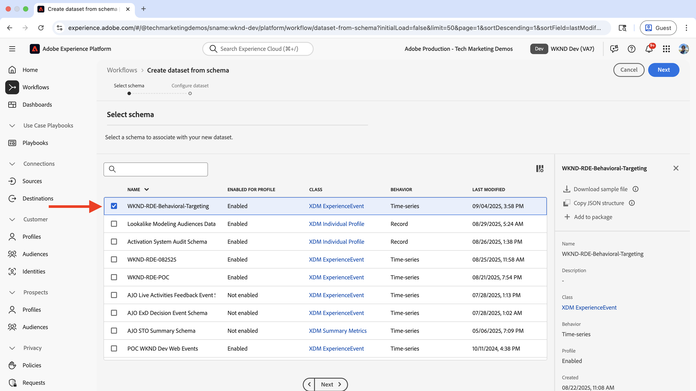
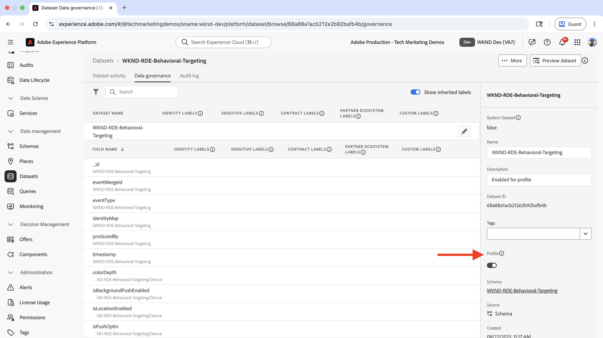
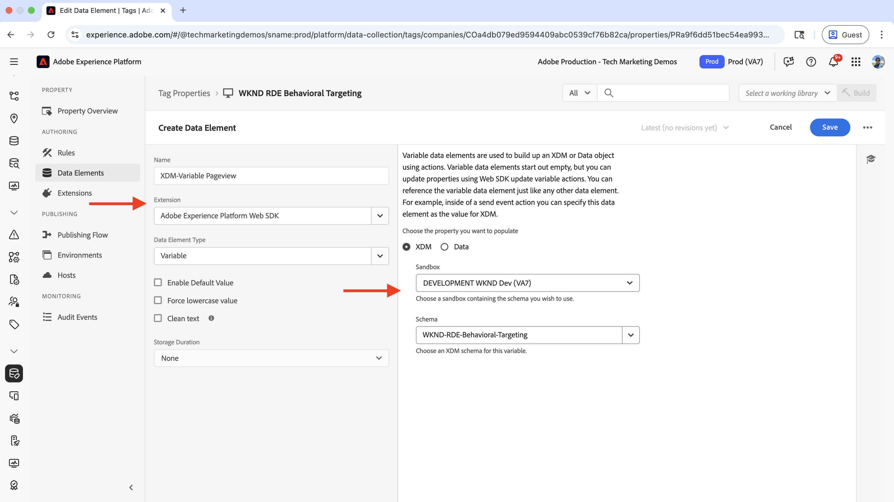
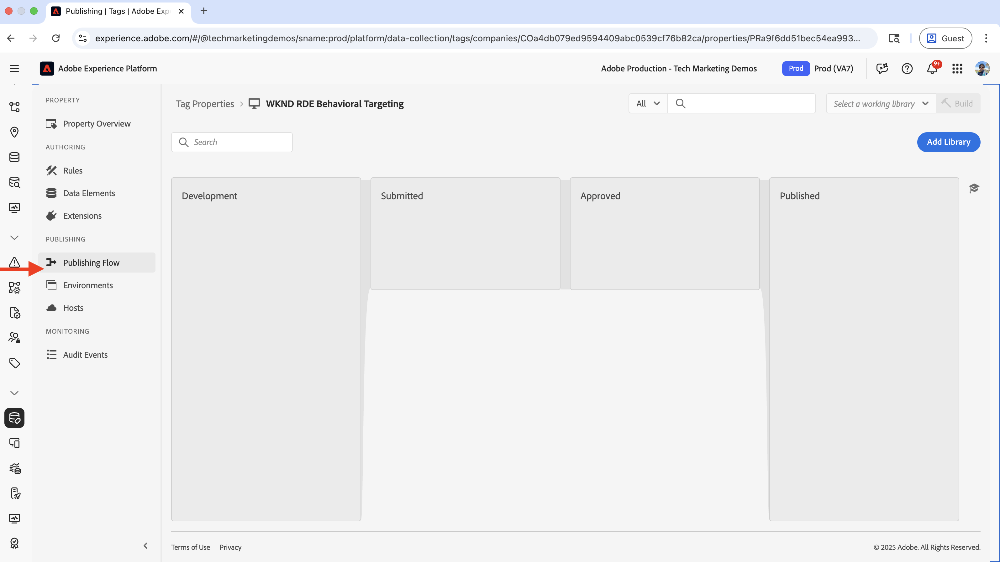
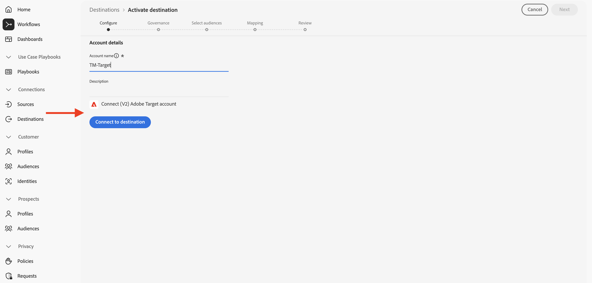
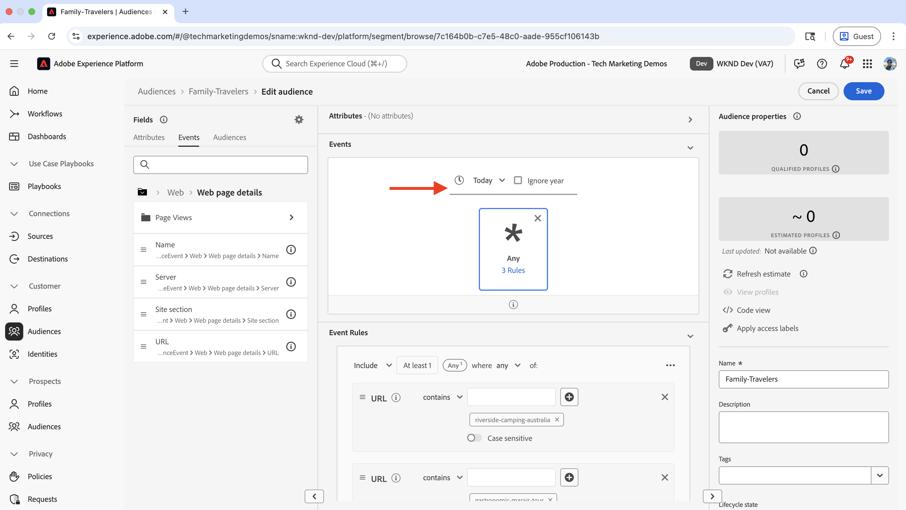
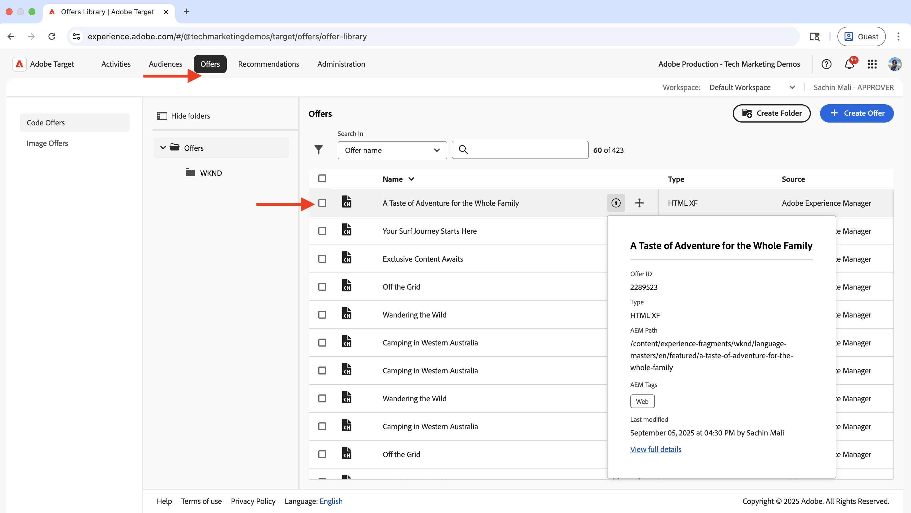

# Ciblage comportemental

Découvrez comment personnaliser le contenu en fonction du comportement de l’utilisateur ou l’utilisatrice à l’aide d’Adobe Experience Platform (AEP) et d’Adobe Target.

Le ciblage comportemental vous permet de personnaliser la page suivante en fonction du comportement de l’utilisateur ou l’utilisatrice, tel que les pages qu’il ou elle a visitées, les produits ou les catégories qu’il ou elle a parcourus. Voici quelques exemples de scénarios courants :

- **Personnalisation de la section principale** : affichez du contenu principal personnalisé sur la page suivante en fonction de l’activité de navigation de l’utilisateur ou l’utilisatrice.
- **Personnalisation d’élément de contenu** : modifiez les titres, les images ou les boutons d’appel à l’action en fonction de l’activité de navigation de l’utilisateur ou l’utilisatrice.
- **Adaptation du contenu de la page** : modifiez l’intégralité du contenu de la page en fonction de l’activité de navigation de l’utilisateur ou l’utilisatrice.

## Cas d’utilisation de démonstration

Dans ce tutoriel, le processus montre comment les **utilisateurs et utilisatrices anonymes** qui ont visité les pages Adventure _Bali Surf Camp_, _Riverside Camping_ ou _Tahoe Skiing_ voient du contenu principal personnalisé affiché au-dessus de la section **Next Adventures** de la page d’accueil du site WKND.


À des fins de démonstration, les utilisateurs et utilisatrices ayant ce comportement de navigation sont classés dans l’audience **Family Travelers**.

### Démonstration en direct

Rendez-vous sur le [site web WKND Enablement](https://wknd.enablementadobe.com/us/en.html) pour voir le ciblage comportemental en action. Le site propose trois expériences de ciblage comportemental différentes :

- **Page d’accueil** : lorsque les utilisateurs et utilisatrices consultent la page d’accueil après avoir parcouru les pages Adventure _Bali Surf Camp_, _Riverside Camping_ ou _Tahoe Skiing_, ils sont classés dans l’audience **Family Travellers** et voient une section principale personnalisée au-dessus de la section _Next Adventures_.

- **Page Adventure** : lorsque les utilisateurs et utilisatrices consultent les pages Adventure _Bali Surf Camp_ ou _Surf Camp au Costa Rica_, ils sont classés dans l’audience **Surfing Interest** et voient une section principale personnalisée sur la page Adventure.

- **Page Magazine** : lorsque les utilisateurs et utilisatrices lisent _trois articles ou plus_, ils sont classés dans l’audience **Magazine Readers** et voient une section principale personnalisée sur la page Magazine.

>[!VIDEO](https://video.tv.adobe.com/v/3474003/?captions=fre_fr&learn=on&enablevpops)

>[!TIP]
>
>La première audience utilise l’évaluation **Edge** pour la personnalisation en temps réel, tandis que la deuxième et la troisième audiences utilisent l’évaluation **Batch** pour la personnalisation, idéale pour les visiteurs et visiteuses réguliers.

## Conditions préalables

Avant de poursuivre avec le cas d’utilisation du ciblage comportemental, assurez-vous d’avoir effectué les étapes suivantes :

- [Intégrer Adobe Target](../setup/integrate-adobe-target.md) : permet aux équipes de créer et de gérer du contenu personnalisé de manière centralisée dans AEM et de l’activer en tant qu’offres dans Adobe Target.
- [Intégrer Tags dans Adobe Experience Platform](../setup/integrate-adobe-tags.md) : permet aux équipes de gérer et de déployer du JavaScript pour la personnalisation et la collecte de données sans avoir à redéployer de code AEM.

Familiarisez-vous également avec les concepts d’[Adobe Experience Cloud Identity Service (ECID)](https://experienceleague.adobe.com/fr/docs/id-service/using/home) et d’[Adobe Experience Platform](https://experienceleague.adobe.com/fr/docs/experience-platform/landing/home), tels que le schéma, le flux de données, les audiences, les identités et les profils.

Bien que vous puissiez créer des audiences simples dans Adobe Target, Adobe Experience Platform (AEP) offre une approche moderne pour créer et gérer des audiences et développer des profils clientes et clients complets à l’aide de diverses sources de données telles que les données comportementales et transactionnelles.

## Étapes avancées

Le processus de configuration du ciblage comportemental implique des étapes dans Adobe Experience Platform, AEM et Adobe Target.

1. **Dans Adobe Experience Platform :**
   1. Créer et configurer un schéma
   2. Créer et configurer un jeu de données
   3. Créer et configurer un flux de données
   4. Créer et configurer une propriété de balise
   5. Configurer une politique de fusion pour le profil
   6. Configurer une destination Adobe Target (V2)
   7. Créer et configurer une audience

2. **Dans AEM :**
   1. Créer des offres personnalisées à l’aide d’un fragment d’expérience
   2. Intégrer et injecter la propriété Tags dans les pages AEM
   3. Intégrer Adobe Target et exporter des offres personnalisées vers Adobe Target

3. **Dans Adobe Target :**
   1. Vérifier les audiences et les offres
   2. Créer et configurer une activité

4. **Vérifier l’implémentation du ciblage comportemental sur vos pages AEM**

Les différentes solutions d’AEP sont utilisées pour collecter, gérer et récolter les données comportementales afin de créer des audiences. Ces audiences sont ensuite activées dans Adobe Target. Grâce aux activités dans Adobe Target, des expériences personnalisées sont diffusées aux utilisateurs et utilisatrices qui correspondent aux critères d’audience.

## Étapes d’Adobe Experience Platform

Pour créer des audiences en fonction des données comportementales, il est nécessaire de collecter et de stocker des données lorsque les utilisateurs et utilisatrices consultent votre site web ou interagissent avec celui-ci. Dans cet exemple, pour classer un utilisateur ou une utilisatrice dans l’audience **Family Travelers**, les données de pages vues doivent être collectées. Le processus commence dans Adobe Experience Platform afin de configurer les composants nécessaires à la collecte de ces données.

Connectez-vous à [Adobe Experience Cloud](https://experience.adobe.com/) et accédez à **Experience Platform** à partir de la section Sélecteur d’applications ou Accès rapide.


### Créer et configurer un schéma

Un schéma définit la structure et le format des données que vous collectez dans Adobe Experience Platform. Il garantit la cohérence des données et vous permet de créer des audiences significatives basées sur des champs de données normalisés. Pour le ciblage comportemental, un schéma est nécessaire. Il peut capturer les événements de pages vues et les interactions des utilisateurs et utilisatrices.

Créez un schéma pour collecter les données de pages vues en vue du ciblage comportemental.

- Sur la page d’accueil d’**Adobe Experience Platform**, cliquez sur **Schémas** dans le volet de navigation de gauche, puis cliquez sur **Créer un schéma**.

  

- Dans l’assistant **Créer un schéma**, pour l’étape **Détails du schéma**, sélectionnez l’option **Événement d’expérience** et cliquez sur **Suivant**.

  

- Pour l’étape **Nommer et vérifier**, saisissez les informations suivantes :
   - **Nom d’affichage du schéma** : WKND-RDE-Behavioral-Targeting
   - **Classe sélectionnée** : XDM ExperienceEvent

  

- Mettez à jour le schéma comme suit :
   - **Ajouter un groupe de champs** : AEP Web SDK ExperienceEvent
   - **Profil** : Activer

  

- Cliquez sur **Enregistrer** pour créer le schéma.

### Créer et configurer un jeu de données

Un jeu de données est un conteneur pour les données qui suit un schéma spécifique. Il agit comme un emplacement de stockage où les données comportementales sont collectées et organisées. Le jeu de données doit être activé pour Profil afin de permettre la création et la personnalisation d’audiences.

Créons un jeu de données pour stocker les données de pages vues.

- Dans **Adobe Experience Platform**, cliquez sur **Jeux de données** dans le volet de navigation de gauche, puis cliquez sur **Créer un jeu de données**.
  

- À l’étape **Créer un jeu de données**, sélectionnez l’option **Créer un jeu de données à partir d’un schéma** et cliquez sur **Suivant**.
  

- Dans l’assistant **Créer un jeu de données à partir d’un schéma**, à l’étape **Sélectionner un schéma**, sélectionnez le schéma **WKND-RDE-Behavioral-Targeting** et cliquez sur **Suivant**.
  

- Pour l’étape **Configurer le jeu de données**, saisissez les informations suivantes :
   - **Nom** : WKND-RDE-Behavioral-Targeting
   - **Description** : jeu de données pour stocker les données de pages vues

  

  Cliquez sur **Terminer** pour créer le jeu de données.

- Mettez à jour le jeu de données comme suit :
   - **Profil** : Activer

  

### Créer et configurer un flux de données

Un flux de données est une configuration qui définit le flux de données de votre site web vers Adobe Experience Platform via le SDK web. Il fait office de pont entre votre site web et la plateforme, garantissant ainsi que les données sont correctement mises en forme et acheminées vers les jeux de données appropriés. Pour le ciblage comportemental, nous devons activer des services spécifiques tels que la segmentation Edge et les destinations Personalization.

Créons un flux de données pour envoyer des données de pages vues vers Experience Platform via le SDK web.

- Dans **Adobe Experience Platform**, cliquez sur **Flux de données** dans le volet de navigation de gauche, puis cliquez sur **Créer un flux de données**.

- À l’étape **Nouveau flux de données**, saisissez les informations suivantes :
   - **Nom** : WKND-RDE-Behavioral-Targeting
   - **Description** : flux de données pour envoyer des données de pages vues vers Experience Platform
   - **Schéma de mappage** : WKND-RDE-Behavioral-Targeting
Cliquez sur **Enregistrer** pour créer le flux de données.

  

- Une fois le flux de données créé, cliquez sur **Ajouter un service**.

  

- À l’étape **Ajouter un service**, sélectionnez **Adobe Experience Platform** dans la liste déroulante et saisissez les informations suivantes :
   - **Jeu de données d’événement** : WKND-RDE-Behavioral-Targeting
   - **Jeu de données de profil** : WKND-RDE-Behavioral-Targeting
   - **Prise de décisions sur les offres** : Activer
   - **Segmentation Edge** : Activer
   - **Destinations Personalization** : Activer

  Cliquez sur **Enregistrer** pour ajouter le service.

  

- À l’étape **Ajouter un service**, sélectionnez **Adobe Target** dans la liste déroulante et saisissez l’**ID d’environnement cible**. Vous pouvez retrouver l’ID d’environnement cible dans Adobe Target sous **Administration** > **Environnements**. Cliquez sur **Enregistrer** pour ajouter le service.
  

### Créer et configurer une propriété de balise

Une propriété Tags est un conteneur de code JavaScript qui collecte des données de votre site web et les envoie vers Adobe Experience Platform. Il agit comme la couche de collecte de données qui capture les interactions des utilisateurs et utilisatrices et les pages vues. Pour le ciblage comportemental, nous collectons des détails de page spécifiques tels que le nom de page, l’URL, la section du site et le nom d’hôte afin de créer des audiences significatives.

Créons une propriété Tags qui capture les données de pages vues lorsque les utilisateurs et utilisatrices consultent votre site web.

Pour ce cas d’utilisation, les détails de page, tels que le nom de la page, l’URL, la section du site et le nom d’hôte, sont collectés. Ces détails sont utilisés pour créer des audiences comportementales.

Vous pouvez mettre à jour la propriété Tags que vous avez créée à l’étape [Intégrer Adobe Tags](../setup/integrate-adobe-tags.md). Toutefois, pour simplifier le processus, une nouvelle propriété Tags est créée.

#### Créer une propriété Tags

Pour créer une propriété Tags, effectuez les étapes suivantes :

- Dans **Adobe Experience Platform**, cliquez sur **Tags** dans le volet de navigation de gauche, puis cliquez sur le bouton **Nouvelle propriété**.
  

- Dans la fenêtre **Créer une propriété**, saisissez les informations suivantes :
   - **Nom de la propriété** : WKND-RDE-Behavioral-Targeting
   - **Type de propriété** : sélectionnez **Web**.
   - **Domaine** : domaine dans lequel vous déployez la propriété (par exemple, `.adobeaemcloud.com`).

  Cliquez sur **Enregistrer** pour créer la propriété.

  

- Ouvrez la nouvelle propriété, cliquez sur **Extensions** dans le volet de navigation de gauche, puis sur l’onglet **Catalogue**. Recherchez **SDK web** et cliquez sur le bouton **Installer**.
  

- Dans la boîte de dialogue **Installer l’extension**, sélectionnez le **Flux de données** créé précédemment et cliquez sur **Enregistrer**.
  

#### Ajouter des éléments de données

Les éléments de données sont des variables qui capturent des points de données spécifiques sur votre site web et les rendent disponibles pour une utilisation dans des règles et d’autres configurations de balises. Ils servent de blocs de création pour la collecte de données, ce qui vous permet d’extraire des informations significatives à partir des interactions d’utilisation et des pages vues. Pour le ciblage comportemental, les détails de la page, tels que le nom d’hôte, la section du site et le nom de page, doivent être capturés pour créer des segments d’audience.

Créez les éléments de données suivants pour capturer les détails importants de la page.

- Cliquez sur **Éléments de données** dans le volet de navigation de gauche, puis sur le bouton **Créer un élément de données**.
  

- Dans la boîte de dialogue **Créer une propriété**, saisissez les informations suivantes :
   - **Name** : Host Name
   - **Extension** : sélectionnez **Core**
   - **Data Element Type** : sélectionnez le bouton **Custom Code**
   - **Open Editor**, puis saisissez le fragment de code suivant :

     ```javascript
     if(window && window.location && window.location.hostname) {
         return window.location.hostname;
     }
     ```

  

- De même, créez les éléments de données suivants :

   - **Name** : section du site
   - **Extension** : sélectionnez **Core**
   - **Data Element Type** : sélectionnez le bouton **Custom Code**
   - Cliquez sur le bouton **Ouvrir l’éditeur** et saisissez l’extrait de code suivant :

     ```javascript
     if(event && event.component && event.component.hasOwnProperty('repo:path')) {
         let pagePath = event.component['repo:path'];
     
         let siteSection = '';
     
         //Check for html String in URL.
         if (pagePath.indexOf('.html') > -1) { 
         siteSection = pagePath.substring(0, pagePath.lastIndexOf('.html'));
     
         //replace slash with colon
         siteSection = siteSection.replaceAll('/', ':');
     
         //remove `:content`
         siteSection = siteSection.replaceAll(':content:','');
         }
     
         return siteSection 
     }        
     ```

   - **Name** : le nom de la page
   - **Extension** : sélectionnez **Core**
   - **Data Element Type** : sélectionnez le bouton **Custom Code**
   - Cliquez sur le bouton **Ouvrir l’éditeur** et saisissez l’extrait de code suivant :

     ```javascript
     if(event && event.component && event.component.hasOwnProperty('dc:title')) {
         // return value of 'dc:title' from the data layer Page object, which is propagated via 'cmp:show' event
         return event.component['dc:title'];
     }        
     ```

- Créez ensuite un élément de données de type **Variable**. Cet élément de données est renseigné avec les détails de la page avant d’être envoyé à Experience Platform.

   - **Name** : XDM-Variable Pageview
   - **Extension** : sélectionnez **SDK web d’Adobe Experience Platform**
   - **Data Element Type** : sélectionnez **Variable**

  Dans le panneau de droite,

   - **Sandbox** : sélectionnez votre sandbox
   - **Schema** : sélectionnez le schéma **WKND-RDE-Behavior-Targeting**

  Cliquez sur **Enregistrer** pour créer l’élément de données.

  

- Votre liste **Éléments de données** doit comporter quatre éléments de données :

  

#### Ajouter des règles

Les règles définissent quand et comment les données sont collectées et envoyées à Adobe Experience Platform. Ils agissent comme la couche logique qui détermine ce qui se produit lorsque des événements spécifiques se produisent sur votre site web. Pour le ciblage comportemental, des règles sont créées pour capturer les événements de page vue et renseigner les éléments de données avec les informations collectées avant de les envoyer à la plateforme.

Créez une règle pour renseigner l’élément de données **XDM-Variable Pageview** à l’aide des autres éléments de données avant de l’envoyer à Experience Platform. La règle est déclenchée lorsqu’un utilisateur ou une utilisatrice parcourt le site Web WKND.

- Cliquez sur **Règles** dans le volet de navigation de gauche, puis sur le bouton **Créer une règle**.
  

- Dans la boîte de dialogue **Créer une règle**, saisissez les informations suivantes :

   - **Nom** : all pages - on load

   - Dans la section **Événements**, cliquez sur **Ajouter** pour ouvrir l’assistant **Configuration d’événement**.
      - **Extension** : sélectionnez **Core**
      - **Type d’événement** : sélectionnez **Code personnalisé**
      - Cliquez sur le bouton **Ouvrir l’éditeur** et saisissez l’extrait de code suivant :

        ```javascript
        var pageShownEventHandler = function(evt) {
            // defensive coding to avoid a null pointer exception
            if(evt.hasOwnProperty("eventInfo") && evt.eventInfo.hasOwnProperty("path")) {
                //trigger Launch Rule and pass event
                console.debug("cmp:show event: " + evt.eventInfo.path);
                var event = {
                    //include the path of the component that triggered the event
                    path: evt.eventInfo.path,
                    //get the state of the component that triggered the event
                    component: window.adobeDataLayer.getState(evt.eventInfo.path)
                };
        
                //Trigger the Launch Rule, passing in the new 'event' object
                // the 'event' obj can now be referenced by the reserved name 'event' by other Launch data elements
                // i.e 'event.component['someKey']'
                trigger(event);
            }
        }
        
        //set the namespace to avoid a potential race condition
        window.adobeDataLayer = window.adobeDataLayer || [];
        
        //push the event listener for cmp:show into the data layer
        window.adobeDataLayer.push(function (dl) {
            //add event listener for 'cmp:show' and callback to the 'pageShownEventHandler' function
            dl.addEventListener("cmp:show", pageShownEventHandler);
        });
        ```

   - Pour la section **Conditions**, cliquez sur **Ajouter** pour ouvrir l’assistant **Configuration de condition**.
      - **Type de logique** : sélectionnez **Standard**
      - **Extension** : sélectionnez **Core**
      - **Type de condition** : sélectionnez **Code personnalisé**
      - Cliquez sur le bouton **Ouvrir l’éditeur** et saisissez l’extrait de code suivant :

        ```javascript
        if(event && event.component && event.component.hasOwnProperty('@type') && event.component.hasOwnProperty('xdm:template')) {
            console.log('The cmp:show event is from PAGE HANDLE IT');
            return true;
        }else{
            console.log('The cmp:show event is NOT from PAGE IGNORE IT');
            return false;
        }            
        ```

   - Pour la section **Actions**, cliquez sur **Ajouter** pour ouvrir l’assistant **Configuration de l’action**.
      - **Extension** : sélectionnez **SDK web d’Adobe Experience Platform**
      - **Type d’action** : sélectionnez **Mettre à jour la variable**
      - Mappez l’élément de données **web** > **webPageDetails** > **name** à l’élément de données **Nom de page**.

        

      - De même, mappez l’élément de données **server** à l’élément de données **Nom d’hôte** et l’élément de données **siteSection** à l’élément de données **Section du site**. Pour **pageView** > **value**, saisissez `1` pour indiquer un événement de page vue.

      - Cliquez sur **Conserver les modifications** pour enregistrer la configuration de l’action.

   - Cliquez à nouveau sur **Ajouter** pour ajouter une autre action et ouvrir l’assistant **Configuration de l’action**.
      - **Extension** : sélectionnez **SDK web d’Adobe Experience Platform**
      - **Type d’action** : sélectionnez **Envoyer l’événement**
      - Dans la section **Données** du panneau de droite, mappez l’élément de données **XDM-Variable Pageview** au type **Web Webpagedetails Page Views**.

     

      - De plus, dans la section **Personnalisation** du panneau de droite, cochez l’option **Afficher les choix de personnalisation**.  Cliquez ensuite sur **Conserver les modifications** pour enregistrer l’action.

     

   - Cliquez sur **Conserver les modifications** pour enregistrer la règle.

- Votre règle ressembler à ceci :

  

Les étapes de création de règle ci-dessus comportent un nombre considérable de détails. Soyez donc prudent lors de la création de la règle. Cela peut sembler complexe, mais souvenez-vous que ces étapes de configuration la rendent prête à l’emploi sans devoir mettre à jour le code AEM ni redéployer l’application.

#### Ajouter une bibliothèque et la publier

Une bibliothèque est une collection de toutes vos configurations Tags (éléments de données, règles, extensions) qui est créée et déployée sur votre site web. Elle regroupe toutes les informations afin que la collecte de données fonctionne correctement. Pour le ciblage comportemental, la bibliothèque est publiée de sorte que les règles de collecte de données soient actives sur votre site web.

- Cliquez sur **Flux de publication** dans le volet de navigation de gauche, puis cliquez sur le bouton **Ajouter une bibliothèque**.
  

- Dans la boîte de dialogue **Ajouter une bibliothèque**, saisissez les informations suivantes :
   - **Nom** : 1.0
   - **Environnement** : sélectionnez **Développement**.
   - Cliquez sur **Ajouter toutes les ressources modifiées** pour sélectionner toutes les ressources.

  Cliquez sur **Enregistrer et créer pour le développement** pour créer la bibliothèque.

  

- Une fois la bibliothèque créée pour la piste **Développement**, cliquez sur les points de suspension (trois points) et sélectionnez l’option **Approuver et publier en production**.
  

Félicitations ! Vous avez créé la propriété Tags avec la règle pour collecter les détails de page et les envoyer à Experience Platform. Il s’agit de l’étape fondamentale pour créer des audiences comportementales.

### Configurer une politique de fusion pour le profil

Une politique de fusion définit la manière dont les données client et cliente provenant de plusieurs sources sont unifiées dans un seul et même profil. Elle détermine les données qui priment en cas de conflit, ce qui vous permet d’obtenir une vue complète et cohérente de chaque client et cliente pour le ciblage comportemental.

Dans le cadre de ce cas d’utilisation, une politique de fusion est créée ou mise à jour, à savoir :

- **Politique de fusion par défaut** : Activer
- **Politique de fusion active sur Edge** : Activer

Pour créer une politique de fusion, effectuez les étapes suivantes :

- Dans **Adobe Experience Platform**, cliquez sur **Profils** dans le volet de navigation de gauche, puis cliquez sur l’onglet **Politiques de fusion**.

  

- Vous pouvez utiliser une politique de fusion existante, mais pour ce tutoriel, une nouvelle politique de fusion est créée avec la configuration suivante :

  

- Veillez à activer les deux options **Politique de fusion par défaut** et **Politique de fusion active sur Edge**. Ces paramètres garantissent que vos données comportementales sont correctement unifiées et disponibles pour l’évaluation de l’audience en temps réel.

### Configurer une destination Adobe Target (V2)

La destination Adobe Target (V2) vous permet d’activer les audiences comportementales créées dans Experience Platform directement dans Adobe Target. Cette connexion permet d’utiliser vos audiences comportementales pour des activités de personnalisation dans Adobe Target.

- Dans **Adobe Experience Platform**, cliquez sur **Destinations** dans le volet de navigation de gauche, puis cliquez sur l’onglet **Catalogue**, filtrez par **Personnalisation** et sélectionnez la destination **(v2) Adobe Target**.

  

- À l’étape **Activer les destinations**, donnez un nom à la destination et cliquez sur le bouton **Se connecter à la destination**.
  

- Dans la section **Détails de la destination**, saisissez les informations suivantes :
   - **Nom** : WKND-RDE-Behavioral-Targeting-Destination
   - **Description** : destination pour les audiences de ciblage comportemental
   - **Flux de données** : sélectionnez le **Flux de données** que vous avez créé précédemment
   - **Espace de travail** : sélectionnez votre espace de travail Adobe Target

  

- Cliquez sur **Suivant** et terminez la configuration de la destination.

Une fois configurée, cette destination vous permet d’activer les audiences comportementales d’Experience Platform sur Adobe Target en vue de les utiliser dans des activités de personnalisation.

### Créer et configurer une audience

Une audience définit un groupe spécifique d’utilisateurs et d’utilisatrices en fonction de leurs modèles et caractéristiques comportementaux. À cette étape, une audience « Family Travelers » est créée à l’aide des règles de données comportementales.

Pour créer une audience, effectuez les étapes suivantes :

- Dans **Adobe Experience Platform**, cliquez sur **Audiences** dans le volet de navigation de gauche, puis cliquez sur le bouton **Créer une audience**.
  

- Dans la boîte de dialogue **Créer une audience**, sélectionnez l’option **Créer une règle** et cliquez sur le bouton **Créer**.
  

- À l’étape **Créer**, saisissez les informations suivantes :
   - **Nom** : Family Travelers
   - **Description** : utilisateurs et utilisatrices qui ont consulté des pages d’aventures destinées aux familles
   - **Méthode d’évaluation** : sélectionnez **Edge** (pour l’évaluation de l’audience en temps réel)

  

- Cliquez ensuite sur l’onglet **Événements** et accédez à **Web** > **Détails de la page web**, puis faites glisser et déposez le champ **URL** vers la section **Règles d’événement**. Faites glisser deux fois le champ **URL** vers la section **Règles d’événement**. Saisissez les valeurs suivantes :
   - **URL** : sélectionnez l’option **contient** et saisissez `riverside-camping-australia`
   - **URL** : sélectionnez l’option **contient** et saisissez `bali-surf-camp`
   - **URL** : sélectionnez l’option **contient** et saisissez `gastronomic-marais-tour`

  

- Dans la section **Événements**, sélectionnez l’option **Aujourd’hui**. Votre audience doit ressembler à ceci :

  

- Passez en revue l’audience et cliquez sur le bouton **Activer sur la destination**.

  

- Dans la boîte de dialogue **Activer sur la destination**, sélectionnez la destination Adobe Target que vous avez créée précédemment et suivez les étapes pour activer l’audience.

  

- Il n’y a pas encore de données dans AEP, le nombre d’audiences est donc de 0. Une fois que les utilisateurs et utilisatrices commencent à consulter le site web, les données sont collectées et le nombre d’audiences augmente.

  

Félicitations ! Vous avez créé l’audience et l’avez activée vers la destination Adobe Target.

Les étapes d’Adobe Experience Platform sont terminées et le processus est prêt à créer l’expérience personnalisée dans AEM et à l’utiliser dans Adobe Target.

## Étapes d’AEM

Dans AEM, la propriété Tags est intégrée pour collecter les données de pages vues et les envoyer à Experience Platform. Adobe Target est également intégré et des offres personnalisées sont créées pour l&#39;audience **Family Travelers**. Ces étapes permettent à AEM de fonctionner avec la configuration du ciblage comportemental créée dans Experience Platform.

Nous commençons par nous connecter au service de création AEM pour créer et configurer le contenu personnalisé.

- Connectez-vous à [Adobe Experience Cloud](https://experience.adobe.com/) et accédez à **Experience Manager** à partir de la section Sélecteur d’applications ou Accès rapide.

  

- Accédez à votre environnement de création AEM et cliquez sur le bouton **Sites**.
  

### Intégrer et injecter la propriété Tags dans les pages AEM

Cette étape intègre la propriété Tags qui a été créée précédemment dans vos pages AEM, ce qui permet la collecte de données pour le ciblage comportemental. La propriété Tags capture automatiquement les données de pages vues et les envoie à Experience Platform lorsque les utilisateurs et utilisatrices consultent votre site web.

Pour intégrer la propriété Tags dans les pages AEM, suivez la procédure décrite dans [Intégrer Tags dans Adobe Experience Platform](../setup/integrate-adobe-tags.md).

Veillez à utiliser la propriété Tags **WKND-RDE-Behavioral-Targeting** créée précédemment, et non une autre propriété.


Une fois intégrée, la propriété Tags commence à collecter les données comportementales de vos pages AEM et à les envoyer à Experience Platform pour la création d’audiences.

### Intégrer Adobe Target et exporter des offres personnalisées vers Adobe Target

Cette étape intègre Adobe Target à AEM et permet d’exporter du contenu personnalisé (fragments d’expérience) vers Adobe Target. Cette connexion permet à Adobe Target d’utiliser le contenu créé dans AEM pour des activités de personnalisation avec les audiences comportementales créées dans Experience Platform.

Pour intégrer Adobe Target et exporter les offres d’audience **Family Travelers** vers Adobe Target, suivez la procédure décrite dans [Intégrer Adobe Target dans Adobe Experience Platform](../setup/integrate-adobe-target.md).

Assurez-vous que la configuration de Target est appliquée aux fragments d’expérience afin qu’ils puissent être exportés vers Adobe Target en vue d’être utilisés dans des activités de personnalisation.


Une fois intégrés, vous pouvez exporter des fragments d’expérience d’AEM vers Adobe Target, où ils sont utilisés en tant qu’offres personnalisées pour les audiences comportementales.

### Créer des offres personnalisées pour les audiences ciblées

Les fragments d’expérience sont des composants de contenu réutilisables qui peuvent être exportés vers Adobe Target en tant qu’offres personnalisées. Pour le ciblage comportemental, du contenu est créé spécifiquement pour l’audience **Family Travelers** qui s’affiche lorsque les utilisateurs et utilisatrices correspondent aux critères comportementaux.

Créez un fragment d’expérience avec du contenu personnalisé pour l’audience Family Travelers.

- Dans AEM, cliquez sur **Fragments d’expérience**.

  

- Accédez au dossier **WKND Site Fragments**, puis au sous-dossier **Featured** et cliquez sur le bouton **Créer**.

  

- Dans la boîte de dialogue **Créer un fragment d’expérience**, sélectionnez Modèle de variation web et cliquez sur **Suivant**.

  

- Développez le fragment d’expérience nouvellement créé en ajoutant un composant Teaser et personnalisez-le avec du contenu pertinent pour les voyageurs et voyageuses en famille. Ajoutez un titre, une description et un appel à l’action attrayants pour les familles intéressées par les voyages d’aventure.

  

- Sélectionnez le fragment d’expérience créé et cliquez sur le bouton **Exporter vers Adobe Target**.

  

Félicitations ! Vous avez créé et exporté les offres d’audience **Family Travelers** vers Adobe Target. Le fragment d’expérience est désormais disponible dans Adobe Target en tant qu’offre personnalisée pouvant être utilisée dans des activités de personnalisation.

## Étapes d’Adobe Target

Dans Adobe Target, la disponibilité des audiences comportementales créées dans Experience Platform et des offres personnalisées exportées depuis AEM est vérifiée. Une activité est alors créée, qui combine le ciblage d’audience et le contenu personnalisé, afin de fournir l’expérience de ciblage comportemental.

- Connectez-vous à [Adobe Experience Cloud](https://experience.adobe.com/) et accédez à **Adobe Target** à partir de la section Sélecteur d’applications ou Accès rapide.

  

### Vérifier les audiences et les offres

Avant de créer l’activité de personnalisation, la disponibilité des audiences comportementales d’Experience Platform et des offres personnalisées d’AEM est vérifiée dans Adobe Target. Cela permet de s’assurer que tous les composants nécessaires au ciblage comportemental sont en place.

- Dans Adobe Target, cliquez sur **Audiences** et vérifiez que l’audience Family Travelers est créée.

  

- En cliquant sur l’audience, vous pouvez afficher les détails de l’audience et vérifier qu’elle est correctement configurée.

  

- Cliquez ensuite sur **Offres** et vérifiez que l’offre exportée AEM existe. Dans mon exemple, l’offre (ou le fragment d’expérience) est appelée **A Taste of Adventure for the Whole Family**.

  

### Créer et configurer une activité

Une activité dans Adobe Target est une campagne de personnalisation qui définit quand et comment le contenu personnalisé est distribué à des audiences spécifiques. Pour le ciblage comportemental, une activité est créée pour présenter l’offre personnalisée aux utilisateurs et utilisatrices qui correspondent aux critères de l’audience Family Travelers.

Une activité est maintenant créée pour proposer l’expérience personnalisée sur la page d’accueil de l’audience **Family Travelers**.

- Dans Adobe Target, cliquez sur **Activités**, sur le bouton **Créer une activité**, puis sélectionnez le type d’activité **Ciblage d’expérience**.
  

- Dans la boîte de dialogue **Créer une activité de ciblage d’expérience**, sélectionnez le type **Web** et l’option de compositeur **Visuel**, puis saisissez l’URL de la page d’accueil du site WKND. Cliquez sur le bouton **Créer** pour créer l’activité.

  

- Dans l’éditeur, sélectionnez l’audience **Family Travelers** et ajoutez l’offre **A Taste of Adventure for the Whole Family** avant la section **Next Adventure**. Consultez la capture d’écran ci-dessous à titre de référence.

  

- Cliquez sur **Suivant** et configurez la section **Objectifs et paramètres** avec les objectifs et mesures appropriés, puis activez-la pour appliquer les modifications.

  

Félicitations ! Vous avez créé et lancé l’activité afin de proposer l’expérience personnalisée à l’audience **Family Travelers** sur la page d’accueil du site WKND. L’activité est désormais en ligne et présente du contenu personnalisé aux utilisateurs et utilisatrices qui correspondent aux critères comportementaux.

## Vérifier l’implémentation du ciblage comportemental sur vos pages AEM

Maintenant que le flux complet de ciblage comportemental a été configuré, le bon fonctionnement de tous les éléments est vérifié. Ce processus de vérification garantit que la collecte de données, l’évaluation de l’audience et la personnalisation fonctionnent toutes comme prévu.

Vérifiez l’implémentation du ciblage comportemental sur vos pages AEM.

- Rendez-vous sur le site publié (par exemple, le [site web WKND Enablement](https://wknd.enablementadobe.com/us/en.html)) et parcourez les pages Adventure _Bali Surf Camp_, _Riverside Camping_ ou _Tahoe Skiing_. Veillez à rester au moins 30 secondes sur la page pour déclencher l’événement de page vue et permettre la collecte des données.

- Revenez ensuite sur la page d’accueil. Vous devriez voir l’expérience personnalisée pour l’audience **Family Travelers** avant la section **Next Adventure**.

  

- Ouvrez les outils de développement de votre navigateur et consultez l’onglet **Réseau**. Filtrez par `interact` pour trouver la requête SDK web. La requête doit afficher les détails de l’événement SDK web.

  

- La réponse doit inclure les décisions de personnalisation prises par Adobe Target et indiquant que vous faites partie de l’audience **Family Travelers**.

  

Félicitations ! Vous avez vérifié l’implémentation du ciblage comportemental sur vos pages AEM. Le flux complet de la collecte de données à l’évaluation de l’audience et à la personnalisation fonctionne désormais correctement.

## Démonstration en direct

Pour voir le ciblage comportemental en action, consultez le [site web WKND Enablement](https://wknd.enablementadobe.com/us/en.html). Il existe trois expériences de ciblage comportemental différentes :

- **Page d’accueil** : pour l’audience Family Travelers, une offre de section principale personnalisée s’affiche au-dessus de la section _Next Adventures_. Lorsqu’un utilisateur ou une utilisatrice consulte la page d’accueil et a visité les pages Adventure _Bali Surf Camp_, _Riverside Camping_ ou _Tahoe Skiing_, il ou elle est classé dans l’audience **Family Travelers**. Le type d’audience est **Edge**. L’évaluation se produit donc en temps réel.

- **Page Adventure** : pour les passionnés de surf, la page Adventure s’affiche avec une section principale personnalisée. Lorsqu’un utilisateur ou une utilisatrice consulte les pages Adventure _Bali Surf Camp_ ou _Surf Camp in Costa Rica_, il ou elle est classé dans l’audience **Surfing Interest**. Le type d’audience est **Batch**. L’évaluation ne se produit donc pas en temps réel, mais sur une période de temps, un jour par exemple. Cela est utile pour les visiteurs et visiteuses réguliers.

  

- **Page Magazine** : pour les lecteurs et lectrices du magazine, la page Magazine s’affiche avec une section principale personnalisée. Lorsqu’un utilisateur ou une utilisatrice lit _trois articles ou plus_, il ou elle est classé dans l’audience **Magazine Readers**. Le type d’audience est **Batch**. L’évaluation ne se produit donc pas en temps réel, mais sur une période de temps, un jour par exemple. Cela est utile pour les visiteurs et visiteuses réguliers.

  

La première audience utilise l’évaluation **Edge** pour la personnalisation en temps réel, tandis que la deuxième et la troisième audiences utilisent l’évaluation **Batch** pour la personnalisation, idéale pour les visiteurs et visiteuses réguliers.


## Ressources supplémentaires

- [SDK web d’Adobe Experience Platform](https://experienceleague.adobe.com/fr/docs/experience-platform/web-sdk/home)
- [Vue d’ensemble des flux de données](https://experienceleague.adobe.com/fr/docs/experience-platform/datastreams/overview)
- [Visual Experience Composer (VEC)](https://experienceleague.adobe.com/fr/docs/target/using/experiences/vec/visual-experience-composer)
- [Segmentation Edge](https://experienceleague.adobe.com/fr/docs/experience-platform/segmentation/methods/edge-segmentation)
- [Types d’audiences](https://experienceleague.adobe.com/fr/docs/experience-platform/segmentation/types/overview)
- [Connexion d’Adobe Target](https://experienceleague.adobe.com/fr/docs/experience-platform/destinations/catalog/personalization/adobe-target-connection)
