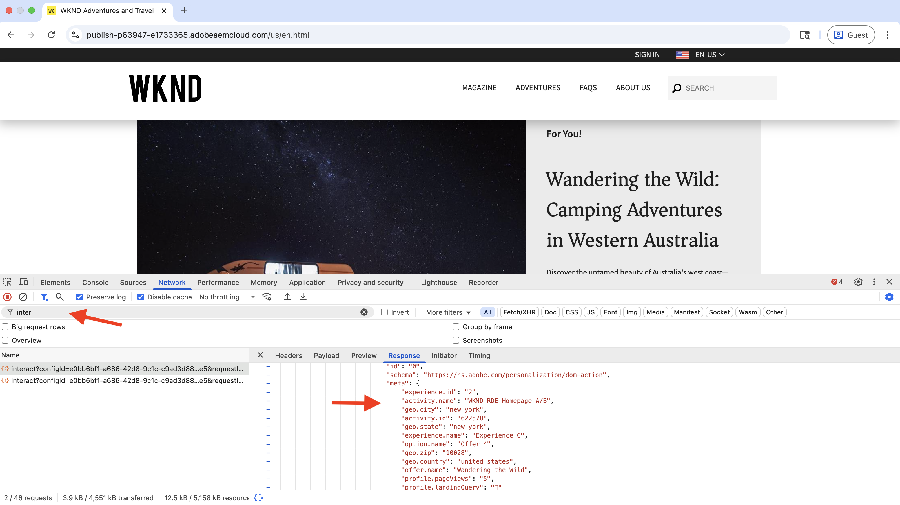

# Expérimentation (tests A/B)

Découvrez comment tester différentes variations de contenu sur un site web AEM as a Cloud Service (AEMCS) à l’aide d’Adobe Target.

Les tests A/B vous aident à comparer différentes versions de contenu afin de déterminer la plus performante pour atteindre vos objectifs métier. Voici quelques exemples de scénarios courants :

- Tests des variations dans les titres, les images ou les boutons d’appel à l’action sur une page de destination
- Comparaison des différentes mises en page ou conceptions pour une page de détails de produit
- Évaluation des offres promotionnelles ou des stratégies de remise

## Cas d’utilisation de démonstration

Dans ce tutoriel, vous configurez les tests A/B pour le fragment d’expérience (XF) **Camping in Western Australia** sur le site web WKND. Vous créez trois variations XF et gérez le test A/B via Adobe Target.

Les variations s’affichent sur la page d’accueil WKND, ce qui vous permet de mesurer les performances et de déterminer la version qui génère le plus d’engagement et de conversions.

### Démonstration en direct

Rendez-vous sur le [site web de mise en œuvre WKND](https://wknd.enablementadobe.com/us/en.html) pour voir le test A/B en action. Dans la vidéo ci-dessous, vous pouvez voir les trois variantes de **Camping in Western Australia** affichées sur la page d&#39;accueil via différents navigateurs.

>[!VIDEO](https://video.tv.adobe.com/v/3473005/?learn=on&enablevpops)

## Conditions préalables

Avant de poursuivre ce cas d’utilisation d’expérimentation, assurez-vous d’avoir effectué les étapes suivantes :

- [Intégrer Adobe Target](../setup/integrate-adobe-target.md) : permet à votre équipe de créer et de gérer du contenu personnalisé de manière centralisée dans AEM et de l’activer en tant qu’offres dans Adobe Target.
- [Intégrer Tags dans Adobe Experience Platform](../setup/integrate-adobe-tags.md) : permet à votre équipe de gérer et de déployer du JavaScript pour la personnalisation et la collecte de données sans avoir à redéployer de code AEM.

## Étapes avancées

Le processus de configuration des tests A/B implique six étapes principales pour créer et configurer l’expérience :

1. **Créer des variations de contenu dans AEM**
2. **Exporter les variations en tant qu’offres vers Adobe Target**
3. **Créer une activité de test A/B dans Adobe Target**
4. **Créer et configurer un flux de données dans Adobe Experience Platform**
5. **Mettre à jour la propriété Tags avec l’extension de SDK web**
6. **Vérifier l’implémentation du test A/B sur vos pages AEM**

## Créer des variations de contenu dans AEM

Dans cet exemple, vous utilisez le fragment d’expérience (XF) **Camping in Western Australia** du projet AEM WKND pour créer trois variations, qui seront utilisées sur la page d’accueil du site web WKND pour les tests A/B.

1. Dans AEM, cliquez sur la carte **Fragments d’expérience**, accédez à **Camping in Western Australia**, puis cliquez sur **Modifier**.
   

1. Dans l’éditeur, sous la section **Variations**, cliquez sur **Créer**, puis sélectionnez **Variation**.\
   

1. Dans la boîte de dialogue **Créer une variation** :
   - **Modèle** : modèle de variation web de fragment d’expérience
   - **Titre** : par exemple, « Déconnexion totale »

   Cliquez sur **Terminé**.

   

1. Créez la variation en copiant le composant **Teaser** à partir de la variation principale, puis personnalisez le contenu (par exemple, mettez à jour le titre et l’image).\
   

   >[!TIP]
   >Vous pouvez utiliser [Générer des variations](https://experience.adobe.com/aem/generate-variations/) pour créer rapidement des variations à partir du fragment d’expérience principal.

1. Répétez les étapes pour créer une autre variation (par exemple, « Retour à la vie sauvage »).\
   

   Vous disposez désormais de trois variations de fragment d’expérience pour les tests A/B.

1. Avant d’afficher des variations à l’aide d’Adobe Target, vous devez supprimer le teaser statique existant de la page d’accueil. Cela évite d’obtenir du contenu en double, car les variations de fragment d’expérience sont injectées de manière dynamique via Target.

   - Accédez à la page d’accueil **English** `/content/wknd/language-masters/en`.
   - Dans l’éditeur, supprimez le composant de teaser **Camping in Western Australia**.\
     

1. Déployez les modifications sur la page d’accueil **US > English** (`/content/wknd/us/en`) pour propager les mises à jour.\
   

1. Publiez la page d’accueil **US > English** pour mettre les mises à jour en ligne.\
   

## Exporter les variations en tant qu’offres vers Adobe Target

Exportez les variations de fragment d’expérience afin qu’elles puissent être utilisées en tant qu’offres dans Adobe Target pour le test A/B.

1. Dans AEM, accédez à **Camping in Western Australia**, sélectionnez les trois variations, puis cliquez sur **Exporter vers Adobe Target**.\
   

2. Dans Adobe Target, accédez à **Offres** et confirmez que les variations ont été importées.\
   

## Créer une activité de test A/B dans Adobe Target

Créez maintenant une activité de test A/B pour exécuter l’expérience sur la page d’accueil.

1. Installez l’extension Chrome [Adobe Experience Cloud Visual Editing Helper](https://chromewebstore.google.com/detail/adobe-experience-cloud-vi/kgmjjkfjacffaebgpkpcllakjifppnca).

1. Dans Adobe Target, accédez à **Activités** et cliquez sur **Créer une activité**.\
   

1. Dans la boîte de dialogue **Créer une activité de test A/B**, saisissez ce qui suit :
   - **Type** : web
   - **Compositeur** : visuel
   - **URL de l’activité** : par exemple, `https://wknd.enablementadobe.com/us/en.html`

   Cliquez sur **Créer**.

   

1. Donnez un nom explicite à l’activité (par exemple, « Test A/B de la page d’accueil WKND »).\
   

1. Dans **Expérience A**, ajoutez le composant **Fragment d’expérience** au-dessus de la section **Recent Articles**.\
   

1. Dans la boîte de dialogue du composant, cliquez sur **Sélectionner une offre**.\
   

1. Choisissez la variation **Camping in Western Australia** et cliquez sur **Ajouter**.\
   

1. Répétez l’opération pour **Expérience B** et **C**, en sélectionnant **Déconnexion totale** et **Retour à la vie sauvage**, respectivement.\
   

1. Dans la section **Ciblage**, vérifiez que le trafic est partagé uniformément entre toutes les expériences.\
   

1. Dans **Objectifs et paramètres**, définissez votre mesure de succès (par exemple, clics CTA sur le fragment d’expérience).\
   

1. Cliquez sur **Activer** dans le coin supérieur droit pour lancer le test.\
   

## Créer et configurer un flux de données dans Adobe Experience Platform

Pour connecter le SDK Adobe Web à Adobe Target, créez un flux de données dans Adobe Experience Platform. Le flux de données sert de couche de routage entre le SDK web et Adobe Target.

1. Dans Adobe Experience Platform, accédez à **Flux de données** et cliquez sur **Créer un flux de données**.\
   

1. Dans la boîte de dialogue **Créer un flux de données**, saisissez un **Nom** pour votre flux de données et cliquez sur **Enregistrer**.\
   

1. Une fois le flux de données créé, cliquez sur **Ajouter un service**.\
   

1. À l’étape **Ajouter un service**, sélectionnez **Adobe Target** dans la liste déroulante et saisissez l’**ID d’environnement cible**. Vous pouvez retrouver l’ID d’environnement cible dans Adobe Target sous **Administration** > **Environnements**. Cliquez sur **Enregistrer** pour ajouter le service.\
   

1. Consultez les détails du flux de données pour vérifier que le service Adobe Target est répertorié et correctement configuré.\
   

## Mettre à jour la propriété Tags avec l’extension de SDK web

Pour envoyer des événements de personnalisation et de collecte de données à partir de pages AEM, ajoutez l’extension SDK web à votre propriété Tags et configurez une règle qui se déclenche au chargement de la page.

1. Dans Adobe Experience Platform, accédez à **Tags** et ouvrez la propriété que vous avez créée à l’étape [Intégrer Adobe Tags](../setup/integrate-adobe-tags.md).
   

1. Dans le menu de gauche, cliquez sur **Extensions**, accédez à l’onglet **Catalogue**, puis recherchez **SDK web**. Cliquez sur **Installer** dans le panneau de droite.\
   

1. Dans la boîte de dialogue **Installer l’extension**, sélectionnez le **Flux de données** créé précédemment et cliquez sur **Enregistrer**.\
   

1. Après l’installation, vérifiez que les extensions **SDK web d’Adobe Experience Platform** et **Core** apparaissent sous l’onglet **Installé**.\
   

1. Configurez ensuite une règle pour envoyer l’événement de SDK web lorsque la bibliothèque est chargée. Accédez à **Règles** dans le menu de gauche, puis cliquez sur **Créer une règle**.

   

   >[!TIP]
   >
   >Une règle vous permet de définir quand et comment les balises se déclenchent en fonction des interactions de l’utilisateur ou de l’utilisatrice ou des événements de navigateur.

1. Dans l’écran **Créer une règle**, saisissez un nom de règle (par exemple, `All Pages - Library Loaded - Send Event`) et cliquez sur **+ Ajouter** sous la section **Événements**.
   

1. Dans la boîte de dialogue **Configuration de l’événement** :
   - **Extension** : sélectionnez **Core**
   - **Type d’événement** : sélectionnez **Bibliothèque chargée (Haut de page)**
   - **Nom** : saisissez `Core - Library Loaded (Page Top)`

   Cliquez sur **Conserver les modifications** pour enregistrer l’événement.

   

1. Sous la section **Actions**, cliquez sur **+ Ajouter** pour définir l’action qui se produit lorsque l’événement se déclenche.

1. Dans la boîte de dialogue **Configuration de l’action** :
   - **Extension** : sélectionnez **SDK web d’Adobe Experience Platform**
   - **Type d’action** : sélectionnez **Envoyer l’événement**
   - **Nom** : sélectionnez **SDK web d’AEP - Envoyer l’événement**

   

1. Dans la section **Personnalisation** du panneau de droite, cochez l’option **Afficher les choix de personnalisation**. Cliquez ensuite sur **Conserver les modifications** pour enregistrer l’action.\
   

   >[!TIP]
   >
   >   Cette action envoie un événement de SDK web d’AEP au chargement de la page, ce qui permet à Adobe Target de diffuser du contenu personnalisé.

1. Vérifiez la règle terminée, puis cliquez sur **Enregistrer**.
   

1. Pour appliquer les modifications, accédez à **Flux de publication** et ajoutez la règle mise à jour à une **Bibliothèque**.\
   

1. Pour finir, passez la bibliothèque en **Production**.
   

## Vérifier l’implémentation du test A/B sur vos pages AEM

Une fois que l’activité est en ligne et que la bibliothèque de balises est publiée en production, vous pouvez vérifier le test A/B sur vos pages AEM.

1. Rendez-vous sur le site publié (par exemple, le [site web de mise en œuvre WKND](https://wknd.enablementadobe.com/us/en.html)) et observez la variation affichée. Essayez d’y accéder à partir d’un autre navigateur ou appareil mobile pour voir d’autres variations.
   

1. Ouvrez les outils de développement de votre navigateur et consultez l’onglet **Réseau**. Filtrez par `interact` pour trouver la requête SDK web. La requête doit contenir les détails de l’événement SDK web.

   

La réponse doit inclure les choix de personnalisation effectués par Adobe Target et indiquer la variation présentée.\

1. Vous pouvez également utiliser l’extension Chrome [Adobe Experience Platform Debugger](https://chromewebstore.google.com/detail/adobe-experience-platform/bfnnokhpnncpkdmbokanobigaccjkpob) pour inspecter les événements du SDK web.
   

## Démonstration en direct

Pour voir le test A/B en action, rendez-vous sur le [site web de mise en œuvre WKND](https://wknd.enablementadobe.com/us/en.html) et observez comment différentes variations du fragment d’expérience s’affichent sur la page d’accueil.

## Ressources supplémentaires

- [Vue d’ensemble du test A/B](https://experienceleague.adobe.com/fr/docs/target/using/activities/abtest/test-ab)
- [SDK web d’Adobe Experience Platform](https://experienceleague.adobe.com/fr/docs/experience-platform/web-sdk/home)
- [Vue d’ensemble des flux de données](https://experienceleague.adobe.com/fr/docs/experience-platform/datastreams/overview)
- [Visual Experience Composer (VEC)](https://experienceleague.adobe.com/fr/docs/target/using/experiences/vec/visual-experience-composer)
