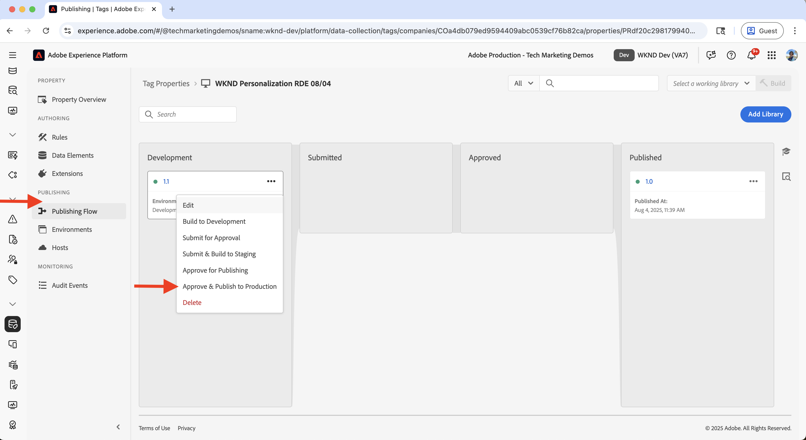

# Expérimentation (Test A/B)

Découvrez comment tester différentes variations de contenu sur un site web AEM as a Cloud Service (AEMCS) à l’aide d’Adobe Target.

Les tests A/B vous aident à comparer différentes versions de contenu afin de déterminer laquelle est la plus performante pour atteindre les objectifs de votre entreprise. Les scénarios courants incluent :

- Test des variations dans les titres, les images ou les boutons call-to-action sur une page de destination
- Comparaison de différentes dispositions ou conceptions pour une page de détails de produit
- Évaluation des offres promotionnelles ou des stratégies de réduction

## Cas d’utilisation de démonstration

Dans ce tutoriel, vous configurez les tests A/B pour le fragment d’expérience **Camping en Australie occidentale** (XF) sur le site web WKND. Vous créez trois variations XF et gérez le test A/B via Adobe Target.

Les variations s’affichent sur la page d’accueil WKND, ce qui vous permet de mesurer les performances et de déterminer la version qui génère le plus d’engagement et de conversions.

Rendez-vous sur le site Web [Activation WKND](https://wknd.enablementadobe.com/us/en.html) pour voir le test A/B en action.

## Prérequis

Avant de poursuivre ce cas d’utilisation d’expérimentation, assurez-vous d’avoir terminé les étapes suivantes :

- [Intégrer Adobe Target](../setup/integrate-adobe-target.md) : permet à votre équipe de créer et de gérer du contenu personnalisé de manière centralisée dans AEM et de l’activer en tant qu’offres dans Adobe Target.
- [Intégrer des balises dans Adobe Experience Platform](../setup/integrate-adobe-tags.md) : permet à votre équipe de gérer et de déployer JavaScript pour la personnalisation et la collecte de données sans avoir à redéployer le code AEM.

## Étapes de haut niveau

Le processus de configuration des tests A/B implique six étapes principales pour créer et configurer l’expérience :

1. **Création de variations de contenu dans AEM**
2. **Exporter les variations sous forme d’offres vers Adobe Target**
3. **Créer une activité de test A/B dans Adobe Target**
4. **Créer et configurer un flux de données dans Adobe Experience Platform**
5. **Mettre à jour la propriété Tags avec l’extension Web SDK**
6. **Vérifier l’implémentation du test A/B sur vos pages AEM**

## Création de variations de contenu dans AEM

Dans cet exemple, vous utilisez le fragment d’expérience (XF) **Camping in Western Australia** du projet AEM WKND pour créer trois variations, qui seront utilisées sur la page d’accueil du site Web WKND pour les tests A/B.

1. Dans AEM, cliquez sur la carte **Fragments d’expérience**, accédez à **Camping en Australie occidentale**, puis cliquez sur **Modifier**.
   

1. Dans l’éditeur, sous la section **Variations**, cliquez sur **Créer**, puis sélectionnez **Variation**.\
   

1. Dans la boîte de dialogue **Créer une variation** :
   - **Modèle** : modèle de variation web de fragment d’expérience
   - **Titre** : par exemple, « Hors de la grille »

   Cliquez sur **Terminé**.

   

1. Créez la variation en copiant le composant **Teaser** à partir de la variation principale, puis personnalisez le contenu (par exemple, mettez à jour le titre et l’image).\
   

   >[!TIP]
   >Vous pouvez utiliser [Générer des variations](https://experience.adobe.com/aem/generate-variations/) pour créer rapidement de nouvelles variations à partir du fichier XF principal.

1. Répétez les étapes pour créer une autre variation (par exemple, « Errer dans la nature »).\
   

   Vous disposez désormais de trois variations de fragment d’expérience pour les tests A/B.

1. Avant d’afficher des variations à l’aide d’Adobe Target, vous devez supprimer le teaser statique existant de la page d’accueil. Cela évite les doublons de contenu, car les variations de fragments d’expérience sont injectées dynamiquement via Target.

   - Accédez à la page d’accueil **en anglais** `/content/wknd/language-masters/en`
   - Dans l’éditeur, supprimez le composant teaser **Camping en Australie occidentale**.\
     

1. Déployez les modifications sur la page d’accueil **US > Anglais** (`/content/wknd/us/en`) pour propager les mises à jour.\
   

1. Publiez la page d’accueil **États-Unis > Anglais** pour mettre les mises à jour en ligne.\
   

## Exporter les variations sous forme d’offres vers Adobe Target

Exportez les variations du fragment d’expérience afin qu’elles puissent être utilisées comme offres dans Adobe Target pour le test A/B.

1. Dans AEM, accédez à **Camping en Australie occidentale**, sélectionnez les trois variantes, puis cliquez sur **Exporter vers Adobe Target**.\
   

2. Dans Adobe Target, accédez à **Offres** et confirmez que les variantes ont été importées.\
   

## Création d’une activité de test A/B dans Adobe Target

Créez maintenant une activité de test A/B pour exécuter l’expérience sur la page d’accueil.

1. Installez l’extension Chrome [Adobe Experience Cloud Visual Editing Helper](https://chromewebstore.google.com/detail/adobe-experience-cloud-vi/kgmjjkfjacffaebgpkpcllakjifppnca).

1. Dans Adobe Target, accédez à **Activités** et cliquez sur **Créer une activité**.\
   

1. Dans la boîte de dialogue **Créer une activité de test A/B**, saisissez ce qui suit :
   - **Type** : Web
   - **Compositeur** : visuel
   - **URL de l’activité** par exemple, `https://wknd.enablementadobe.com/us/en.html`

   Cliquez sur **Créer**.

   

1. Renommez l’activité en quelque chose de significatif (par exemple, « Test A/B de la page d’accueil WKND »).\
   

1. Dans **Experience A**, ajoutez le composant **Fragment d’expérience** au-dessus de la section **Articles récents**.\
   

1. Dans la boîte de dialogue du composant, cliquez sur **Sélectionner une offre**.\
   

1. Choisissez la variante **Camping en Australie occidentale** et cliquez sur **Ajouter**.\
   

1. Répétez l’opération pour **Expérience B** et **C**, en sélectionnant respectivement **Hors de la grille** et **Errer dans la nature**.\
   

1. Dans la section **Ciblage**, vérifiez que le trafic est réparti de manière égale sur toutes les expériences.\
   

1. Dans **Objectifs et paramètres**, définissez votre mesure de succès (par exemple, clics CTA sur le fragment d’expérience).\
   

1. Cliquez sur **Activer** dans le coin supérieur droit pour lancer le test.\
   

## Création et configuration d’un flux de données dans Adobe Experience Platform

Pour connecter Adobe Web SDK à Adobe Target, créez un flux de données dans Adobe Experience Platform. Le flux de données agit comme une couche de routage entre le Web SDK et Adobe Target.

1. Dans Adobe Experience Platform, accédez à **Flux de données** puis cliquez sur **Créer un flux de données**.\
   

1. Dans la boîte de dialogue **Créer un flux de données**, saisissez un **Nom** pour votre flux de données et cliquez sur **Enregistrer**.\
   

1. Une fois le flux de données créé, cliquez sur **Ajouter un service**.\
   

1. À l’étape **Ajouter un service**, sélectionnez **Adobe Target** dans la liste déroulante et saisissez l’**identifiant d’environnement cible**. L’identifiant de l’environnement cible figure dans Adobe Target sous **Administration** > **Environnements**. Cliquez sur **Enregistrer** pour ajouter le service.\
   

1. Consultez les détails du flux de données pour vérifier que le service Adobe Target est répertorié et correctement configuré.\
   

## Mettre à jour la propriété Tags avec l’extension Web SDK

Pour envoyer des événements de personnalisation et de collecte de données à partir de pages AEM, ajoutez l’extension Web SDK à votre propriété Tags et configurez une règle qui se déclenche au chargement de la page.

1. Dans Adobe Experience Platform, accédez à **Balises** et ouvrez la propriété que vous avez créée à l’étape [Intégrer Adobe Tags](../setup/integrate-adobe-tags.md).
   

1. Dans le menu de gauche, cliquez sur **Extensions**, passez à l’onglet **Catalogue** et recherchez **Web SDK**. Cliquez sur **Installer** dans le panneau de droite.\
   

1. Dans la boîte de dialogue **Installer l’extension**, sélectionnez le **Flux de données** créé précédemment et cliquez sur **Enregistrer**.\
   

1. Après l’installation, vérifiez que les extensions **Adobe Experience Platform Web SDK** et **Core** apparaissent sous l’onglet **Installé**.\
   

1. Configurez ensuite une règle pour envoyer l’événement Web SDK lorsque la bibliothèque est chargée. Accédez à **Règles** dans le menu de gauche, puis cliquez sur **Créer une règle**.

   

   >[!TIP]
   >
   >Une règle vous permet de définir quand et comment les balises se déclenchent en fonction des interactions utilisateur ou des événements de navigateur.

1. Dans l’écran **Créer une règle**, saisissez un nom de règle (par exemple, `All Pages - Library Loaded - Send Event`) et cliquez sur **+ Ajouter** sous la section **Événements**.
   

1. Dans la boîte de dialogue **Configuration d’événement** :
   - **Extension** : Sélectionnez **Core**
   - **Type D’Événement** : Sélectionnez **Bibliothèque Chargée (Haut De Page)**
   - **Nom** : Saisissez `Core - Library Loaded (Page Top)`

   Cliquez sur **Conserver les modifications** pour enregistrer l’événement.

   

1. Sous la section **Actions**, cliquez sur **+ Ajouter** pour définir l’action qui se produit lorsque l’événement se déclenche.

1. Dans la boîte de dialogue **Configuration d’action** :
   - **Extension** : Sélectionnez **Adobe Experience Platform Web SDK**
   - **Type D’Action** : Sélectionnez **Envoyer L’Événement**
   - **Name** : sélectionnez **AEP Web SDK - Envoyer l’événement**

   

1. Dans la section **Personalization** du panneau de droite, cochez l’option **Rendre les décisions de personnalisation visuelle**. Cliquez ensuite sur **Conserver les modifications** pour enregistrer l’action.\
   

   >[!TIP]
   >
   >   Cette action envoie un événement AEP Web SDK au chargement de la page, ce qui permet à Adobe Target de diffuser du contenu personnalisé.

1. Vérifiez la règle terminée et cliquez sur **Enregistrer**.
   

1. Pour appliquer les modifications, accédez à **Flux de publication**, ajoutez la règle mise à jour à une **Bibliothèque**.\
   

1. Enfin, promouvez la bibliothèque en **Production**.
   

## Vérification de l’implémentation du test A/B sur vos pages AEM

Une fois que l’activité est active et que la bibliothèque de balises a été publiée en production, vous pouvez vérifier le test A/B sur vos pages AEM.

1. Rendez-vous sur le site publié (par exemple, [site web d’activation WKND](https://wknd.enablementadobe.com/us/en.html)) et observez la variation affichée. Essayez d’y accéder à partir d’un autre navigateur ou appareil mobile pour afficher d’autres variations.
   

1. Ouvrez les outils de développement de votre navigateur et vérifiez l’onglet **Réseau**. Filtrez par `interact` pour trouver la requête Web SDK. La requête doit contenir les détails de l’événement Web SDK.

   

La réponse doit inclure les décisions de personnalisation prises par Adobe Target et indiquer la variation diffusée.\

1. Vous pouvez également utiliser l’extension Chrome [Adobe Experience Platform Debugger](https://chromewebstore.google.com/detail/adobe-experience-platform/bfnnokhpnncpkdmbokanobigaccjkpob) pour inspecter les événements Web SDK.
   

## Démonstration en direct

Pour voir le test A/B en action, consultez le [site web de l’activation de WKND](https://wknd.enablementadobe.com/us/en.html) et observez comment différentes variations du fragment d’expérience s’affichent sur la page d’accueil.

## Ressources supplémentaires

- [Présentation du test A/B](https://experienceleague.adobe.com/en/docs/target/using/activities/abtest/test-ab)
- [Adobe Experience Platform Web SDK](https://experienceleague.adobe.com/en/docs/experience-platform/web-sdk/home)
- [ Présentation des flux de données ](https://experienceleague.adobe.com/en/docs/experience-platform/datastreams/overview)
- [Compositeur d’expérience visuelle (VEC)](https://experienceleague.adobe.com/en/docs/target/using/experiences/vec/visual-experience-composer)