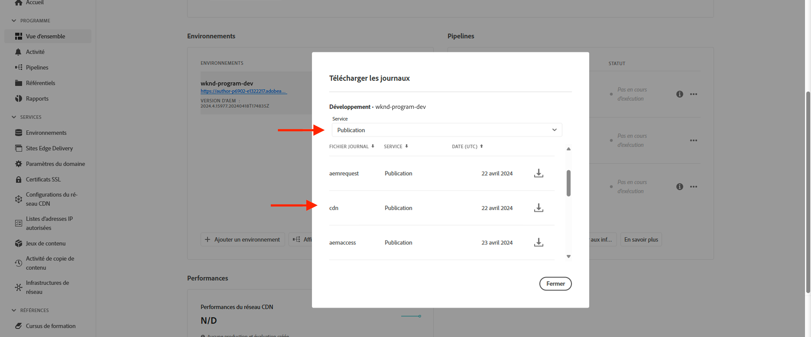

# Blocage des attaques DoS et DDoS à l’aide de règles de filtrage de trafic

Découvrez comment bloquer les attaques par déni de service (DoS) et par déni de service distribué (DDoS) à l’aide de **filtre de trafic limite de taux** règles et autres stratégies au niveau du réseau de diffusion de contenu géré par AEM as a Cloud Service (AEMCS). Ces attaques provoquent des pics de trafic sur le réseau de diffusion de contenu et potentiellement sur le service de publication AEM (alias origine) et peuvent avoir un impact sur la réactivité et la disponibilité du site.

Ce tutoriel sert de guide sur _comment analyser vos schémas de trafic et configurer la limite de taux [règles de filtrage de trafic](https://experienceleague.adobe.com/en/docs/experience-manager-cloud-service/content/security/traffic-filter-rules-including-waf)_ pour atténuer ces attaques. Le tutoriel décrit également comment [configurer des alertes](https://experienceleague.adobe.com/en/docs/experience-manager-cloud-service/content/security/traffic-filter-rules-including-waf#traffic-filter-rules-alerts) afin que vous soyez averti en cas d&#39;attaque suspectée.

## Comprendre la protection

Examinons les protections par défaut pour les attaques par déni de service (DDoS) de votre site web AEM :

- **Mise en cache :** Avec de bonnes stratégies de mise en cache, l’impact d’une attaque DDoS est plus limité, car le réseau de diffusion de contenu empêche la plupart des demandes d’accéder à l’origine et entraîne une dégradation des performances.
- **Mise à l’échelle automatique :** Les services de création et de publication d’AEM se redimensionnent automatiquement pour gérer les pics de trafic, bien qu’ils puissent encore être affectés par des augmentations soudaines et massives du trafic.
- **Blocking :** Le réseau de diffusion de contenu Adobe bloque le trafic vers l’origine s’il dépasse un taux défini par Adobe à partir d’une adresse IP spécifique, par PoP CDN (Point de présence).
- **Alertes :** Le Centre d’actions envoie un pic de trafic à l’alerte d’origine lorsque le trafic dépasse un certain taux. Cette alerte se déclenche lorsque le trafic sur un réseau de diffusion de contenu donné dépasse une valeur _Défini par Adobe_ taux de requête par adresse IP. Voir [Alertes sur les règles de filtrage de trafic](https://experienceleague.adobe.com/en/docs/experience-manager-cloud-service/content/security/traffic-filter-rules-including-waf#traffic-filter-rules-alerts) pour plus d’informations.

Ces protections intégrées doivent être considérées comme une référence pour la capacité d’une organisation à minimiser l’impact sur les performances d’une attaque DDoS. Chaque site web ayant des caractéristiques de performances différentes et pouvant constater une dégradation des performances avant que la limite de taux définie par l’Adobe ne soit atteinte, il est recommandé d’étendre les protections par défaut par le biais de _configuration client_.

Voici quelques autres mesures recommandées que les clients peuvent prendre pour protéger leurs sites contre les attaques DDoS :

- Déclarer **règles de filtre de trafic limite de taux** pour bloquer le trafic qui dépasse un certain taux à partir d’une seule adresse IP, par PoP. Il s’agit généralement d’un seuil inférieur à la limite de taux définie par l’Adobe.
- Configurer **alertes** sur les règles de filtre de trafic de limite de taux par le biais d’une &quot;action d’alerte&quot;. Ainsi, lorsque la règle est déclenchée, une notification du Centre d’actions est envoyée.
- Augmenter la couverture du cache en déclarant **transformations de requêtes** pour ignorer les paramètres de requête.

>[!NOTE]
>
>La variable [alertes de règles de filtrage de trafic](https://experienceleague.adobe.com/en/docs/experience-manager-cloud-service/content/security/traffic-filter-rules-including-waf#traffic-filter-rules-alerts) n’a pas encore été publiée. Pour obtenir un accès par le biais du programme d’adoption précoce, envoyez un courrier électronique à l’adresse **<aemcs-waf-adopter@adobe.com>**.

### Variations des règles de trafic relatives aux limites de taux {#rate-limit-variations}

Il existe deux variantes des règles de trafic de limite de taux :

1. Edge : bloque les requêtes en fonction du taux de tout le trafic (y compris celui qui peut être diffusé à partir du cache CDN), pour une adresse IP donnée, par PoP.
1. Origine : demandes bloquées selon le taux de trafic destiné à l’origine, pour une adresse IP donnée, par PoP.

## Parcours client

Les étapes ci-dessous reflètent le processus probable par lequel les clients doivent s’engager pour protéger leurs sites web.

1. Reconnaissez la nécessité d’une règle de filtre de trafic de limite de taux. Cela peut être dû au pic de trafic d’usine de l’Adobe reçu lors de l’alerte d’origine, ou il peut s’agir d’une décision proactive de prendre des précautions pour réduire le risque de réussite d’un DDoS.
1. Analysez les schémas de trafic à l’aide d’un tableau de bord, si votre site est déjà actif, afin de déterminer les seuils optimaux pour vos règles de filtrage du trafic de limite de débit. Si votre site n’est pas encore actif, sélectionnez des valeurs en fonction des attentes de trafic.
1. À l’aide des valeurs de l’étape précédente, configurez les règles de filtrage du trafic de limite de taux. Veillez à activer les alertes correspondantes afin d’être averti dès que le seuil est atteint.
1. Recevez des alertes de filtre de trafic chaque fois que des pics de trafic se produisent, ce qui vous permet de savoir si votre entreprise est potentiellement ciblée par des acteurs malveillants.
1. Agissez sur l’alerte, si nécessaire. Analysez le trafic pour déterminer si le pic reflète des requêtes légitimes plutôt qu’une attaque. Augmentez les seuils si le trafic est légitime ou réduisez-les si ce n’est pas le cas.

Le reste de ce tutoriel vous guide tout au long de ce processus.

## Reconnaissance de la nécessité de configurer des règles {#recognize-the-need}

Comme mentionné précédemment, l’Adobe bloque par défaut le trafic sur le réseau de diffusion de contenu qui dépasse un certain taux. Cependant, certains sites web peuvent avoir des performances dégradées en dessous de ce seuil. Par conséquent, les règles de filtrage du trafic de limite de taux doivent être configurées.

Idéalement, vous devez configurer les règles avant de passer en production. Dans la pratique, de nombreuses organisations ne déclarent les règles de manière réactive qu’une seule fois lorsqu’elles sont alertées d’un pic de trafic indiquant une attaque probable.

Adobe envoie un pic de trafic à l’alerte d’origine sous la forme d’un [Notification du centre d’actions](https://experienceleague.adobe.com/en/docs/experience-manager-cloud-service/content/operations/actions-center) lorsqu’un seuil de trafic par défaut à partir d’une seule adresse IP est dépassé, pour un PoP donné. Si vous avez reçu une telle alerte, il est recommandé de configurer une règle de filtre de trafic limite de taux. Cette alerte par défaut diffère des alertes que les clients doivent activer explicitement lors de la définition des règles de filtrage du trafic, ce dont vous allez vous familiariser dans une section ultérieure.


## Analyse des schémas de trafic {#analyze-traffic}

Si votre site est déjà actif, vous pouvez analyser les schémas de trafic à l’aide des journaux CDN et de l’une des méthodes suivantes :

### ELK - configuration des outils du tableau de bord

La variable **Elasticsearch, Logstash et Kibana (ELK)** Les outils de tableau de bord fournis par Adobe peuvent être utilisés pour analyser les journaux CDN. Cet outil comprend un tableau de bord qui visualise les schémas de trafic, ce qui facilite la détermination des seuils optimaux pour vos règles de filtrage du trafic limite de taux.

- Cloner le [AEMCS-CDN-Log-Analysis-ELK-Tool](https://github.com/adobe/AEMCS-CDN-Log-Analysis-ELK-Tool) Référentiel GitHub.
- Configurez l’outil en suivant la procédure [Configuration du conteneur ELK Docker](https://github.com/adobe/AEMCS-CDN-Log-Analysis-ELK-Tool?tab=readme-ov-file#how-to-set-up-the-elk-docker-container) étapes.
- Dans le cadre de la configuration, importez le `traffic-filter-rules-analysis-dashboard.ndjson` pour visualiser les données. La variable _Trafic CDN_ Le tableau de bord comprend des visualisations qui indiquent le nombre maximal de requêtes par IP/POP sur le réseau de diffusion de contenu Edge et Origin.
- Dans la [Cloud Manager](https://my.cloudmanager.adobe.com/)&#39;s _Environnements_ , téléchargez les journaux CDN du service de publication AEM.

  

  >[!TIP]
  >
  > 5 minutes peuvent s’écouler avant l’affichage des nouvelles requêtes dans les journaux du réseau CDN.

### Splunk - configuration des outils du tableau de bord

Clients qui ont [Transfert de journal Splunk activé](https://experienceleague.adobe.com/en/docs/experience-manager-cloud-service/content/implementing/developing/logging#splunk-logs) Vous pouvez créer un tableau de bord pour analyser les schémas de trafic. Le fichier XML suivant vous aide à créer un tableau de bord sur Splunk :

- [CDN - Tableau de bord du trafic](./assets/traffic-dashboard.xml): ce tableau de bord fournit des informations sur les schémas de trafic sur le réseau de diffusion de contenu Edge et Origin. Elle comprend des visualisations qui affichent le nombre maximal de requêtes par IP/POP sur le réseau de diffusion de contenu Edge et Origin.

### Recherche de données

Les visualisations suivantes sont disponibles dans les tableaux de bord ELK et Splunk :

- **Edge RPS par adresse IP du client et POP**: cette visualisation affiche le nombre maximal de requêtes par IP/POP. **sur le réseau CDN Edge**. Le pic dans la visualisation indique le nombre maximal de requêtes.

  **Tableau de bord ELK**:
  

  **Tableau de bord Splunk**:\
  

- **RPS d’origine par adresse IP du client et POP**: cette visualisation affiche le nombre maximal de requêtes par IP/POP. **à l’origine**. Le pic dans la visualisation indique le nombre maximal de requêtes.

  **Tableau de bord ELK**:
  

  **Tableau de bord Splunk**:
  

## Choix des valeurs de seuil

Les valeurs de seuil pour les règles de filtre de trafic de limite de taux doivent être basées sur l’analyse ci-dessus et s’assurer que le trafic légitime n’est pas bloqué. Consultez le tableau suivant pour savoir comment choisir les valeurs de seuil :

| Variante | Valeur |
| :--------- | :------- |
| Origin | Prenez la valeur la plus élevée des demandes d’origine maximale par IP/POP sous **normal** conditions de trafic (c’est-à-dire, pas le taux au moment d’un DDoS) et l’augmenter de plusieurs |
| Edge | Prenez la valeur la plus élevée des requêtes Edge max. par IP/POP sous **normal** conditions de trafic (c’est-à-dire, pas le taux au moment d’un DDoS) et l’augmenter de plusieurs |

Le multiple à utiliser dépend des pics de trafic normaux que vous attendez en raison du trafic organique, des campagnes et d’autres événements. Un multiple compris entre 5 et 10 peut être raisonnable.

Si votre site n’est pas encore en ligne, il n’y a aucune donnée à analyser. Vous devez deviner avec précision les valeurs appropriées à définir pour vos règles de filtrage du trafic de limite de taux. Par exemple :

| Variante | Valeur |
|------------------------------ |:-----------:|
| Edge | 500 |
| Origin | 100 |

## Configuration des règles {#configure-rules}

Configurez la variable **filtre de trafic limite de taux** règles de votre projet AEM `/config/cdn.yaml` avec des valeurs basées sur la discussion ci-dessus. Si nécessaire, consultez votre équipe de sécurité web pour vous assurer que les valeurs limites de taux sont appropriées et ne bloquent pas le trafic légitime.

Voir [Création de règles dans votre projet AEM](https://experienceleague.adobe.com/en/docs/experience-manager-learn/cloud-service/security/traffic-filter-and-waf-rules/how-to-setup#create-rules-in-your-aem-project) pour plus d’informations.

```yaml
kind: CDN
version: '1'
metadata:
  envTypes:
    - dev
    - stage
    - prod
data:
  trafficFilters:
    rules:
    ...
    #  Prevent attack at edge by blocking client for 5 minutes if they make more than 500 requests per second on average
      - name: prevent-dos-attacks-edge
        when:
          reqProperty: tier
          in: ["author","publish"]
        rateLimit:
          limit: 500 # replace with the appropriate value
          window: 10 # compute the average over 10s
          penalty: 300 # block IP for 5 minutes
          count: all # count all requests
          groupBy:
            - reqProperty: clientIp
        action: 
          type: log
          experimental_alert: true
    #  Prevent attack at origin by blocking client for 5 minutes if they make more than 100 requests per second on average            
      - name: prevent-dos-attacks-origin
        when:
          reqProperty: tier
          in: ["author","publish"]
        rateLimit:
          limit: 100 # replace with the appropriate value
          window: 10 # compute the average over 10s
          penalty: 300 # block IP for 5 minutes
          count: fetches # count only fetches
          groupBy:
            - reqProperty: clientIp
        action: 
          type: log
          experimental_alert: true   
          
```

Notez que les règles d’origine et de périphérie sont déclarées et que la propriété alert est définie sur `true` vous pouvez donc recevoir des alertes chaque fois que le seuil est atteint, ce qui indique probablement une attaque.

>[!NOTE]
>
>La variable _expérimental_ prefix_ devant la fonction &quot;expérimental_alert&quot; sera supprimé lorsque la fonction d’alerte sera libérée. Pour rejoindre le programme d’adoption précoce, envoyez un email à **<aemcs-waf-adopter@adobe.com>**.

Il est recommandé de définir le type d’action de manière à pouvoir surveiller le trafic pendant quelques heures ou jours, en veillant à ce que le trafic légitime ne dépasse pas ces taux. Au bout de quelques jours, passez en mode bloc.

Pour déployer les modifications dans votre environnement AEM, procédez comme suit :

- Validez et envoyez les modifications ci-dessus à votre référentiel Git Cloud Manager.
- Déployez les modifications dans l’environnement AEM CS à l’aide du pipeline de configuration de Cloud Manager. Voir [Déploiement de règles via Cloud Manager](https://experienceleague.adobe.com/en/docs/experience-manager-learn/cloud-service/security/traffic-filter-and-waf-rules/how-to-setup#deploy-rules-through-cloud-manager) pour plus d’informations.
- Pour vérifier la variable **règle de filtre de trafic limite de taux** fonctionne comme prévu, vous pouvez simuler une attaque comme décrit dans la section [Simulation des attaques](#attack-simulation) . Limitez le nombre de requêtes à une valeur supérieure à la valeur limite de taux définie dans la règle.

### Configuration des règles de transformation de requêtes {#configure-request-transform-rules}

Outre les règles de filtrage du trafic de limite de taux, il est recommandé d’utiliser [transformations de requêtes](https://experienceleague.adobe.com/en/docs/experience-manager-cloud-service/content/implementing/content-delivery/cdn-configuring-traffic#request-transformations) pour annuler la définition des paramètres de requête dont l’application n’a pas besoin afin de minimiser les façons de contourner le cache par le biais de techniques de contournement du cache. Par exemple, si vous souhaitez autoriser uniquement `search` et `campaignId` paramètres de requête, la règle suivante peut être déclarée :

```yaml
kind: "CDN"
version: "1"
metadata:
  envTypes: 
    - dev
    - stage
    - prod  
data:  
  experimental_requestTransformations:
    rules:            
      - name: unset-all-query-params-except-those-needed
        when:
          reqProperty: tier
          in: ["publish"]
        actions:
          - type: unset
            queryParamMatch: ^(?!search$|campaignId$).*$
```

## Recevoir des alertes de règles de filtrage du trafic {#receiving-alerts}

Comme mentionné ci-dessus, si la règle de filtre de trafic inclut *expérimental_alert: true*, une alerte est reçue lorsque la règle correspond.

## Agir sur les alertes {#acting-on-alerts}

Parfois, l&#39;alerte est informative, ce qui vous donne une idée de la fréquence des attaques. Il est utile d’analyser vos données CDN à l’aide du tableau de bord décrit ci-dessus, afin de vérifier que le pic de trafic est dû à une attaque et pas seulement à une augmentation du volume de trafic légitime. Dans ce dernier cas, envisagez d’augmenter votre seuil.

## Simulation des attaques{#attack-simulation}

Cette section décrit les méthodes de simulation d’une attaque de déni de service, qui peuvent être utilisées pour générer des données pour les tableaux de bord utilisés dans ce tutoriel et pour vérifier que toutes les règles configurées bloquent correctement les attaques.

>[!CAUTION]
>
> N’effectuez pas ces étapes dans un environnement de production. Les étapes suivantes sont destinées uniquement à des fins de simulation.
> 
>Si vous avez reçu une alerte indiquant un pic de trafic, passez à la [Analyse des schémas de trafic](#analyzing-traffic-patterns) .

Pour simuler une attaque, des outils tels que [Apache Benchmark](https://httpd.apache.org/docs/2.4/programs/ab.html), [Apache JMeter](https://jmeter.apache.org/), [Vegeta](https://github.com/tsenart/vegeta), et d’autres peuvent être utilisés.

### Requêtes Edge

En procédant comme suit [Vegeta](https://github.com/tsenart/vegeta) vous pouvez envoyer de nombreuses requêtes à votre site web :

```shell
$ echo "GET https://<YOUR-WEBSITE-DOMAIN>" | vegeta attack -rate=120 -duration=5s | vegeta report
```

La commande ci-dessus effectue 120 demandes pendant 5 secondes et génère un rapport. En supposant que le débit du site web ne soit pas limité, cela peut entraîner un pic de trafic.

### Requêtes d’origine

Pour contourner le cache CDN et envoyer des requêtes à l’origine (service de publication AEM), vous pouvez ajouter un paramètre de requête unique à l’URL. Reportez-vous à l’exemple de script Apache JMeter du [Simulation de l’attaque du DoS à l’aide du script JMeter](https://experienceleague.adobe.com/en/docs/experience-manager-learn/foundation/security/modsecurity-crs-dos-attack-protection#simulate-dos-attack-using-jmeter-script)

